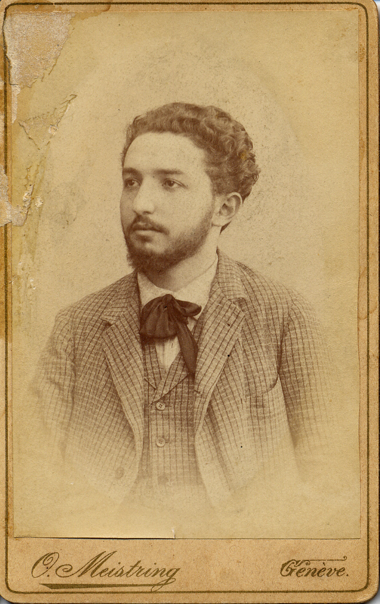
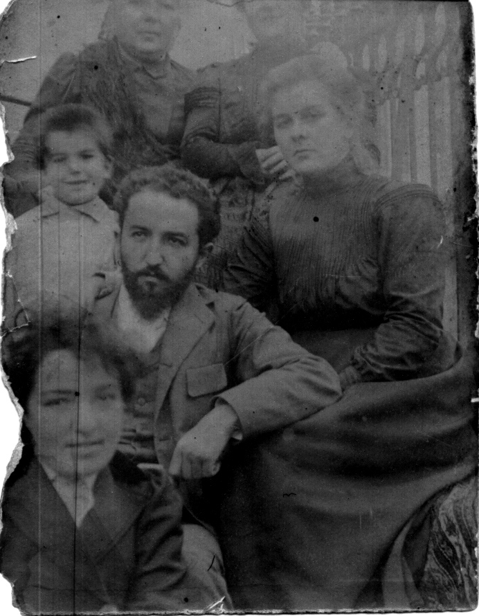
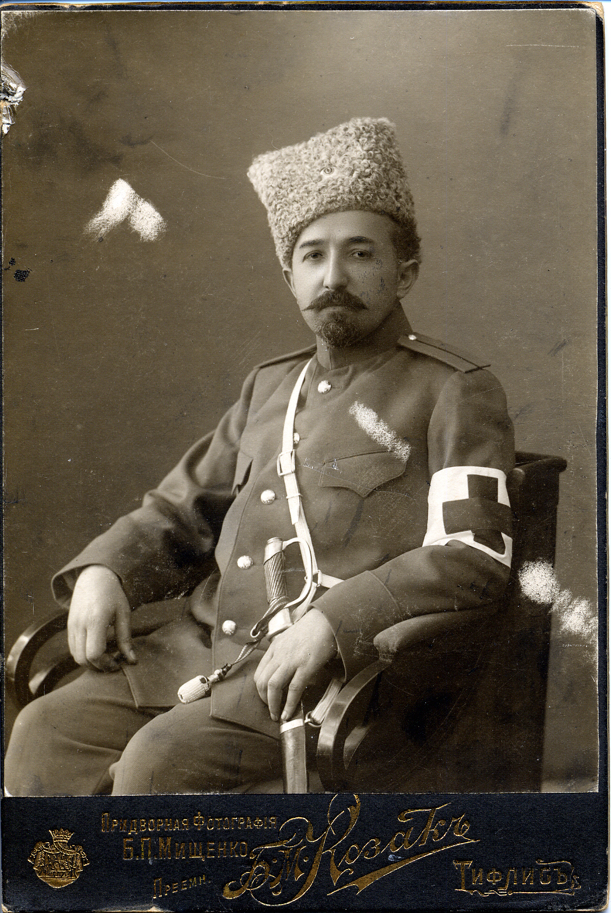
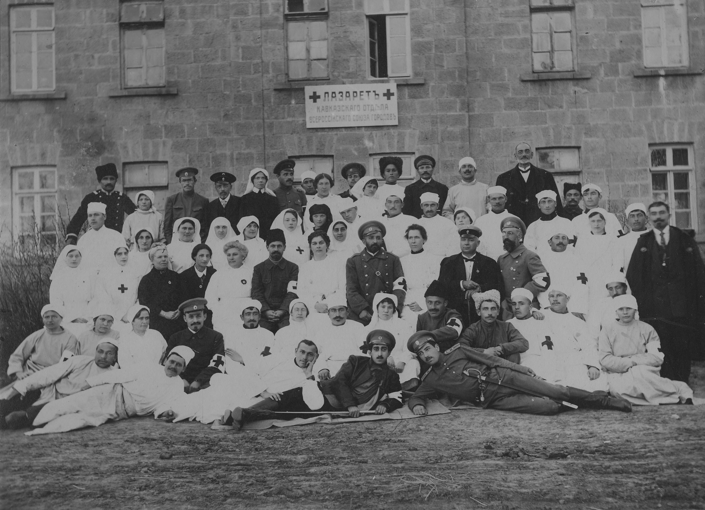

# Александр Моисеевич Атабекян
(1869–1933)

Второй сын [Мосеса Аслановича (Мосес-бека) Атабекяна](MbA.md). После окончания Шушинского реального училища вместе с сестрой Анной отправился в Женеву, где поступил на медицинский факультет университета.

По его собственным воспоминаниям, вскоре увлекся анархическими идеями, стал читать книги Кропоткина и журнал «La Révolté». От чтения брошюр и журналов через некоторое время перешёл к активным действиям — стал издавать анархическую литературу вначале на армянском, а затем и на русском языке.

Учебу он не забросил, но вскоре по окончании университета (1896 г.) женевские власти попросили анархиста не задерживаться в свободной Швейцарии. Видимо, с помощью болгарских друзей (Стоила Бойчева и др.) он нашел место в Болгарии, а в начале XX в. перебрался в северную Персию, в г. Решт, где была большая армянская колония и где появились на свет двое младших его детей Арсен и Ариана (старший, Александр, родился еще в Швейцарии).

С началом I Мировой войны поступил врачом в русскую армию. После февральской революции 1917 г. осел в Москве, организовал издательство «Почин», выпускавшее анархические брошюры и одноименный журнал. В январе–феврале 1921 г. был у постели умирающего П.А. Кропоткина.

В 1922 г. большевики закрыли издательство «Почин»; А.М. Атабекян вернулся к основной специальности, работал санитарным врацом спрева в Подмосковье, потом в Москве. В 1930 г. перенёс инсульт и ушёл на пенсию по инвалидности. Последние годы страдал прогрессирующим склерозом.

Дети: [Александр](AlAA.md), [Арсен](ArAA.md) и [Ариана](Ariana-sen.md).

**См. также:**

• [Диплом бакалавра медицины](doc-1894-04-23.md), выданный 23 апреля 1894 г.

• [Подробная биография.](AMA-pref.md)

• [Биография в Википедии.](https://ru.wikipedia.org/wiki/%D0%90%D1%82%D0%B0%D0%B1%D0%B5%D0%BA%D1%8F%D0%BD,_%D0%90%D0%BB%D0%B5%D0%BA%D1%81%D0%B0%D0%BD%D0%B4%D1%80_%D0%9C%D0%BE%D0%B8%D1%81%D0%B5%D0%B5%D0%B2%D0%B8%D1%87)

• [Полный библиографический список работ](http://oldcancer.narod.ru/Atabekian/bibl.htm) (большую часть можно почитать).

Фотография O. Meistring, Женева, 1889-1892 гг.

С женой Екатериной Николаевной Соколовой (слева) 
и сестрой Анной.
Фотограф Louis Kuntz, Ньон (Nyon), Швейцария.

Фотограф неизвестен. Болгария (?), 1900–1901 гг.

На переднем плане — Анна Моисеевна Атабекян, за нею — Александр Моисеевич, который опирается на колено своей жены Екатерины Николаевны. Слева от А.М. Атабекяна — его старший сын Шура (р. в 1896 г.). Исходя из его возраста (4–5 лет) и датируется снимок. Женщины на эаднем плане неизвестны.

Тифлис, придворная фотография Б.П. Мищенко, преемн. Б.М. Козак, 1914 г.
В форме титулярного советника медицинской службы.

Персонал лазарета Кавказского отдела Всероссийского союза городов, 
которым (лазаретом) руководил А.М. Атабекян. 
Он в центре, рядом с ним его жена Екатерина Николаевна.