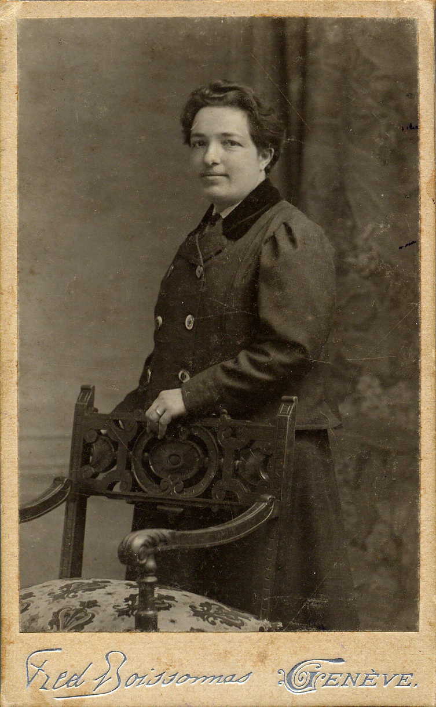

# Анна Моисеевна Атабекян

Дочь [Мосеса Аслановича (Мосес-бека) Атабекяна](MbA.md). Училась на медицинском факультете Женевского университета вместе с [братом Александром](AMA.md). Училась очень долго, с 1891 по 1900 г., хотя доплом получила еще в 1896 г.

Вместе с братом участвовала в каких-то социалистических сходках; в письмах П.А. Кропоткина А.М. Атабекяну 1890-х гг., хранящихся в Международном институте социальной истории в Амстердаме, попадаются приветы сестре.

Дальнейшая судьба почти неизвестна. Детей у нее не было.

С братом Александром и его женой Екатериной Николаевной Соколовой.
Фотограф Louis Kuntz, Ньон (Nyon), Швейцария.

Фотограф неизвестен. Болгария (?), 1900–1901 гг.

На переднем плане — Анна Моисеевна Атабекян, за нею — брат Александр Моисеевич, который опирается на колено своей жены Екатерины Николаевны. Слева от А.М. Атабекяна — его старший сын Шура (р. в 1896 г.). Исходя из его возраста (4–5 лет) и датируется снимок. Женщины на эаднем плане неизвестны.

Фотограф Fréd. Boissonnas, Женева, 1908 г.