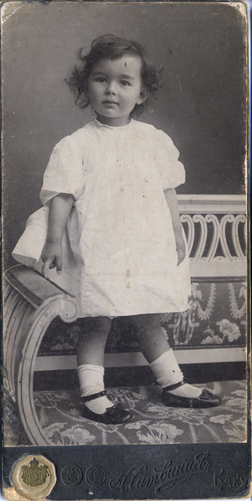
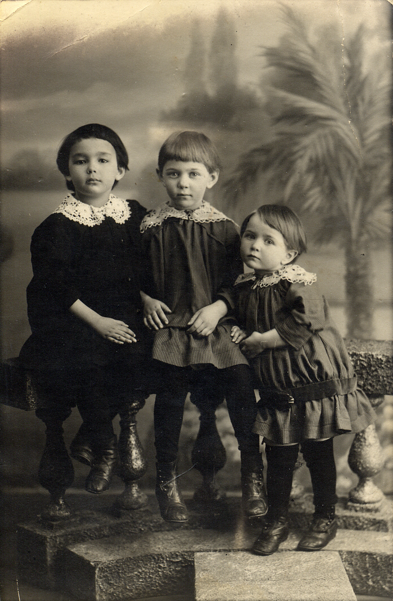
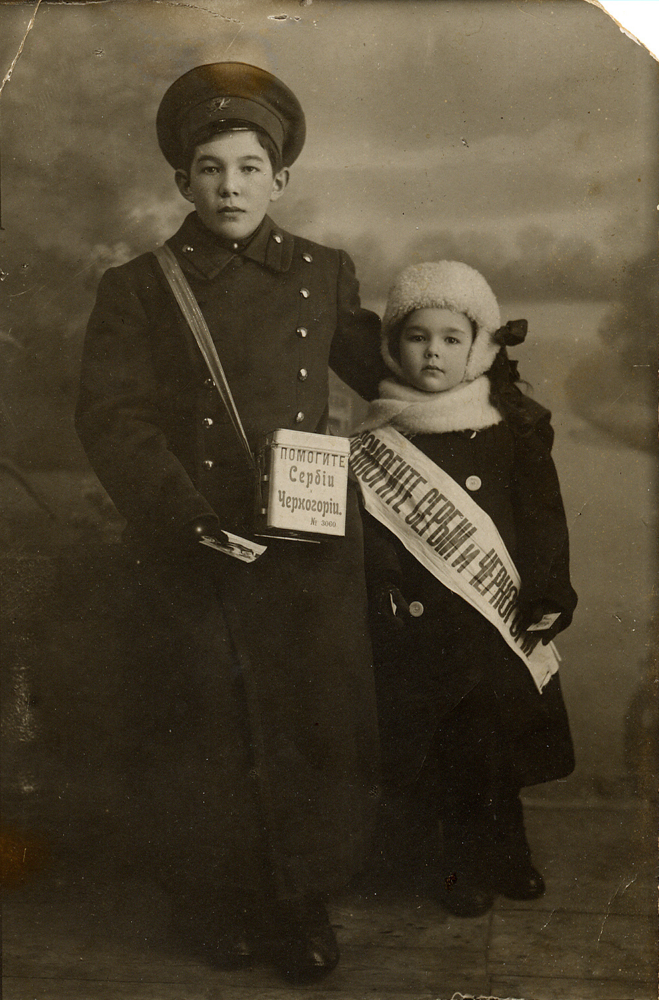
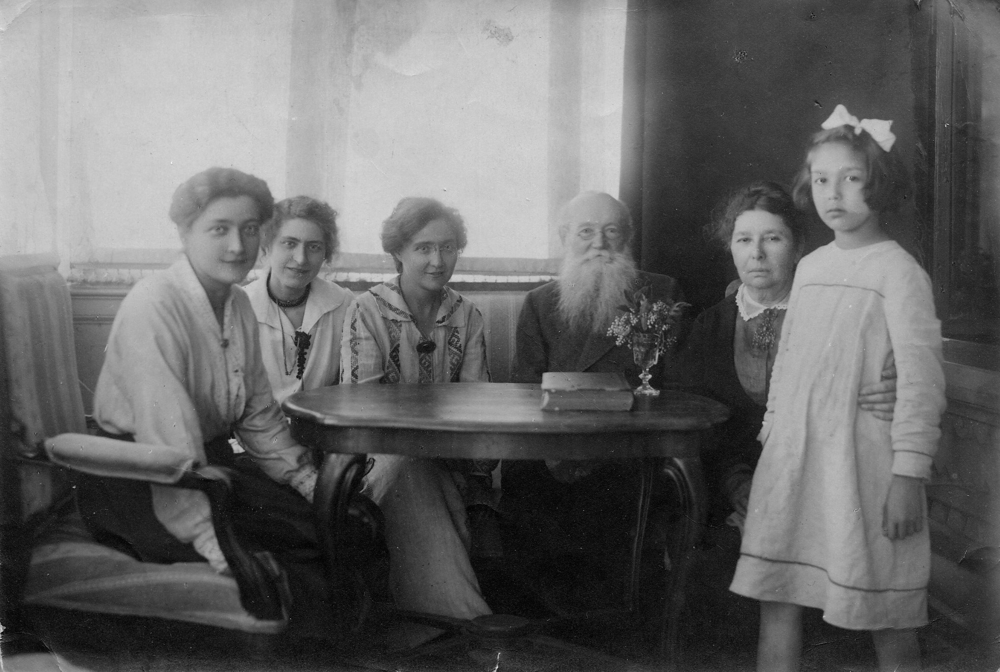
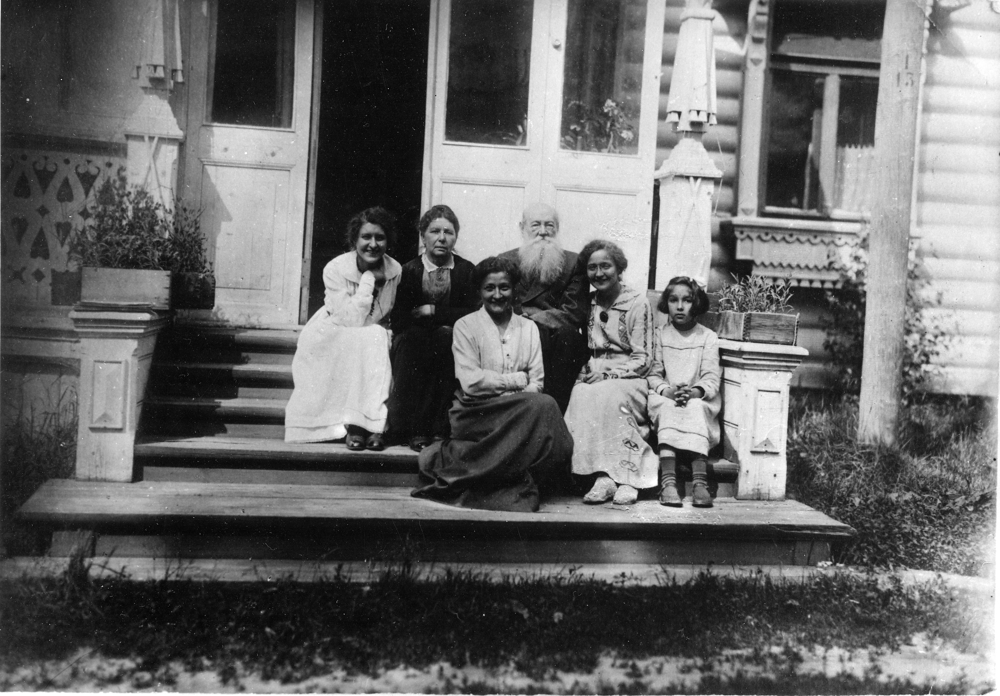
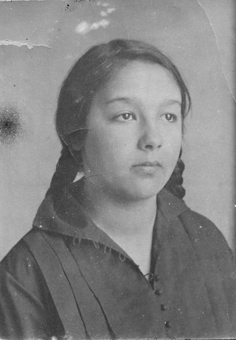
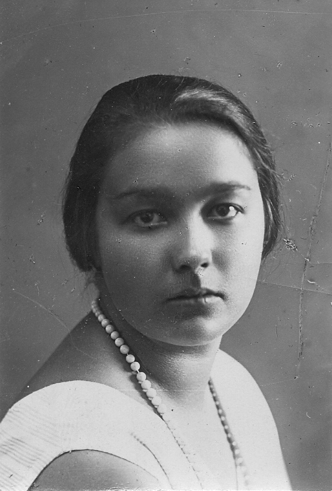
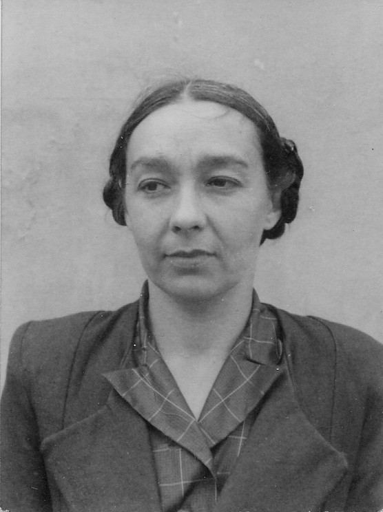
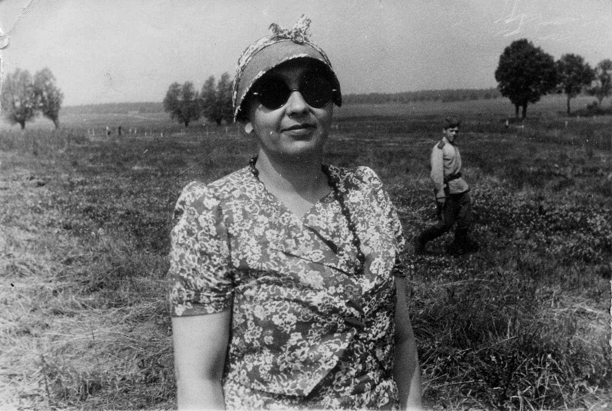
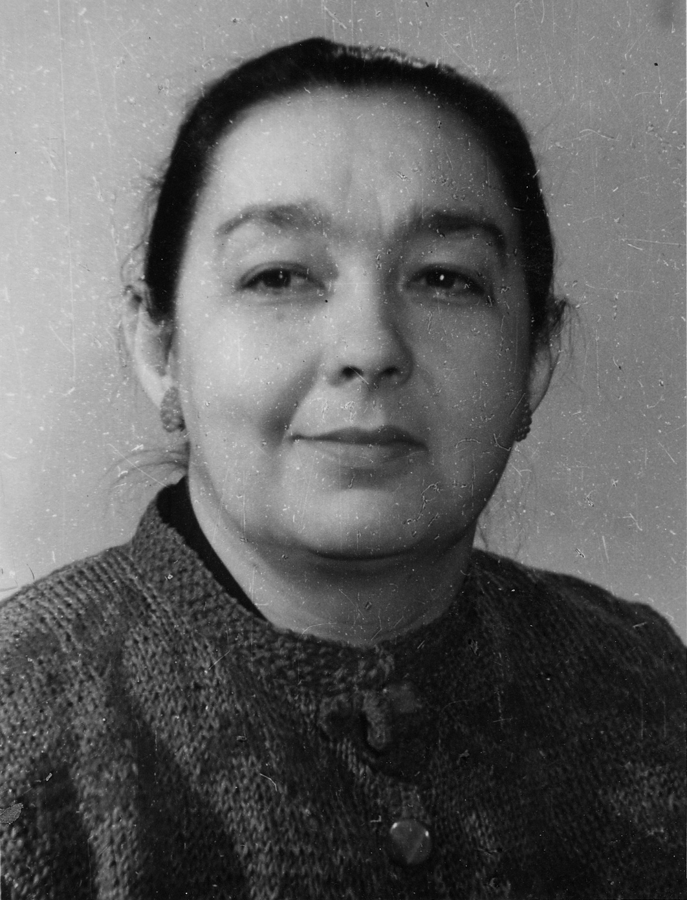

# Ариана Александровна Атабек
(1910–1977)

Дочь [Александра Моисеевича Атабекяна](AMA.md) и [Екатерины Николаевны Соколовой-Атабекян](ENS.md). Кинорежиссер, специалист по дубляжу иностранных фильмов.

Баку, фотограф Н. Литвинцев, 1913-1914 г.
Поскольку семья Александра Моисеевича Атабекяна жила в Реште (северная Персия), а его отец [Мосес-бек](MbA.md) — в Шуше (с ним жил [Арсен](ArAA.md), который учился в реальном училище, т.к. в Персии образование получить, понятное дело, было невозможно), кратчайший путь, которым Екатерина Наколаевна Соколова-Атабекян ездила к своему сыну и к родственникам мужа, шел через Баку. Здесь и фотографировались — наверное, и в Реште, и в Шуше приличного фотографа не было.

С двоюродными сестрами Ниной и Ириной Островскими.

С братом Арсеном.
Осенью 1915 Германия и Австро-Венгрия при поддержке вступившей в войну 14 октября Болгарии разбили Сербию и захватили всю ее территорию. Видимо, к этому времени и относится та благотворительная кампания, в которой участвовали Арсен и Ариана.

Слева направо: тетка Вера Николаевна Островская, брат Арсен с двоюродными сестрами Ириной (слева от него) и Ниной (справа) Островскими, старший брат Александр (в форме вольноопределяющегося), Ариана с матерью Екатериной Николаевной. Ковров, 1916 г.

Справа налево: Ариана, Софья Григорьевна Кропоткина, Петр Алексеевич Кропоткин, три дамы неизвестны. Дмитров, июнь 1920 г.

Та же группа.

