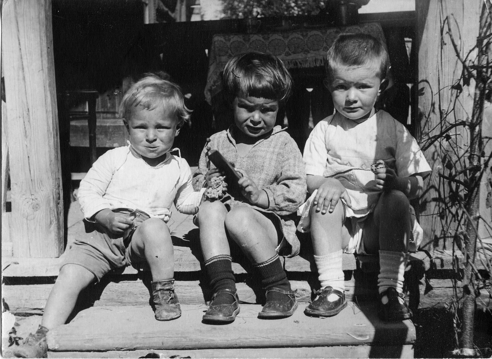
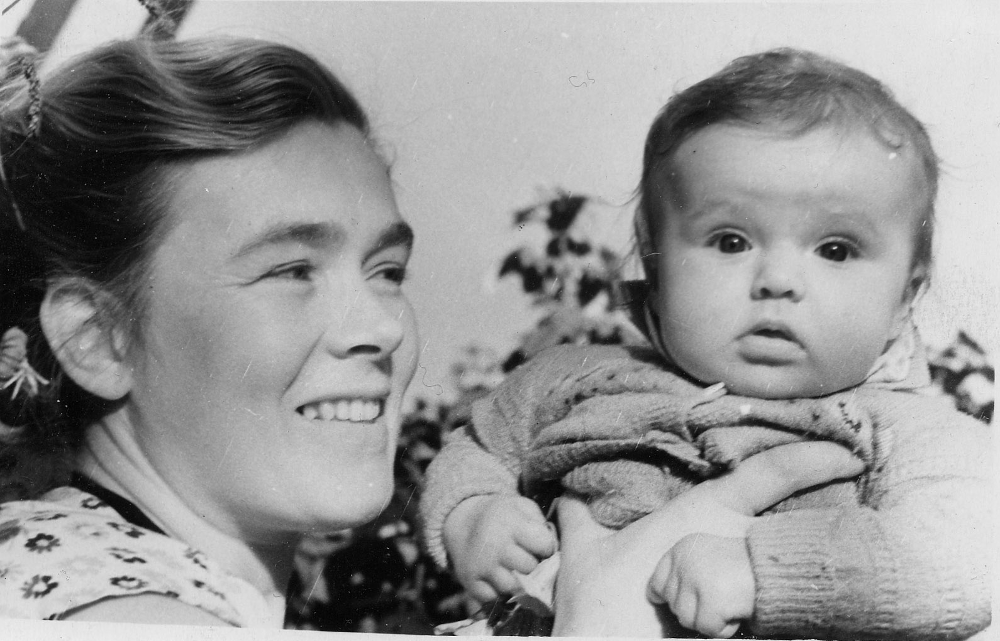

# Екатерина Арсеновна Атабекова-Бойчева
(1925–1997)

Старшая дочь [Арсена Александровича Атабека](ArAA.md) и [Марианны Стоиловны Бойчевой](../B2/MSB.md), жена [Тараса Филипповича Козицкого](../K/TFK.md), мать [Марьяны](../K/MTK.md) и [Людмилы Козицких](../K/LTK.md). Врач-эндокринолог.

Слева направо: Сергей Бирюков, Наталья Бирюкова (в будущем — Гасова), 
Катя Атабек (в будущем переименовавшая себя в Атабекову-Бойчеву).
Конец 1920-х гг.

С младшей дочерью Людой. Лето 1957 г.

Справа налево: Екатерина Арсеновна Атабекова-Бойчева, Марианна и Анастасия Бойчевы.
Видимо, на какой-то автобусной экскурсии; судя по дизайну автобуса,
1960-е — начало 1970-х гг.

Слева направо: Ариана Арсеновна Атабек, Екатерина Арсеновна Атабекова-Бойчева, 
[Наталья Николаевна Гасова](../B1/NNG.md), [Надежда Эммануиловна Коломенская](../B2/NEK.md). 
12 февраля 1991 г. Фотограф С.Н. Бирюков.