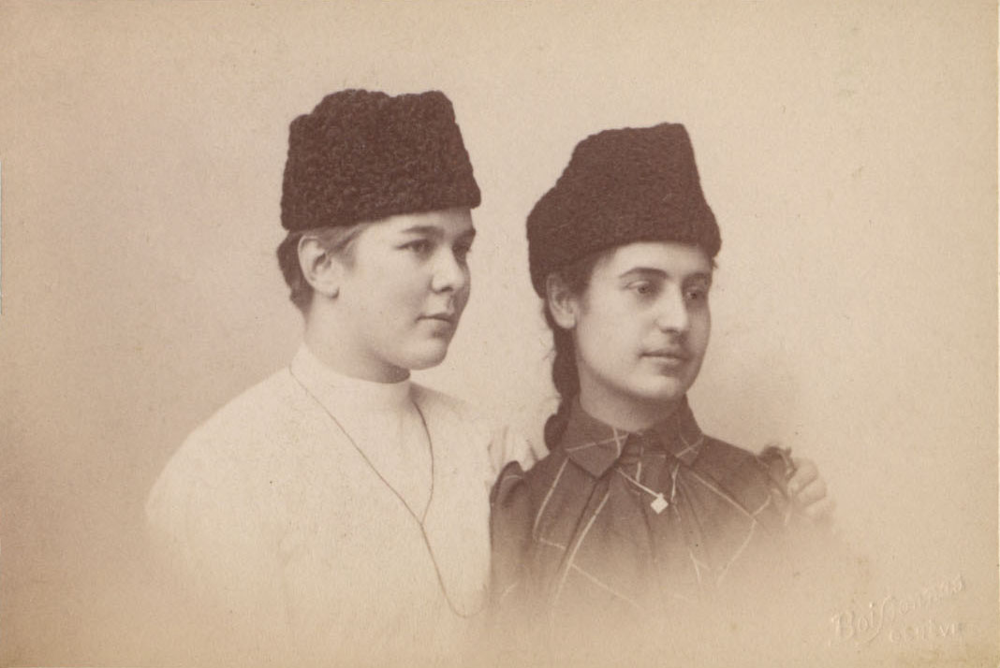
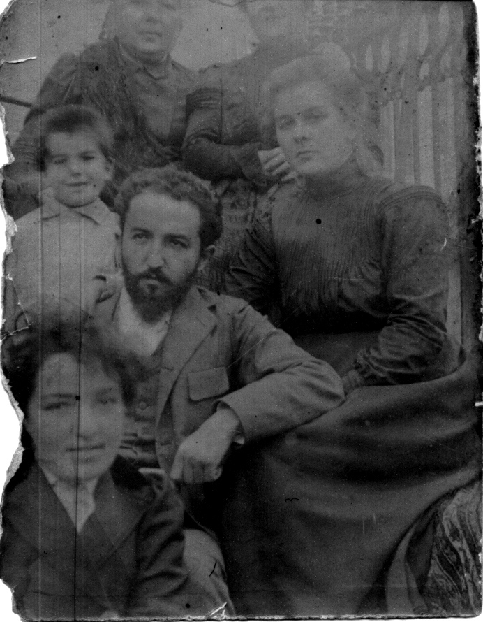

# Екатерина Николаевна Соколова
(1874–1922)

Дочь [Николая Дмитриевича Соколова](NDS.md). Училась в Женевском университете, где познакомиласть со своим будущим мужем [Александром Моисеевичем Атабекяном](AMA.md). Университетская подруга [Надежды Михайловны Богдановой](../B2/NMBB.md). В университете училась в 1892–1893 гг. и затем с 1905 по 1907 г.

В 1896 г. вышла замуж за Александра Моисеевича Атабекяна. Их младший сын Арсен в 1922 г. женился на средней дочери Н.М. Бойчевой Марианне.

Сохранилось около 80 писем Е.Н. Соколовой 1903–1920 гг., главным образом сестре В.Н. Островской. Они пепепечатаны на пишущей машинке, но не оцифрованы.

Екатерина (слева) и Вера Соколовы.
Тифлис, фотография В. Барканова, 1878.
Их отец Николай Дмитриевич Соколов, получив диплом врача, должен был отслужить военную службу за стипендию, которую он получал в Петербургской медико-хирургической академии. Был назначен на Кавказ. Фото сделано незадолго до возвращения в Россию.

Фотография И.Ф. Курбатова, Москва, 1885 г.

Фотографы Шиндлер и Мей под фирмою Шерер, Набгольц и Ко., Москва, 1890 г.

Фотография Г.В. Трунова, Москва, 1893 г.

Женева. Фотограф Fréd. Boissonnas

С неизвестной
Женева. Фотограф Fréd. Boissonnas.

С мужем Александром Моисеевичем Атабекяном и его сестрой Анной Моисеевной.
Фотограф Louis Kuntz, Ньон (Nyon), Швейцария.

С сыновьями Арсеном (слева) и Александром
Женева. Фотограф Fréd. Boissonnas, 
1905–1906 гг.

Фотограф неизвестен. Болгария (?), 1900–1901 гг.
На переднем плане — Анна Моисеевна Атабекян, за нею — ее брат Александр Моисеевич, который опирается на колено своей жены Екатерины Николаевны. Слева от А.М. Атабекяна — его старший сын Шура (р. в 1896 г.). Исходя из его возраста (4–5 лет) и датируется снимок. Женщины на эаднем плане неизвестны; возможно, одна из них — мать А.М. Атабекяна.

Фотограф Fréd. Boissonnas, Женева, 1905–1907 гг.

Персонал лазарета Кавказского отдела Всероссийского союза городов, 
которым (лазаретом) руководил А.М. Атабекян. 
Он в центре, рядом с ним Екатерина Николаевна.

Е.Н. Атабекян (крайняя справа) с младшей сестрой Верой Николаевной Островской (крайняя слева) и их дети Ирина Островская (рядом с матерью), Нина Островская (посередине), Ариана Атабекян (рядом с матерью), Арсен и Александр Атабекян (в форме вольноопределяющегося). Ковров, 1916 г.

В.Н. Островская, как и ее сестра — врачи. Из пятерых детей врачами станут Арсен и обе девочки Островские.

