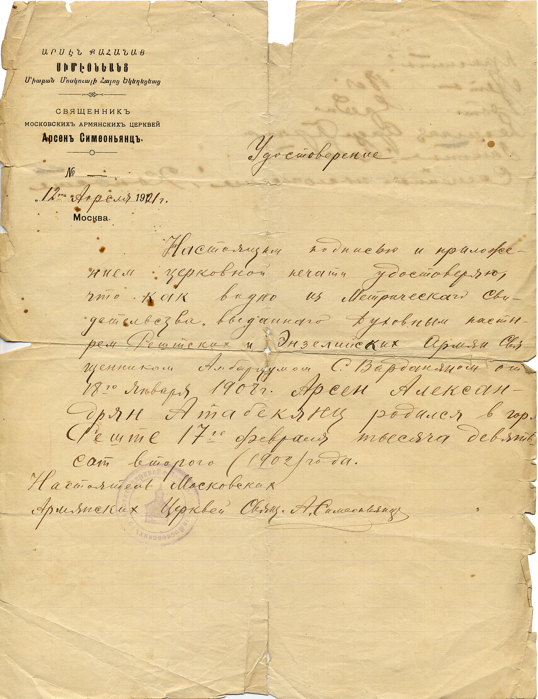

# Удостоверение
о дате и месте рождения Арсена Атабекяна

Упоминаемое в документе метрическое свидетельство было составлено, очевидно, на армянском языке, так что потребовался перевод, или вернее, пересказ. Документ хотя и подлинный, но крайне своеобразный: родители не указаны, а уж «приметы» совершенно смехотворные.

*СВЯЩЕННИКЪ  
МОСКОВСКИХЪ АРМЯНСКИХЪ ЦЕРКВЕЙ  
**Арсенъ Симеоньянцъ.***

*№ —  
„12" Апреля 1921 г.  
Москва*

*Удостоверение*

*Настоящим подписью и приложением церковной печати удостоверяю, что как видно из Метрического Свидетельства, выданного Духовным пастырем Рештских и Энзелинских армян Священником Амбарцумом С. Варданяном от 18го января 1908 г. Арсен Александрян Атабекянц родился в гор. Реште 17го февраля тысяча девятьсот второго (1902) года.*

*Настоятель Московских  
Армянских Церквей Свящ. А. Симеоньянц.*

[На обороте:]

*Приметы:*

*Лет 18 л.*

*Рост средн.*

*Религия Арм.-Грегор.*

*Занятие: рабочий*

*Семейное положение: холост*