# Знакомые из Богдановского альбома

Хотя в альбоме много фотографий лиц, остающихся нераскрытыми, всё-таки некоторых удалось установить. Друзья, знакомые и одна очень дальняя свойственница на страницах мною подписаны, а чтобы не пускаться в слишком длинные разъяснения, маленькие справки вынесены сюда.

## Любовь Валентиновна Амфитеатрова {#LVA}
(1869–1932)

На обороте надпись: «*1897 г. 24/1. М.*». Сестра писателя Александра Амфитеатрова; их мать приходилась родной сестрой [А.И. Чупрову](../B2/AICh.md), который, в свою очередь, был женат на сестре [М.Е. Богданова](../B2/MEB.md). То еще родство, конечно, но А.В. Амфитеатров оставил воспоминания о родителях М.Е. Богданова, т.е. о самых древних наших предках по этой линии.

О сестре же, когда она умерла, он написал очень теплый очерк. Довольно странная была женщина. [Читать тут](http://az.lib.ru/a/amfiteatrow_a_w/text_1933_roman_odnoy_idealistki.shtml).

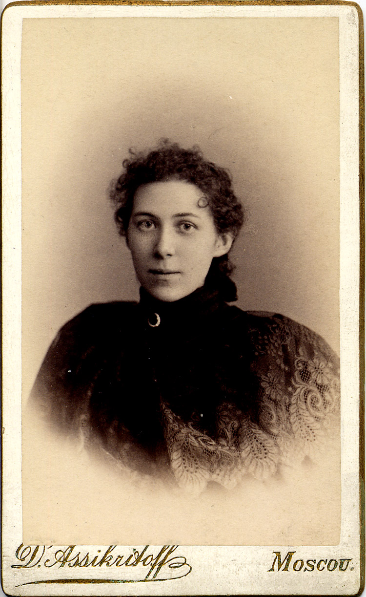

## Галина Зборовская {#GZ}

Подруга [М.С. Бойчевой](../B2/MSB.md). На фотографии она слева.

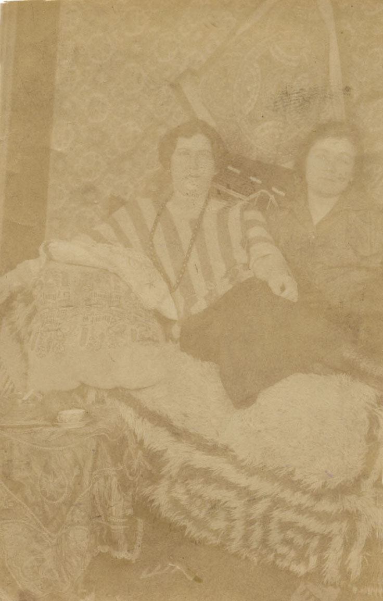

## Леонид Яковлевич Манько {#LJaM}
(1863—1922)  
Украинский актер, драматург.

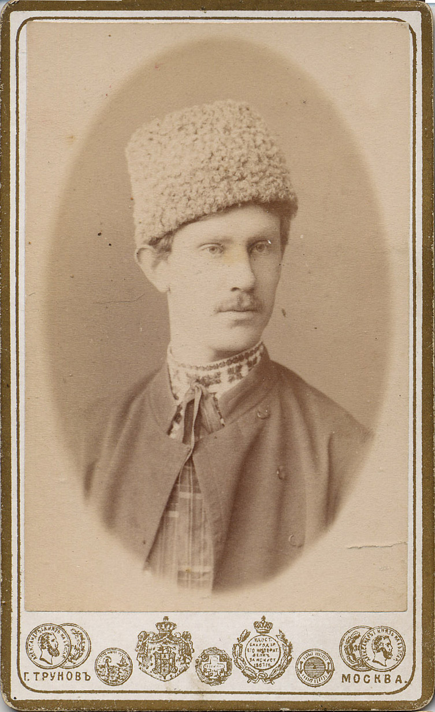

## Мщалянц {#M}

Совершенно загадочный персонаж. На обороте правой фотографии надпись: «*30/18 Марта 93.* <неразб.> *par Clarens от Мщалянца*».

| | |
|---|---|
| 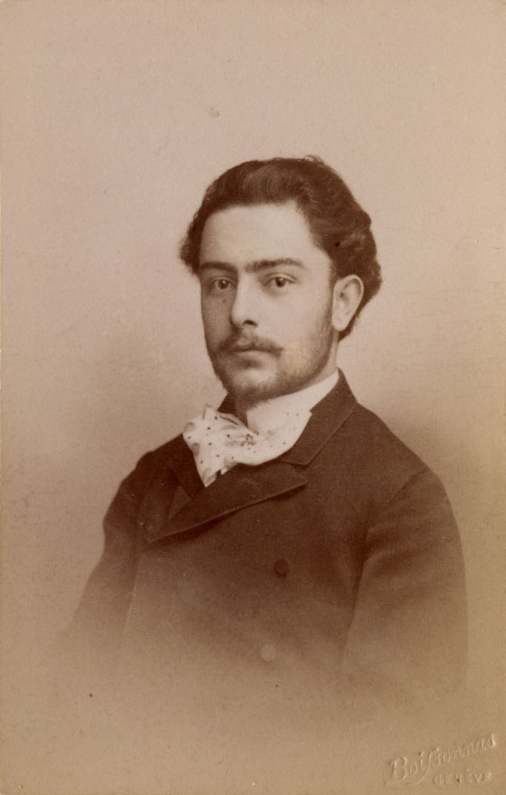 | 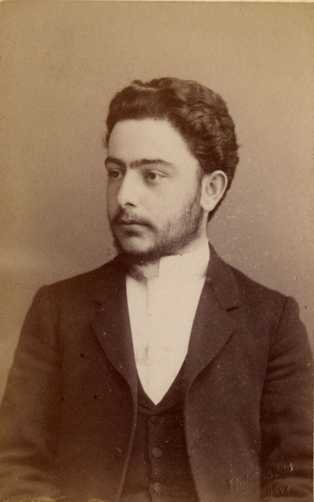 |

## Евгения Альбертовна Репман {#EAR}
(1870–1937)

Основательница, совместно с В.Ф. Фёдоровой, и директор 1-й Московской кооперативной гимназии. В Википедии есть статья о гимназии, а о ее основательницах нет.

На правой фотографии — вместе с [Надеждой Михайловной Богдановой](../B2/NMBB.md).

| | |
|---|---|
| 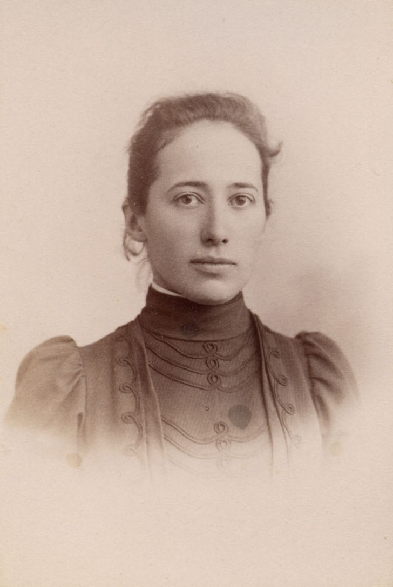 | 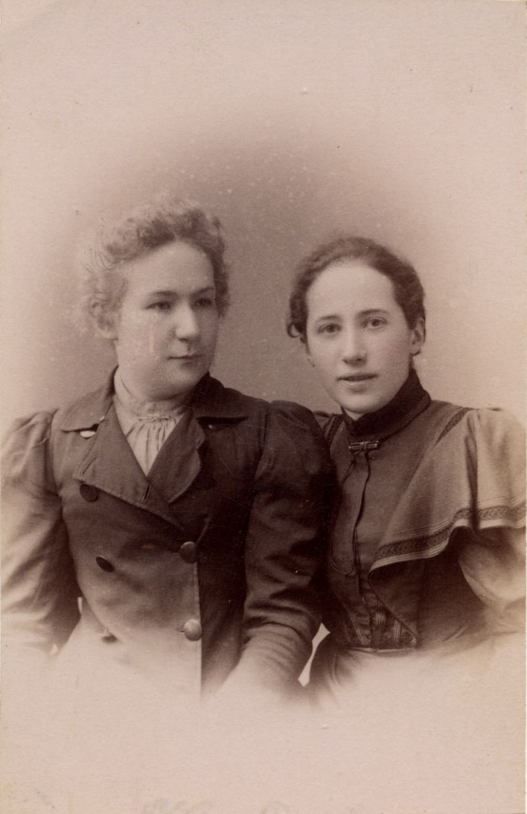 |

## Юлия Богдановна Репман {#JuBR}
(1848–1922)

Мать предыдущей. Фото датировано 1893 годом. Справа, для сравнения, портрет работы И.Е. Репина 1881 года.

| | |
|---|---|
| 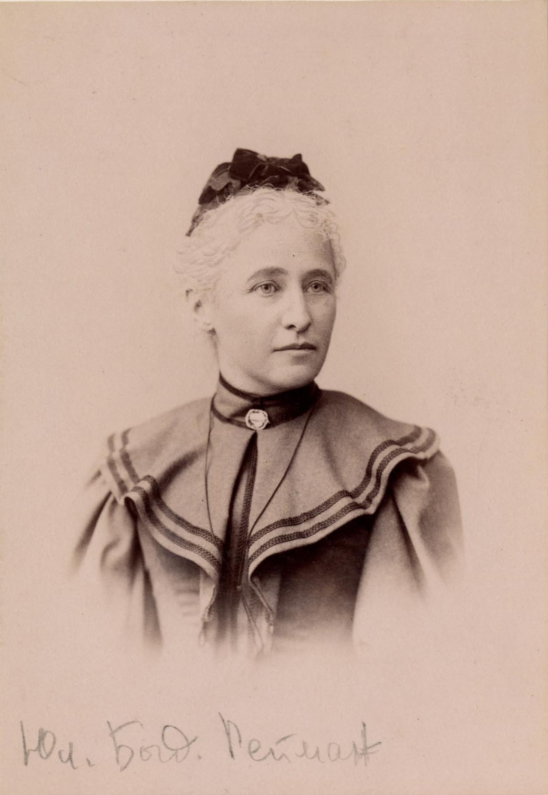 | 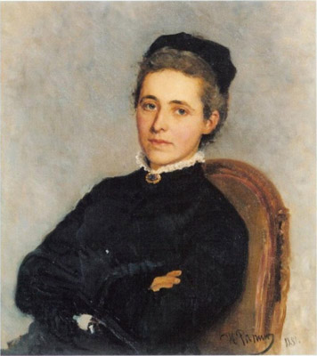 |

## Люля Семидова {#LS}

Подруга [М.С. Бойчевой](../B2/MSB.md). На фотографии она слева.

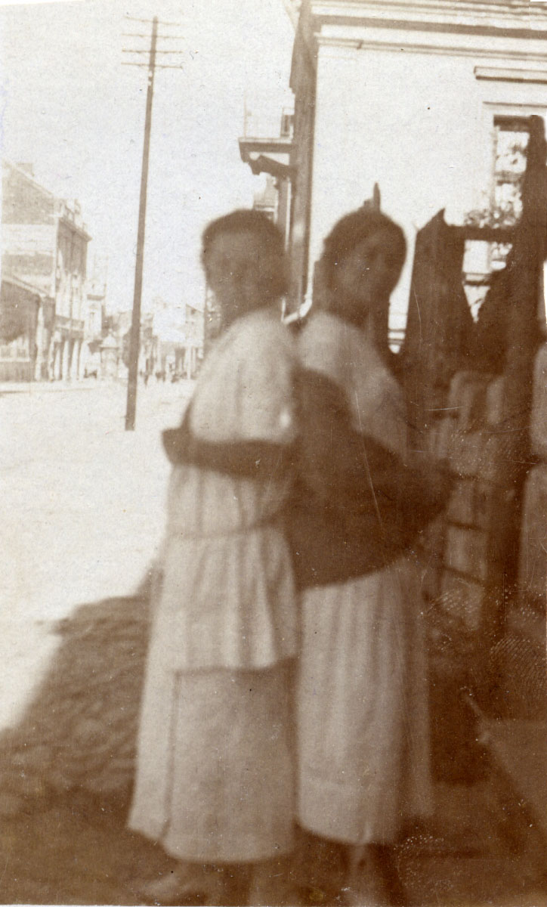

## Гликерия Николаевна Федотова {#GNF}
(1846–1925)

Актриса Малого театра.  
На лицевой стороне надпись:  
«*Наде Богдановой на память о Гликерии Федотовой. 1886, 2 Апреля*»

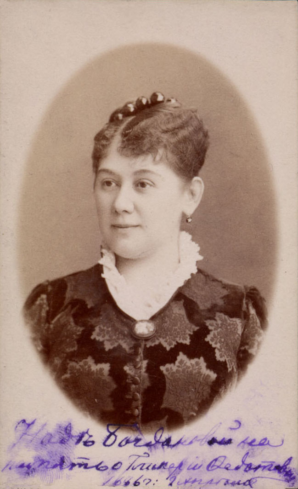

## Иван Иванович Янжул {#IIJa}
(1846–1914)

Экономист, статистик, один из первых в России фабричных инспекторов. В 1876—1898 гг. профессор Московского университета. Академик Петербургской Академии наук (1895). Поскольку И.И. Янжул был очень дружен с [А.И. Чупровым](../B2/AICh.md), он, очевидно, общался и с семьей Богдановых — с Чупровыми они были очень тесно связаны. Странно только, что Янжул в своих Воспоминаниях упоминает [М.Е. Богданова](../B2/MEB.md) только раз и совершенно мельком.

| | |
|---|---|
| 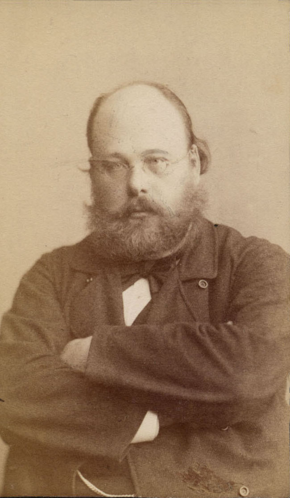 | 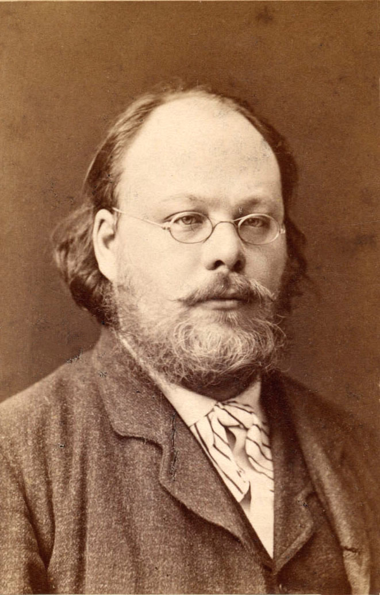 |