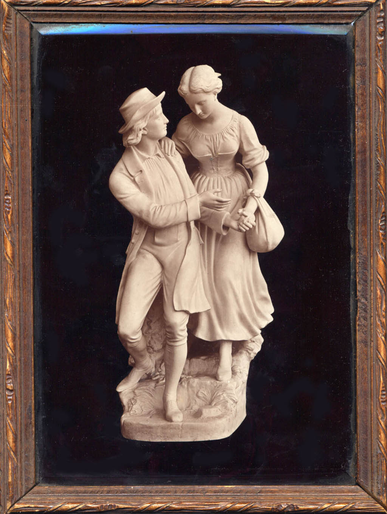
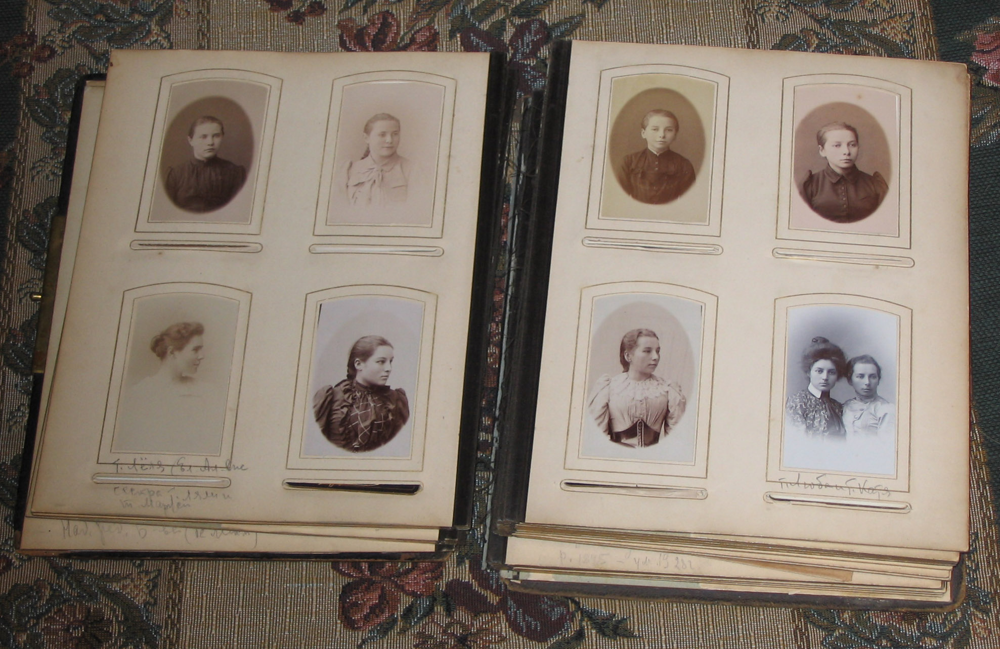

# Богдановский альбом

**Небольшое вступление, написанное [Андреем Викторовичем Бирюковым](../people/AVB.md):**

Старинный альбом в толстенном переплете, с очень толстыми картонными страницами, в которых проделаны окошки для фотографий. Он хранился у бабушкиной сестры [Татьяны Стоиловны Бойчевой](../people/TSB.md). Помню его с детских лет, но помню смутно: больше всего привлекала верхняя крышка переплёта, представлявшая картинку в деревянной рамке под толстым стеклом. На картинке — фарфоровая скульптура: галантная парочка в старинных костюмах. Впрочем, что рассказывать — вот она перед вами.

{: width=50%}

Что касается содержимого альбома, то оно в моей юной голове не задержалось. Не помню даже, рассказывала ли мне бабушкина сестра, кто эти люди, изображённые на фотографиях, или не рассказывала, догадываясь, что мне это не интересно.

К счастью, страницы альбома листали руки менее равнодушных людей, чем автор этих строк (всё же замечу в скобках, что мне было тогда лет 12–15). Рукой нашей бабушки Марианны во многих местах сделаны записи, благодаря которым мы знаем, как выглядели многочисленные кузины и тётки прабабушки [Надежды Михайловны Богдановой](NMBB.htm) (отчего-то мужской пол среди этой ветви предков был представлен слабее женского).

Увы — из 142 фотографий альбома на 52 изображены неизвестные, точнее — нераскрытые лица. Более дальние родственницы и родственники? подруги матери, тёток, знакомые знакомых? Трудно теперь сказать. Вот если бы взяться за это дело, ходить по архивам, сличать, расспрашивать… Конечно, облик немногих ближайших предков известен и без благословенных бабушкиных записей — по другим семейным фотографиям; ещё несколько лиц удалось идентифицировать мне, но всё-таки более трети портретов — неизвестны. Об известных я постарался составить небольшие биографические справки, снабдив их фотографиями — и из этого альбома, и из других источников.

К сожалению, в настоящее время альбом находится в довольно плачевном состоянии — корешок оторвался, страницы вываливаются. Чинить сложно, но зато электронный вариант можно листать без опасения что-то порвать, испортить или потерять.
