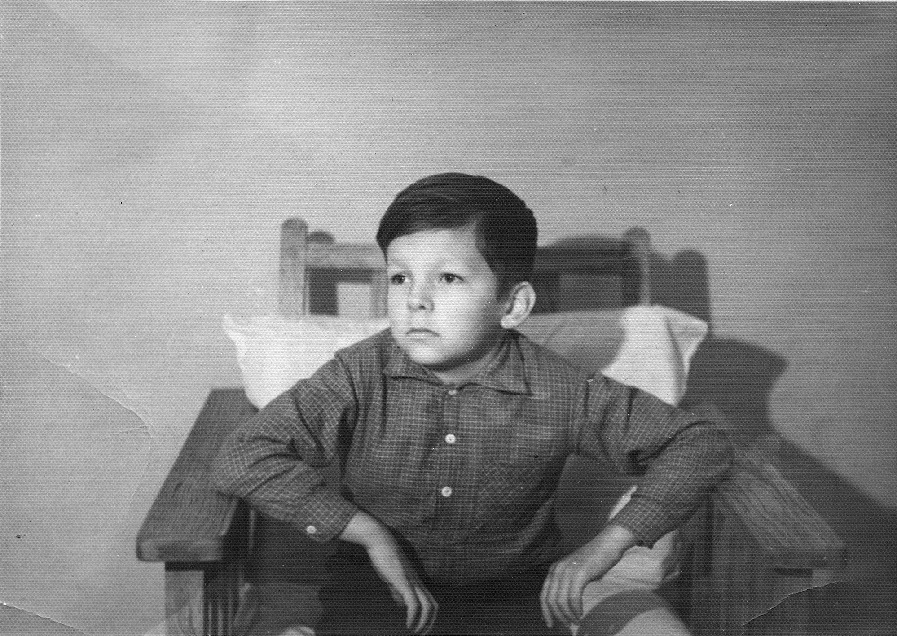
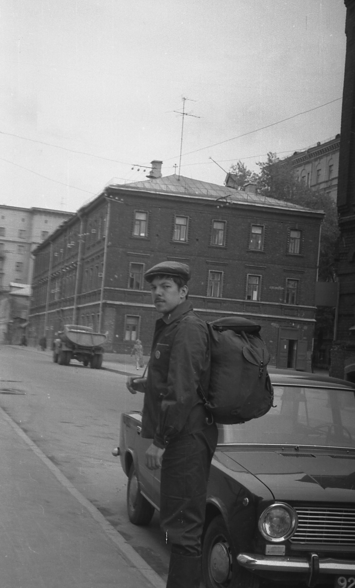
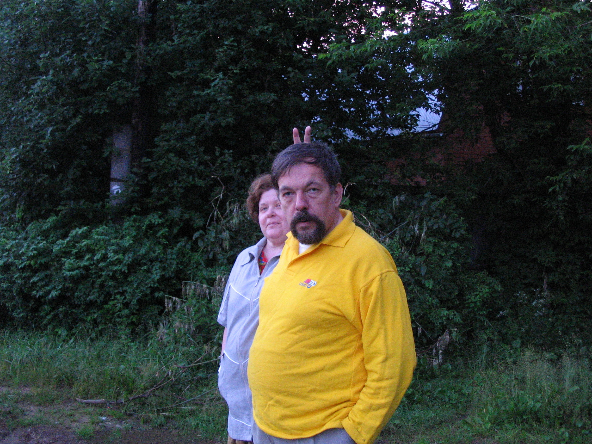
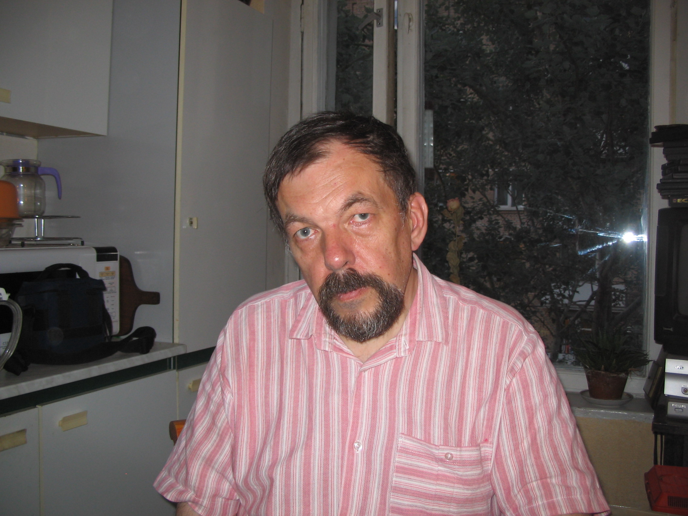
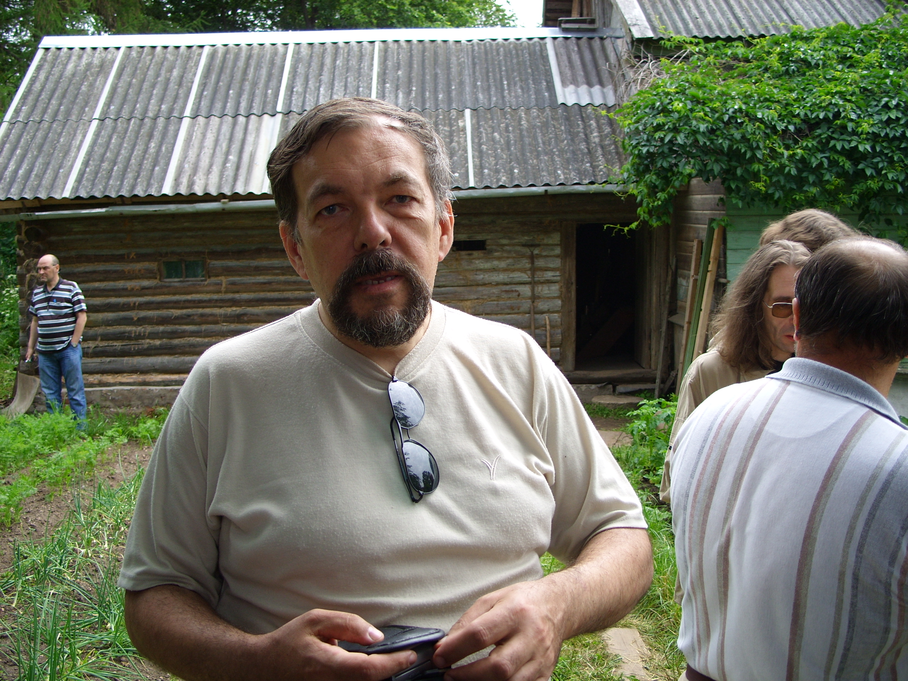

# Андрей Викторович Бирюков
(р. 1955)

Сын [Виктора Дмитриевича Бирюкова](VDB.md) и [Арианы Арсеновны Атабек](../A/Ariana-sen.md), отец Арсения Андреевича Бирюкова. По образованию географ, по профессии редактор

1965 г.

На практику в Сатино. 1974 г.

С женой Мариной Юрьевной Константиновой. 26 июня 2005 г.

На работе. 18 августа 2006 г.

Дома у Арсения. 22 мая 2007 г.

Прямухинские чтения 2007 года.
Вполне научное мероприятие, посвященные истории анархизма ежегодно проходит в селе Прямухине Тверской обл., на родине одного из основоположников анархизма М.А. Бакунина. Часть докладов проходит на дачном участке одного из организаторов. 1 июля 2007 г.

24 марта 2012 г.

Люда, Марьяна, Андрюша и арбуз. Купавна, август 1960 г.

Первый ряд: Марьяна Козицкая, Саша Бойчева (дочь Михаила Эммануиловича Бойчева), Люда Козицкая; 
второй ряд: Андрей Бирюков, Костя Коломенский. Москва, 1966 г.

Те же лица, в тот же день.