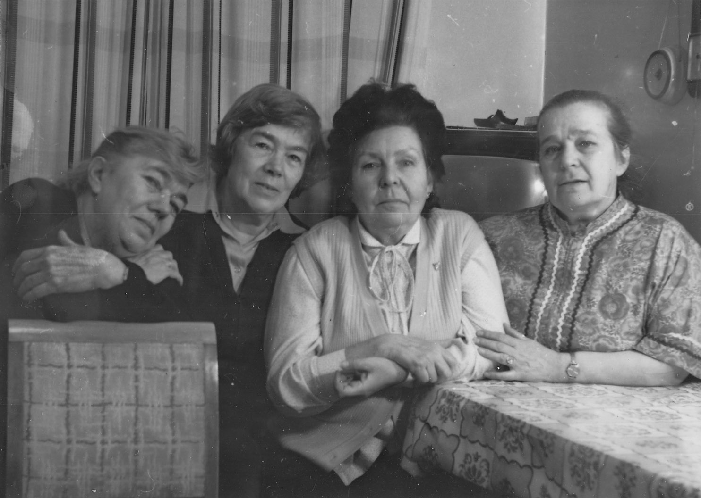

# Наталья Николаевна Гасова
(1925–1997)

Дочь Николая Дмитриевича Бирюкова и [Татьяны Стоиловны Бойчевой](../B2/TSB.md), жена Бориса Петроовича Гасова, мать Татьяны Гасовой.

Слева направо: Сергей Бирюков, Наталья Бирюкова (в будущем — Гасова), 
Катя Атабек (в будущем переименовавшая себя в Атабекову-Бойчеву).
Конец 1920-х гг.

Слева направо: Ариана Арсеновна Атабек, [Екатерина Арсеновна Атабекова-Бойчева](../A/EAAB.md), 
Наталья Николаевна Гасова, [Надежда Эммануиловна Коломенская](../B2/NEK.md). 
12 февраля 1991 г. Фотограф С.Н. Бирюков.

У себя на даче во Фроловском. 10 сентября 2005 г.
Кто из внуков у нее на коленях — я не знаю.

С [Соней Козицкой](../K/SK.md).
Январь 2010 г.