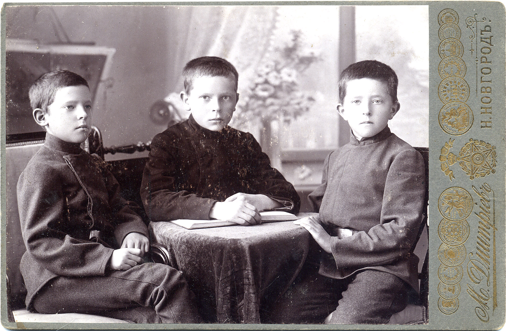
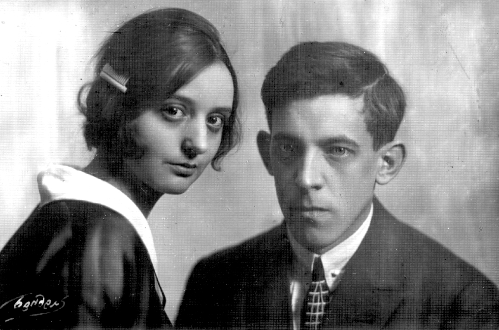
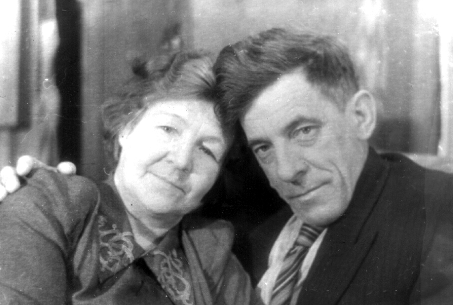
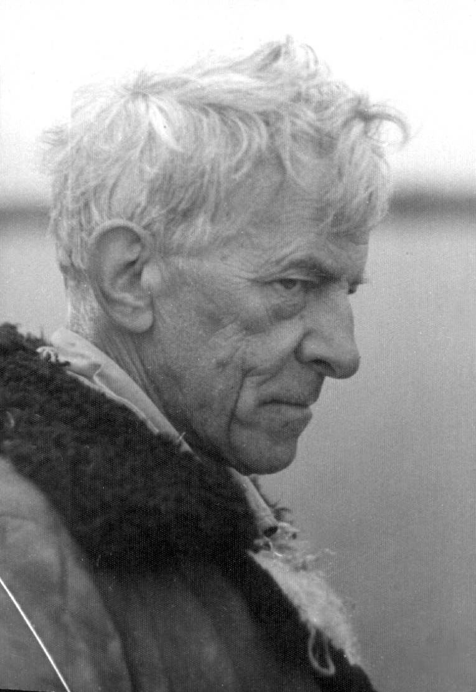
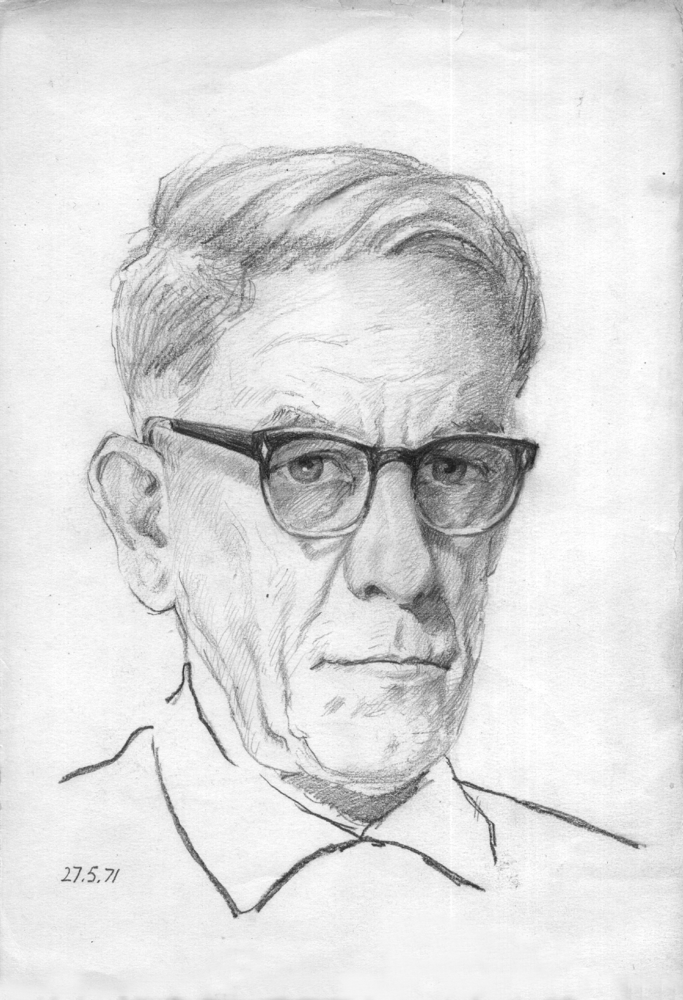
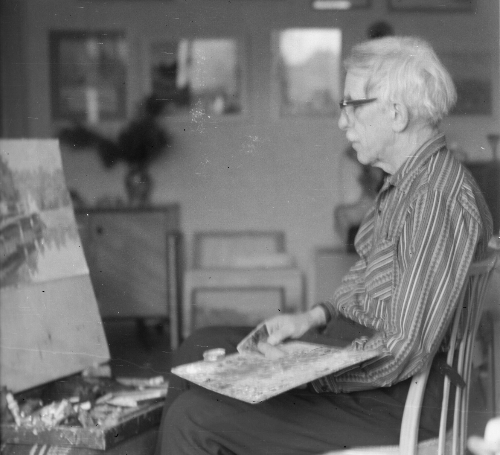
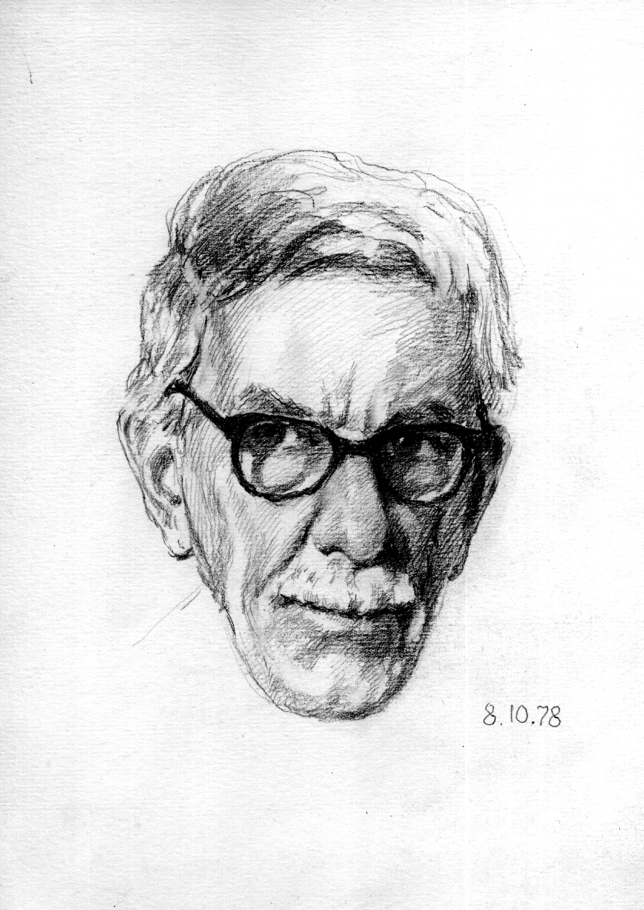

# Виктор Дмитриевич Бирюков
(1898–1983)

Сын Дмитрия Петровича Бирюкова и Анны Арсеньевны Бирюковой, урожд. Андриевской; отец Андрея Викторовича Бирюкова. Художник.

Родился в Вятке (нынешнем Кирове), детство и юность провел в Нижнем Новгороде. Окончил Первую Нижегородскую гимназию в 1916 году, один семестр проучился в Московском университете и был призван в армию. Как выпускник гимназии попал не в окопы, а в Одесское юнкерское училище. Осенью 1917 г.был командирован училищем в Москву, целью поездки было получение на складе амуниции, офицерских погон и т.п. ввиду приближавшегося выпуска прапорщиков. Был очевидцем и даже немного поучаствовал в революционных боях в Москве, на чьей стороне — понятно. Поглядев на всю эту «заварушку» (его собственное определение случившегося), получил необходимый груз и отбыл обратно в Одессу.

В I Мировой войне не участвовал, в Граждансой оказался почему-то на стороне красных. После окончательного завершения «заварушки» осел в Ростове-на-Дону, работал в издательствах, оформлял и иллюстрировал книжки. Году в 1943 или 1944, во время оккупации, перебрался в Одессу, после ее освобождения успел немного повоевать (впрочем, занимался главным образом художественным оформлением отчетов того подразделения, где служил). В 1945 году переехал во Львов, а в 1972 — в Москву.

Был женат три раза; первые две жены — родные сестры Наталья Николаевна и Елена Николаевна Рахт. В третий раз женился на племяннице жены брата, Ариане Арсеновне Атабек, произведя тем самым некоторую путаницу в генеалогии. Впрочем, путаница затрагивает главным образом его единственного сына Андрея, автора сих строк. Мне бывает трудно объяснить, отчего часть родственников мне приодятся и тетками и дядьями и двоюродными братьями и сестрами. Увы, и на генеалогической схеме наглядно показать эту двойственность я не смог.

Ну, да уж как есть.

**См. также:**

• [Метрическое свидетельство](doc-1900-04-28.md)

• [Аттестат зрелости](doc-1916-05-23.md), 23 мая 1916 г.

Братья Бирюковы: слева направо Виктор, Николай, Андрей.
Нижний Новгород, август 1908 г. Фотограф М.П. Дмитриев.

Как следует из надписи на обороте, мальчики сняты в год поступления Виктора (самого младшего) в гимназию. Скорее всего, по этому поводу и снимались.

С первой женой Натальей Петровной Рахт. 
Москва, 1920-е гг. Фотограф Э.С. Бендель.

С Татьяной Стоиловной Бойчевой. 1950-е гг.

1968 г.

Автопортрет. 1971 г.

За работой. 1970-е гг.

Автопортрет. 1978 г.