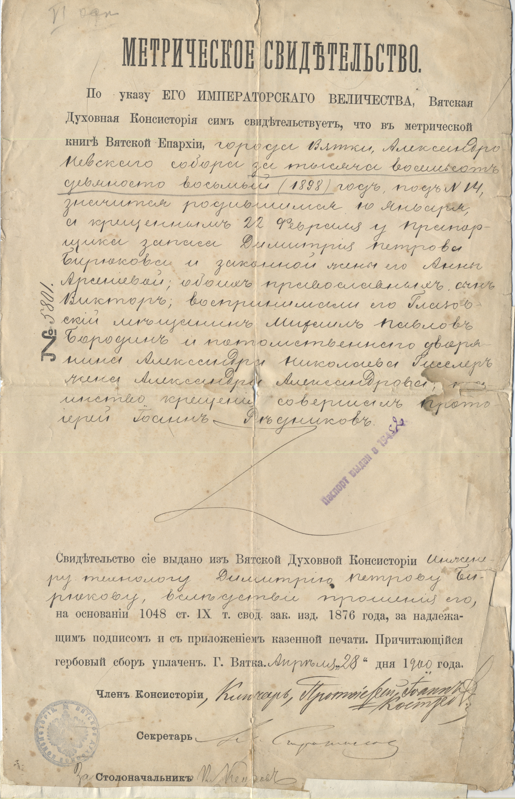

# МЕТРИЧЕСКОЕ СВИДЕТЕЛЬСТВО

По указу ЕГО ИМПЕРАТОРСКОГО ВЕЛИЧЕСТВА, Вятская Духовная консистория сим свидетельствует, что в метрической книге Вятской Епархии, *города Вятки, Александро-Невского собора за тысяча восемьсот девяносто восьмый (1898) год, под № 14, значится родившимся 10 января, а крещенным 22 февраля у Прапорщика запаса Димитрия Петрова Бирюкова и законной жены его Анны Арсеньевой; обоих православных, сын Виктор; воспринимали его Глазовский мещанин Михаил Павлов Бородин и потомственного дворянина Александра Николаева Гисслер жена Александра Александрова; таинство крещения совершал протоиерей Иоанн Редников.*

Свидетельство сие выдано из Вятской Духовной консистории *инженеру-технологу Димитрию Петрову Бирюкову, вследствие прошения его,* на основании 1048 ст. IX т. свод. зак. изд. 1876 года, за надлежащим подписом и с приложением казенной печати. Причитающийся гербовый сбор уплачен. Г. Вятка. *Апреля *„*28*" дня 1*900* года.

Член консистории, *Ключарь, Протоиерей Иоанн Костров.*

Секретарь [подпись]

За Столоначальника [подпись]

№ *5801*

Паспорт выдан в 1952 г.