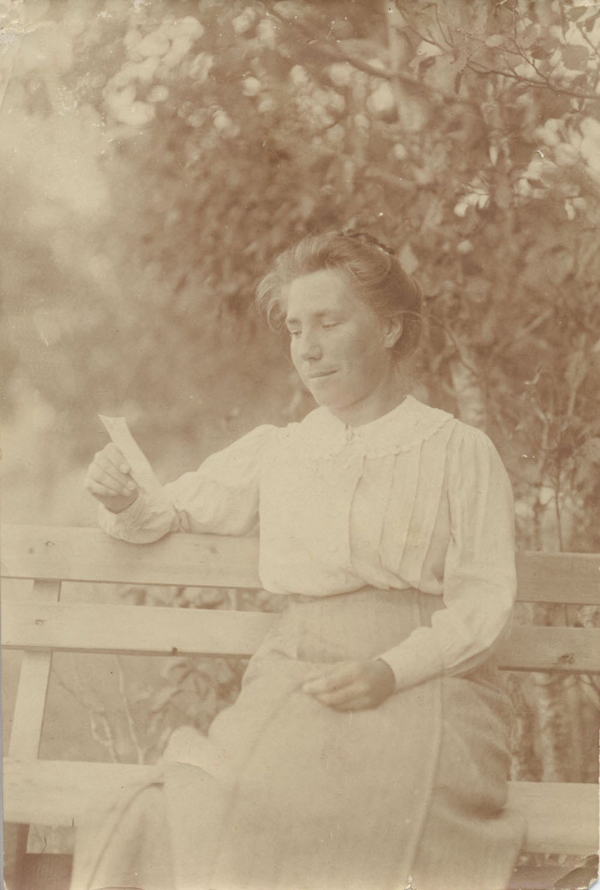

# Дочери Александра Ивановича Чупрова

У Александра Ивановича и Ольги Егоровны Чупровых было пятеро детей — сын Александр (1874–1926) и четыре дочери Ольга (Ляля; замужем за Николаем Васильевичем Сперанским), Мария, Елена (Лёля) и Ася (1884–1889). Изображением младшей, умершей в детстве, мы не располагаем, а даты ее жизни сохранились только на надгробном памятнике на Ваганьковском кладб. в Москве (она похоронена рядом с родителями).

## Ольга Александровна Сперанская (урожд. Чупрова)

 

Фотограф Александр Эйхенвальд, Москва | Большая французская фотография, Москва
На об. полустёртая надп. карандашом: «Мертвецы мы, если ненавидим, боги — если любим»

 

Фотограф Л.В. Красовский, Курск | С теткой Надеждой Федоровной Богдановой и двоюродной сестрой Анастасией Михайловной Ордынской.
Фотограф неизвестен

## Мария Александровна Чупрова

Фотограф И. Курбатов, Москва

 

Мария Александровна и Елена Александровна (?) Чупровы
Фотограф Н. Гольдберг, Москва. | **Мария Александровна Чупрова** 
с теткой Марией Егоровной Сперанской (урожд. Богдановой)
Фотограф К.А. Фишер, Москва

 

Фотограф неизвестен | Фотограф неизвестен

## Елена Александровна Чупрова

 

Фотограф Е. Овчаренко, Москва.
На об. надпись: «Наде для того, чтобы не забыла меня на будующий [sic!] год в Женеве. 1892 г. 21го февраля. Леля Чупрова» | Фотограф Р. Бродовский, Москва.
На об. надпись: «Дорогой Наде. 1896 г. Еще в Москве»

---

 

На этих двух фотографиях, сделанных, очевидно, в последние годы жизни А.И. Чупрова, рядом с ним изображены: Александр Александрович Чупров (см. более чёткое правое фото) — во втором ряду справа, Мария Александровна и Ольга Александровна (в третьем ряду) и Николай Васильевич Сперанский (рядом с А.А. Чупровым). Кроме них: Юлия Егоровна Богданова (рядом с Н.В. Сперанским) и неизвестные.