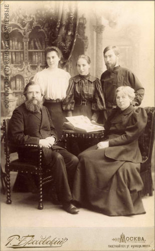
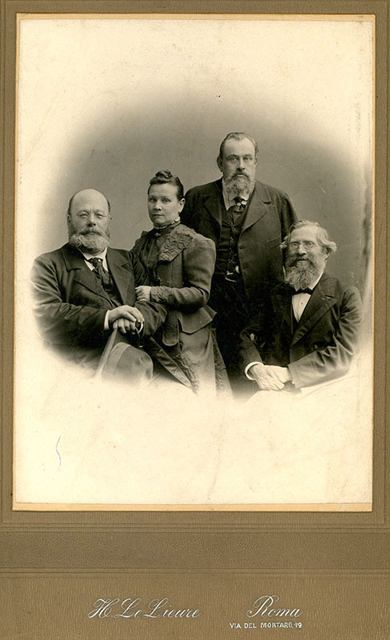
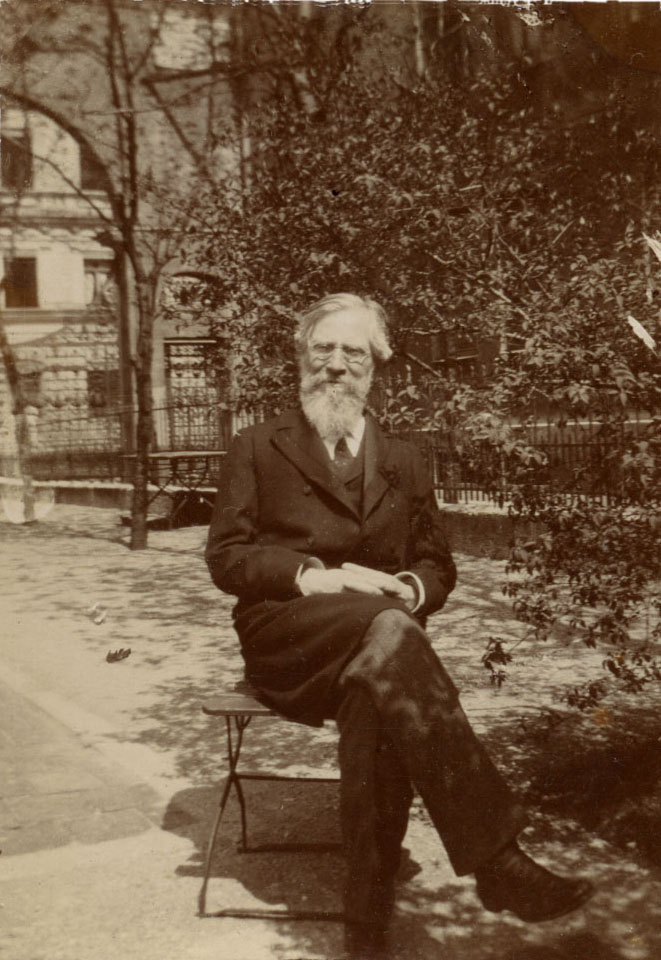

# Александр Иванович Чупров
(1842–1908)

Профессор Московского университета, известный экономист, теоретик статистики и общественный деятель. Его работы по экономике железнодорожного транспорта давно считаются классикой. Родился в г. Мосальске Калужской губ., там же, где и М.Е. Богданов, на сестре которого Ольге Егоровне женился.

Его лекции по экономике и политической экономии были чрезвычайно популярны у студентов.

Осенью 1899 г. заболел, выехал за границу для лечения, жил в Германии и в Италии. Умер в Мюнхене, похоронен в Москве на Ваганьковском кладбище.

Большинство любительских фотографий, сохранившихся в альбоме, сделано в последние годы жизни А.И. Чупрова, в Германии, где он жил с 1899 г.

**См. также:**

• [Статья в Википедии.](https://ru.wikipedia.org/wiki/%D0%A7%D1%83%D0%BF%D1%80%D0%BE%D0%B2,_%D0%90%D0%BB%D0%B5%D0%BA%D1%81%D0%B0%D0%BD%D0%B4%D1%80_%D0%98%D0%B2%D0%B0%D0%BD%D0%BE%D0%B2%D0%B8%D1%87)

Фотограф Р. Бродовский, Москва
На об. надпись: «Милой Наде Богдановой А. Чупров. Москва 18 III/9 95».

Сидят А.И. Чупров и М.Е. Богданова, 
стоят, очевидно, дочери А.И. Чупрова 
(кто именно — трудно разобрать) и А.А. Чупров.
Фотограф Р. Бродовский, Москва
На обороте надпись: «На память о 29 апреля 1869 г.»
Фотография найдена на сайте Московского университета.

Фотограф Альберт Ив. Мей под фирмою Шерер и Набгольц, Москва

Фотограф неизвестен.

Фотограф Max Fischer, Дрезден

Слева направо: [И.И. Янжул](../Album/friends.md#IIJa), его жена Екатерина Николаевна, 
М.М. Ковалевский, А.И. Чупров. Фотограф H. Le Lieure, Рим.
Фотография найдена на сайте Московского университета.

 

 | С внуком, сыном Ольги Александровны.

 

 

Юлия Егоровна Богданова, Александр Александрович Чупров, Александр Иванович Чупров, Николай Васильевич Сперанский, Ольга Александровна Чупрова, Мария Александровна Чупрова. Девушка на переднем плане и двое справа — неизвестны | 1-й ряд: неизвестная, Александр Иванович Чупров, двое неизвестных; 2-й ряд: Юлия Егоровна Богданова, Николай Васильевич Сперанский, Александр Александрович Чупров; 3-й ряд: Мария Александровна Чупрова, Ольга Александровна Чупрова

 