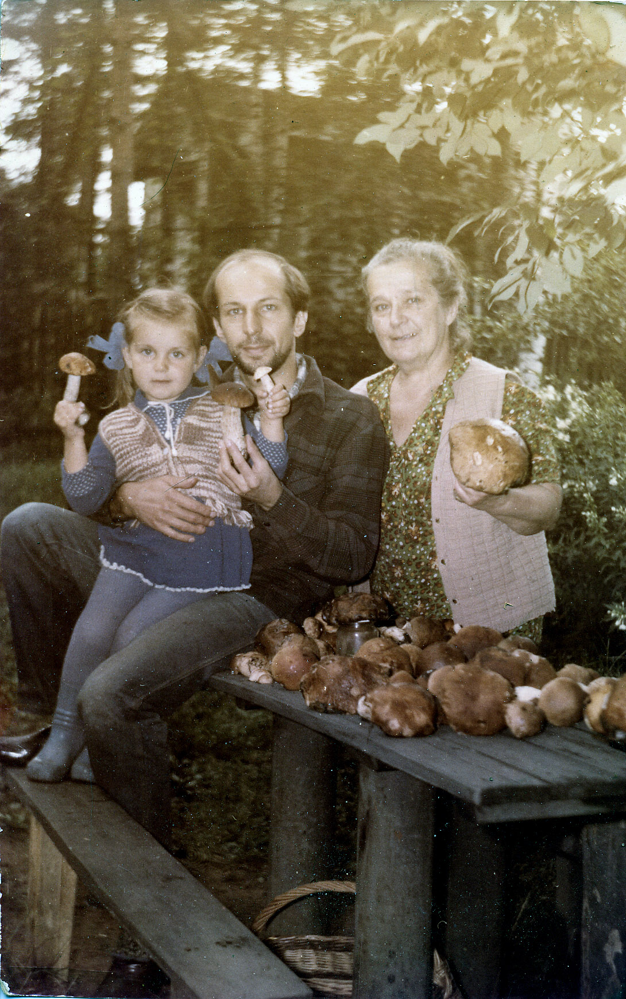

# Константин Юрьевич Коломенский
(р. 1957)

Сын Юрия Александровича и [Надежды Эммануиловны Коломенских](NEK.md).

 

Люда и Марьяна Козицкие и Костя Коломенский. 1960 г.

Первый ряд: Марьяна Козицкая, Саша Бойчева (дочь Михаила Эммануиловича Бойчева), Люда Козицкая; 
второй ряд: Андрей Бирюков, Костя Коломенский. Москва, 1966 г.

Те же лица, в тот же день.

1977 г.

С дочерью Тасей и матерью Н.Э. Коломенской. Август 1988 г., на даче.

На работе. Нью-Йорк, 13 июня 1993 г.

С родителями и троюродной сестрой Марьяной Тарасовной Козицкой. Май 2006 г.

Как заметил директор по развитию компании «Дельта Телеком», Северо-Западного филиала «Скайлинка»…
Круглый стол «Строительство сетей. Тренды, перспективы». 29 июля 2010 г. 
Фото из интернета.