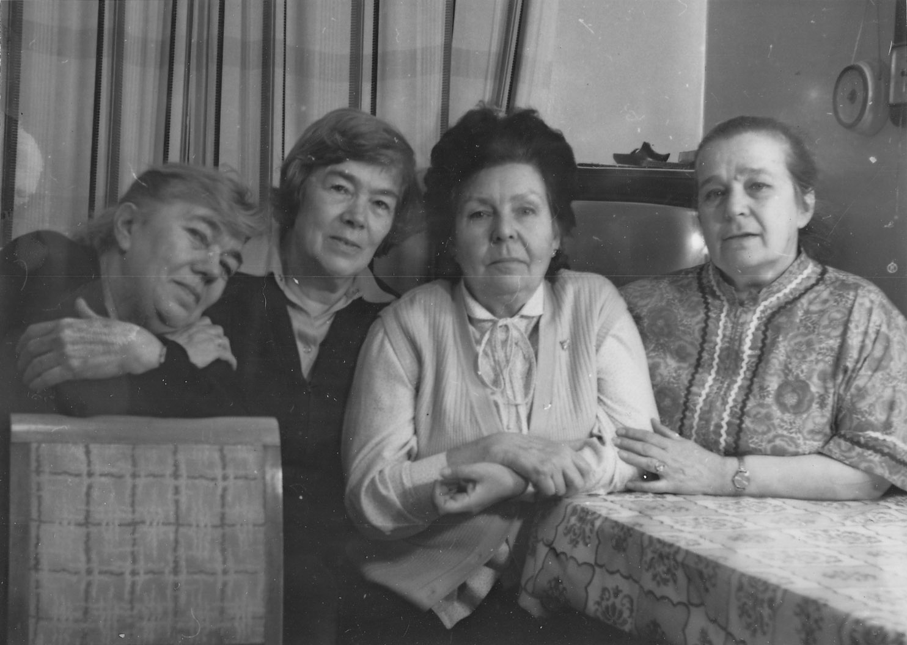

# Надежда Эммануиловна Коломенская
(р. 1926)

Дочь [Эммануила Филипповича Ципельзона](EFC.md) и [Анастасии Стоиловны Бойчевой](ASB.md).

С сыном Константином и внучкой Тасей. Август 1988 г., на даче.

Слева направо: Ариана Арсеновна Атабек, [Екатерина Арсеновна Атабекова-Бойчева](../A/EAAB.md), 
  [Наталья Николаевна Гасова](../B1/NNG.md), Надежда Эммануиловна Коломенская. 
12 февраля 1991 г. Фотограф С.Н. Бирюков.

С сыном Константином, мужем Юрием Александровичем, 
племянницей Марьяной Козицкой. Май 2006 г.

За тем же столом. Октябрь 2006 г.