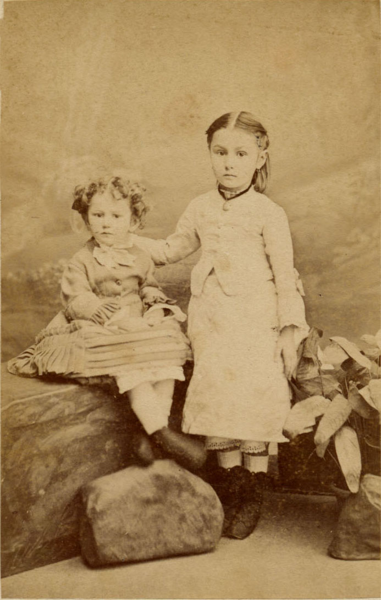
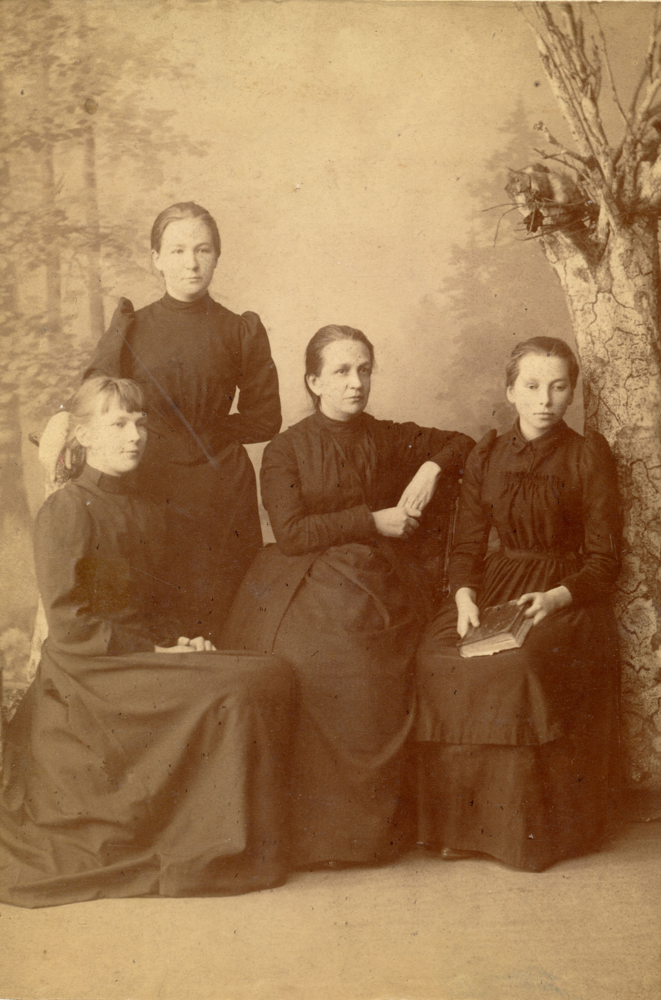
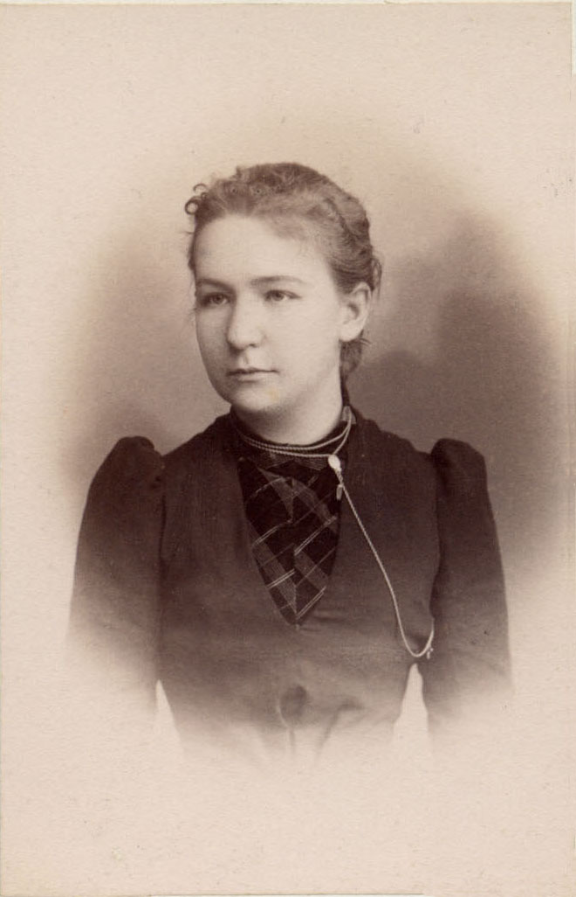
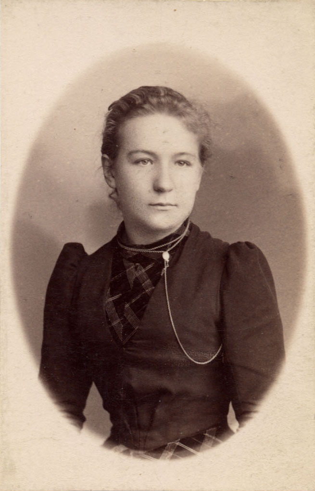
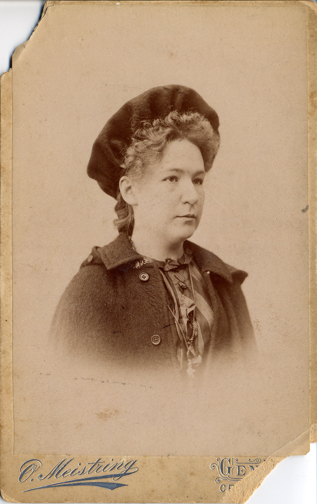
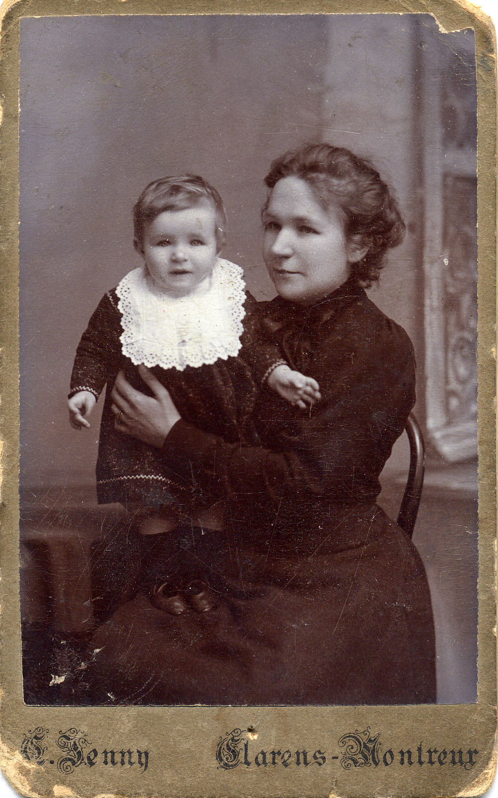
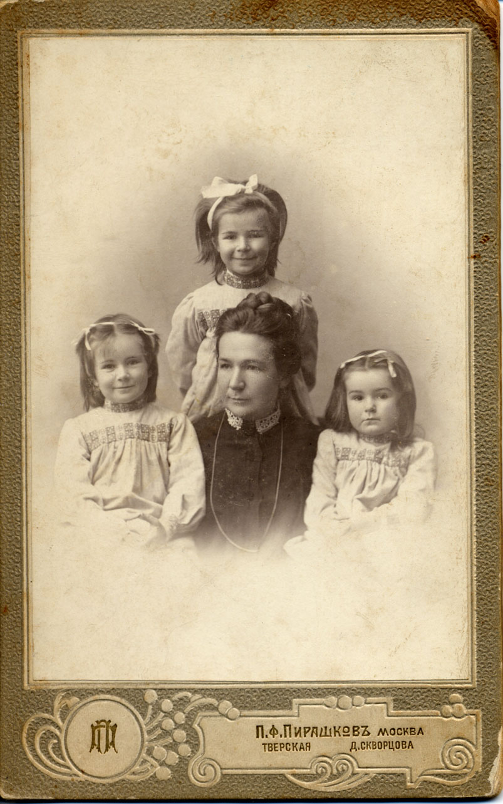

# Надежда Михайловна БОЙЧЕВА
(1872–1944)

Младшая дочь [Михаила Егоровича Богданова](MEB.md).

В 1892–1895 и 1900 гг. училась в Женевском университете, вначале на естественном, а потом на медицинском факультете. Сохранилась «Книжка учащегося» (Livret d'Étudiant) с отметками о сдаче экзаменов за эти годы, а также три справки о прохождении лабораторных практик в 1893 и 1895 гг. Университетского курса не закончила, в дальнейшем работала зубным врачом.

В Женеве познакомилась со [Стоилом Бойчевым](SPB.md), в 1897 г. вышла за него замуж (текст свидетельства о бракочосетании [см. здесь](doc-1897-11-29.md)). В 1899 г. у них родилась дочь Татьяна, в 1900 г. — Марианна, в 1904 г. — Анастасия.

В 1937 г. была сослана в Семипалатинск; умерла в ссылке.

**См. также:**

• [Свидетельство о бракосочетании С.П. Бойчева и Н.М. Бойчевой](doc-1897-11-29.md) 12 ноября 1897 г.

 

Фотограф C.E. Schlunck, Кенигсберг.
На об. надпись: «Апрель 1874» | Со старшей сестрой Анастасией
Фотограф И. Дьяговченко, Москва

Фотограф А. Эйхенвальд, Москва.
На об. надпись: «Апрель 1885 г.»

Стоит **Надежда Михайловна Богданова;** сидят (слева направо) Анастасия Михайловна Богданова, Надежда Фёдоровна Богданова, Екатерина Егоровна Богданова
Фотограф неизвестен.

Фотограф Л.В. Крассовский, Курск.

  

Фотографы Шиндлер и Мей, Москва.
Не ранее 1892 г.

Фотограф O. Meistring, Женева.
На об. надпись: «Не забывай! 2/IV 94»

Фотограф O. Meistring, Женева

С Евгенией Альбертовной Репман.
Фотограф Т.Н. Нужденко, Курск

Фотограф Fréd. Boissonnas, Женева.

С мужем Стоилом Петровичем Бойчевым.
Фотограф O. Meistring, Женева.
На об. надпись рукой Н.М. Богдановой: «Мерзость! 28 Августа 94 г. Ванино»

С мужем Стоилом Петровичем Бойчевым. 
Фотограф Fréd. Boissonnas, Женева

Со старшей дочерью Таней.
Фотограф C. Jenny, Кларан–Монтрё (Швейцария). 1900 г.

С дочерьми Марианной, Татьяной и Анастасией.
Фотограф П.Ф. Пирашков.