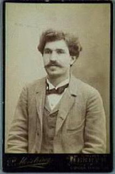

# Стоил Петрович БОЙЧЕВ
(1870–1920)

Жена — [Надежда Михайловна Богданова](NMBB.md), младшая дочь Михаила Егоровича Богданова.

Врач. По национальности болгарин.

Родился в г. Русе (Рущуке) на севере Болгарии. Год рождения устанавливается условно, на основании свидетельства о бракосочетании, состоявшемся 12 ноября 1897 г., в котором указано, что жених Стоил П. Бойчев имел 27 лет от роду.

В 1892 г. получил от Болгарского правительства разовую дотацию в 200 левов для обучения ветеринарии в Бухаресте (см. *Танчев И.* Българската държава и учението на българи в чужбина (1879–1892). — София: Марин Дринов, 1994. — С.150). Примерно в 1894 г. оказался в Женеве, учился на медицинском факультете Женевского Университета, где познакомился со своей будущей женой, а также с А.М. Атабекяном, сын которого Арсен Александрович Атабек в 1924 г. стал мужем средней дочери С.П. Бойчева Марианны.

По окончании Женевского Университета в 1905 г. работал некоторое время в качестве общинного врача в Женевском кантоне. В 1907 г. защитил диссертацию на тему о действии скропуло-морфина, за которую получил звание доктора медицины Женевского Университета.

Затем вернулся в Болгарию, где наряду с врачебной практикой читал в старших классах софийских гимназий лекции по общедоступной медицине. Во время Балканской войны 1912 г. был призван в армию, работал старшим врачом военно-полевого госпиталя передовой линии, а затем заведующим холерным госпиталем в Софии. За успешную борьбу с холерой получил своеобразную награду от правительства — 1 кг кристаллического иода, часть которого продал, а часть сохранилась до сих пор.

В 1914 г. уехал из Болгарии в Россию. В время I Мировой войны работал на передовых позициях при IX корпусе 3-й армии, затем был приглашён Всероссийским Земским Союзом для организации заразного госпиталя и для борьбы с эпидемическими заболеваниями. В фонде А.И. и А.А. Чупровых в Отделе рукописей Научной библиотеки МГУ сохранился черновик прошения С.П. Бойчева на имя главного медицинского инспектора Министерства внутренних дел от 3 марта 1915 г. (ф.14, карт.23, ед.хр.10, л.6А–6В), в котором он ходатайствовал о получении права врачебной практики в России и излагал биографические данные, часть которых приведена выше.

Отношение С.П. Бойчева к русской действительности того времени хорошо видно из письма Н.Н. Островского жене В.Н. Соколовой-Островской, написанного в мае–июне 1915 г.: «в 8 ч. ко мне пришел врач-болгарин Бойчев — друг Саши [А.М. Атабекяна]. Он собирается ехать на Кавказ…

…Бойчев говорил о своем впечатлении от характера положения врачей. Его крайне удивляет и возмущает отношение к врачам со стороны земских заправил. В союзе он чуть не побил секретаря за то, что тот усомнился при выдаче прогонных денег, правильно ли он состоит старшим врачом в том-то отряде. Он накричал на него и пригрозил выкинуть за окно, если он позволит себе продолжать в том же тоне и духе. Секретарь перетрусил и минуту спустя летел стрелой за ним, прося извинения. Возмущается идеей 60-х годов, возбраняющей поднимать материальный вопрос».

Во время Гражданской войны служил врачом у белых. Умер от тифа в г. Ейске в феврале 1920 г. Сохранилась записка его вдовы Н.М. Бойчевой неизвестному адресату, датированная 13 января 1927 г.: «Уважаемый коллега, покорнейше прошу Вас … сообщить мне,… какая была власть в Эйске в феврале 1920го года? Мне необходимо это для хлопот о пенсии.

С почтением, Н.М. Бойчева».

На обороте записки адресат сообщил, что «Советская власть в г. Ейске утвердилась по старому стилю 23 января, а по новому — 4 февраля 1920 года».

**См. также:**

• [Свидетельство о бракосочетании С.П. Бойчева и Н.М. Бойчевой](doc-1897-11-29.md) 12 ноября 1897 г.

Фотограф Fréd. Boissonnas, Женева.
На об. надпись карандашом: «31 декабря»

Фотограф O. Meistring, Женева.
На об. надпись: «1894 г. февраль»

 

С женой Надеждой Михайловной, урожд. Богдановой.
Фотограф O. Meistring, Женева.
На об. надпись рукой Н.М. Богдановой: «Мерзость! 28 Августа 94 г. Ванино» | Фотограф O. Meistring, Женева.
Фото найдено на сайте Междурнар. Ин-та социальной истории (Амстердам).
Судя по костюму, сделано одновременно с левым снимком.

С женой Надеждой Михайловной, урожд. Богдановой
Фотограф Fréd. Boissonnas, Женева.

Фотограф Fréd. Boissonnas, Женева.
На об. надпись: «Дорогой маме от сына Стоила. 10.VI.1901»