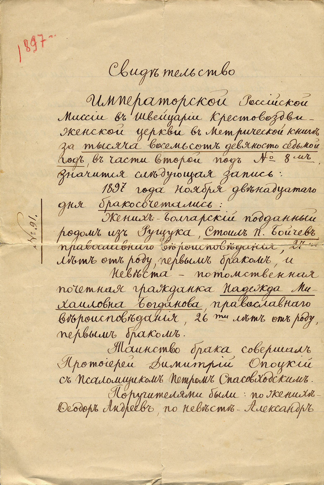
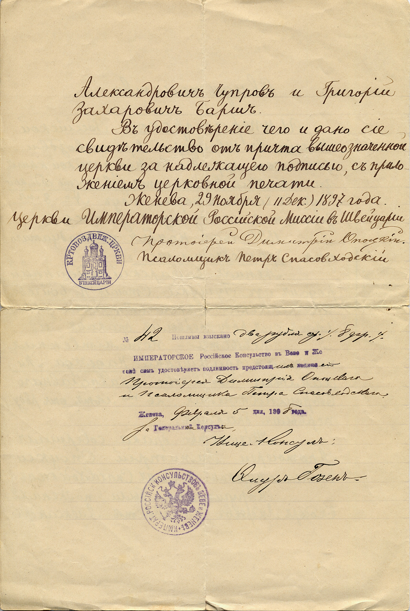

## Свидетельство

ИМПЕРАТОРСКОЙ Российской Миссии в Швейцарии Крестовоздвиженской церкви в Метрической книге за <u>тысяча восемьсот девяносто седьмой год</u>, в части второй под № 8м значится следующая запись:

1897 года ноября двенадцатого дня бракосочетались:

Жених — Болгарский подданный родом из Рущука, <u>Стоил П. Бойчев</u>, православного вероисповедания, 27ми лет от роду, первым браком, и 

Невеста — потомственная почетная гражданка <u>Надежда Михайловна Богданова</u>, православного вероисповедания, 26ти лет от роду, первым браком.

Таинство брака совершал Протоиерей Димитрий Опоцкий с Псаломщиком Петром Спасовходским.

Поручителями были: по женихе — Феодор Андреев, по невесте — Александр Александрович Чупров и Григорий Захарович Барш.

В удостоверение чего и дано сие свидетельство от причта вышеозначенной церкви за надлежащею подписью, с приложением церковной печати.

Женева, 29 Ноября (11 Дек.) 1897 года.

Церкви Императорской Российской Миссии в Швейцарии

*Протоиерей Димитрий Опоцкий*

Псаломщик Петр Спасовходский

№ *42* Пошлины взыскано *два рубля сер. (8 фр.)*  
ИМПЕРАТОРСКОЕ Российское Консульство в Веве и Же-  
неве сим удостоверяет подлинность предстоящ*их* подпис*ей*  
*Протоиерея Димитрия Опоцкого  
и Псаломщика Петра Спасовходского*

Женева, *Февраля 5* дня, 189*8* года.  
*За* Генеральн*ого* Консул*а*

Вице-Консул  
Федор Гозен

