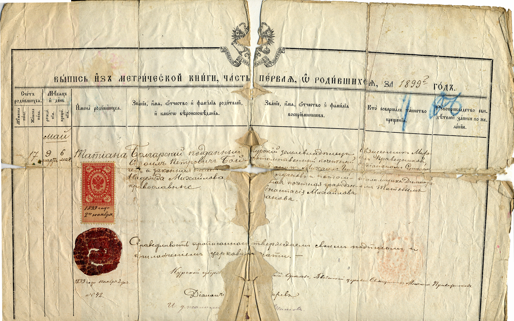

## ВЫПИСЬ ИЗ МЕТРИЧЕСКОЙ КНИГИ, ЧАСТЬ ПЕРВАЯ, О РОДИВШИХСЯ, за 1899 год

| Счет родившихся | | Месяц и день | | Имена родившихся | Звание, имя, отчество и фамилия родителей, и какого вероисповедания | Звание, имя, отчество и фамилия восприемников | Кто совершал таинство крещения | Рукоприкладство свидетелей записи по желанию |
|---|---|---|---|---|---|---|---|---|
| Мужеска пола | Женска пола | рождения | крещения | | | | | |
| | | | *май* | | | | | |
| | 17 | 9 марта | 6 мая | Татиана | Болгарский подданный Стоил Петрович Бойчев и законная жена [его] Надежда Михайлова, православные | Курский землевладелец потомственный почетный гражданин Михаил Геор[гиев Б]огданов и потом[ствен]ная почетная граждан[ка] Анастасия Михайлова Богданова | Священник Михаил Праведников с диаконом Сергеем [...] псаломщика Димитрием Титовым | |
| | | | | 1899 года ноября 2 дня № 42 | Справедливость прописанного подтверждаем своим подписом и приложением церковной печати. — Курской губернии [се]ла Орехова, Введенской церкви Священник Михаил Праведников Диакон [...]арев И. д. псалом[щика] Титов | | | |