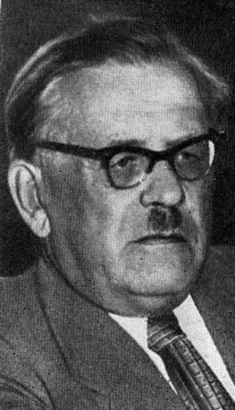

# Филипп Емельянович КОЗИЦКИЙ
(1893–1960)

Украинский композитор. Отец Тараса Филипповича Козицкого.

&nbsp;

**См. также:**

&#9679; [Биография](https://ru.wikipedia.org/wiki/%D0%9A%D0%BE%D0%B7%D0%B8%D1%86%D0%BA%D0%B8%D0%B9,_%D0%A4%D0%B8%D0%BB%D0%B8%D0%BF%D0%BF_%D0%95%D0%BC%D0%B5%D0%BB%D1%8C%D1%8F%D0%BD%D0%BE%D0%B2%D0%B8%D1%87) в Википедии.

&#9679; [Биография](https://uk.wikipedia.org/wiki/%D0%9A%D0%BE%D0%B7%D0%B8%D1%86%D1%8C%D0%BA%D0%B8%D0%B9_%D0%9F%D0%B8%D0%BB%D0%B8%D0%BF_%D0%9E%D0%BC%D0%B5%D0%BB%D1%8F%D0%BD%D0%BE%D0%B2%D0%B8%D1%87) в украинской Википедии, чуть более подробная.

&nbsp;

Фотография оттуда же, из Википедии.