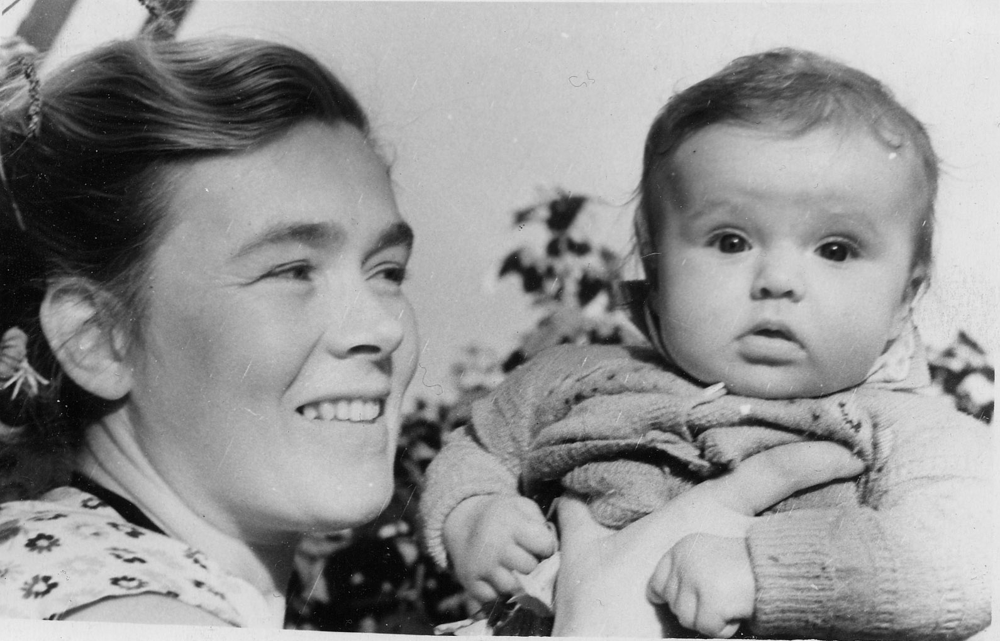
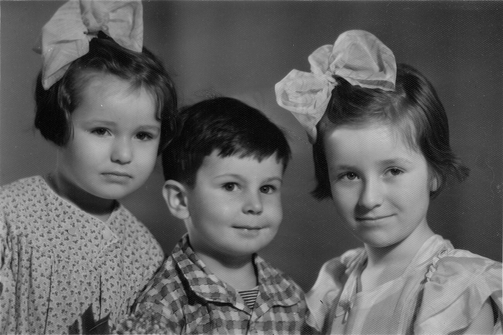
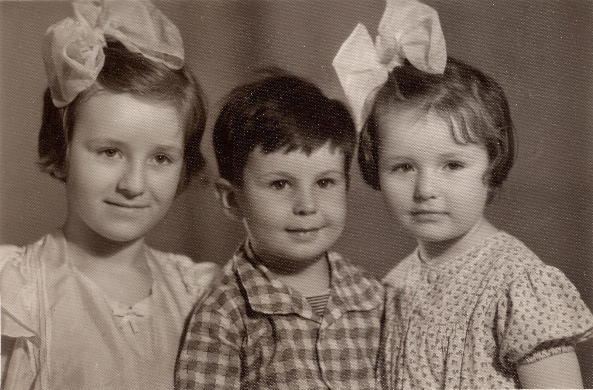

# Людмила Тарасовна Козицкая
(р. 1957)

Младшая дочь [Тараса Филипповича Козицкого](TFK.md) и [Екатерины Арсеновны Атабековой-Бойчевой](../A/EAAB.md).

&nbsp;

Лето 1957 г.

Тоже давненько.

 

Люда и Марьяна Козицкие и Костя Коломенский (сын Надежды Эммануиловны Коломенской). 1960 г.

Люда, Марьяна, Андрюша и арбуз. Купавна, август 1960 г.

«Дети, улыбнитесь». Улыбайся тут, когда живот болит.
10 ноября 1961 г.

Живот продолжает болеть, но фотограф отвязался.

С бабушкой Марианной Стоиловной Бойчевой. Кажется, скоро конец мучениям.

Первый ряд: Марьяна Козицкая, Саша Бойчева (дочь Михаила Эммануиловича Бойчева), Люда Козицкая;
второй ряд: Андрей Бирюков, Костя Коломенский. Москва, 1966 г.

Те же лица, в тот же день.

1971 г.

18 апреля 1971 г.

19 марта 2005 г.

 

25 сентября 2005 г.

20 августа 2006 г.

2 июня 2007 г.

Горькая дума с Катей на заднем плане. 23 февраля 2010 г.

24 марта 2012 г.