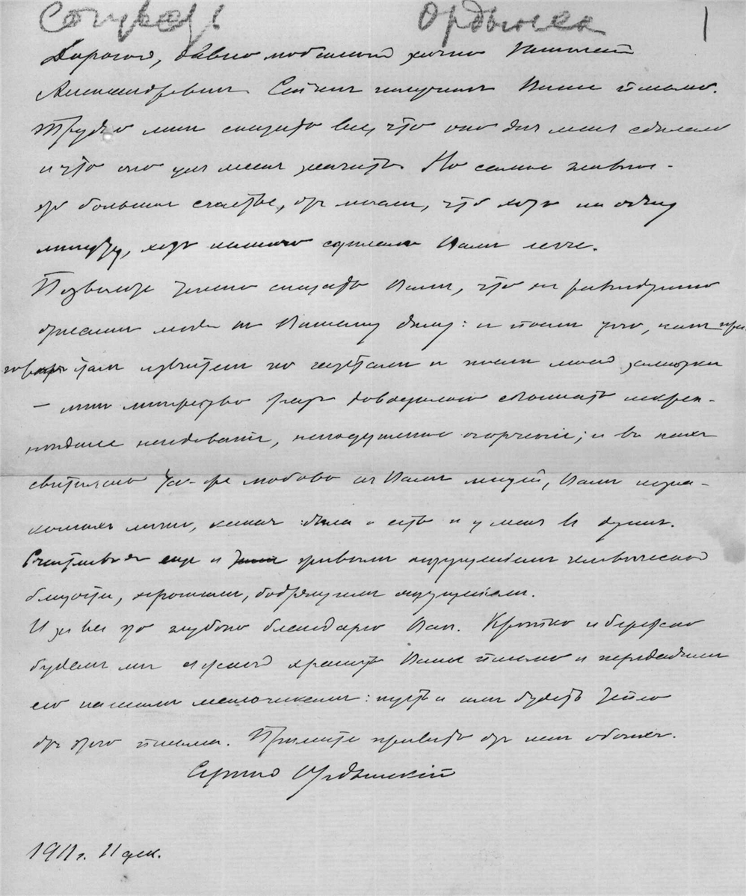

# С.П. Ордынский — Н.А. Морозову

Дорогой, давно любимый лично Николай Александрович. Сейчас получил Ваше письмо. Трудно мне сказать все, что оно для меня сделало и что оно для меня значит. Но самое главное — это большое счастье от мысли, что хоть на одну минуту, хоть немного сделалось Вам легче.

Позвольте теперь сказать Вам, что не равнодушно отнеслись люди к Вашему делу: и после того, как приговор стал известен по газетам и после моей заметки — мне множество раз доводилось слышать искреннее негодование, неподдельное огорчение; и в них светилась та же любовь к Вам людей, Вам незнакомых лично, какая была и есть и у меня в душе. Счастлив я еще и живым ощущением человеческой близости, хорошим, бодрящим ощущением.

И за все это глубоко благодарю Вас. Крепко и бережно будем мы с женой хранить Ваше письмо и передадим его нашим мальчикам: пусть и им будет тепло от этого письма. Примите привет от нас обоих.

Сергей Ордынский

1911 г. 11 дек.

Факсимиле найдено на сайте Архива Российской Академии наук, где выложена большая часть фонда Н.А. Морозова.

**См. также:**

• [Статья о Н.А. Морозове](https://ru.wikipedia.org/wiki/%D0%9C%D0%BE%D1%80%D0%BE%D0%B7%D0%BE%D0%B2,_%D0%9D%D0%B8%D0%BA%D0%BE%D0%BB%D0%B0%D0%B9_%D0%90%D0%BB%D0%B5%D0%BA%D1%81%D0%B0%D0%BD%D0%B4%D1%80%D0%BE%D0%B2%D0%B8%D1%87_%28%D1%80%D0%B5%D0%B2%D0%BE%D0%BB%D1%8E%D1%86%D0%B8%D0%BE%D0%BD%D0%B5%D1%80%29) в Википедии.