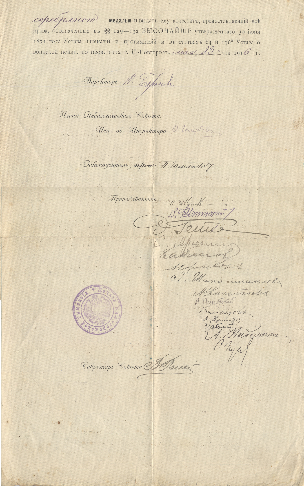

# МИНИСТЕРСТВО НАРОДНОГО ПРОСВЕЩЕНИЯ
# АТТЕСТАТ ЗРЕЛОСТИ

 

Дан сей *сыну инженер-механика Виктору Дмитриевичу Бирюкову, православного* вероисповедания, родившемуся *в городе Вятке *18*98* года *января 9* дня, в том, что он, вступив в Нижегородскую 1-ю гимназию *9 августа *1*908 *года, при *отличном *поведении обучался по 22 мая 19*16 *года и кончил полный восьмиклассный курс, при чем обнаружил нижеследующие познания:

| | | |
|---|---|---|
| В Законе Божием | *отличные* | *(5)* |
| — Русском языке и словесности | *хорошие* | *(4)* |
| — Философской пропедевтике | *отличные* | *(5)* |
| — Законоведении | *отличные* | *(5)* |
| — Латинском языке | *хорошие* | *(4)* |
| — Математике | *хорошие* | *(4)* |
| — Физике | *отличные* | *(5)* |
| — Математической географии | *отличные* | *(5)* |
| — Истории | *хорошие* | *(4)* |
| — Географии | *хорошие* | *(4)* |
| — Немецком языке | *отличные* | *(5)* |
| — Французском языке | *отличные* | *(5)* |

Во внимание к постоянно отличному поведению и прилежанию и к отличным успехам в науках, Педагогический Совет постановил наградить его *серебряною ***медалью **и выдать ему аттестат, предоставляющий все права, обозначенные в §§ 129—132 ВЫСОЧАЙШЕ утвержденного 30 июня 1871 года Устава гимназий и прогимназий и в статьях 64 и 1962 Устава о воинской повин. по прод. 1912 г. Н.-Новгород, *мая *„*23*" дня 191*6* г.

Директор *Г. Баранов*

Члены Педагогического Совета:

Исп. об. инспектора *Ф. Голубев*

Преподаватели: [следует 14 подписей]

Секретарь Совета [подпись]

№ *577*