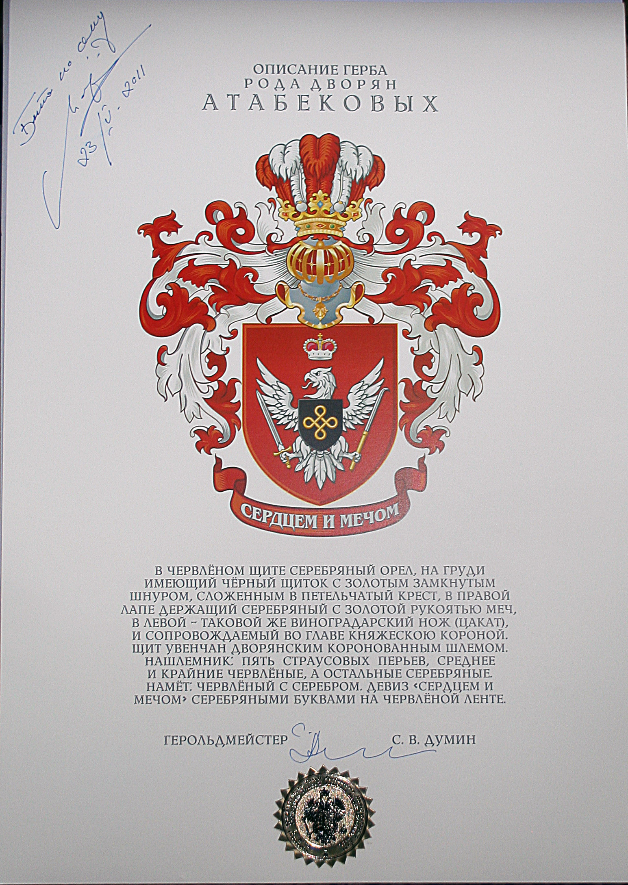

# Герб рода Атабекянов

Один из представителей рода Атабекянов, до того мне неизвестный, разыскал меня в Интернете и попросил прислать какие-нибудь документы по истории рода. Я послал ему генеалогическую схему и копию решения Шушинской бекской комиссии от 24 февраля 1872 г. В благодарность незнакомый родственник прислал мне перевод некролога А.М. Атабекяна, а спустя какое-то ремя — вот эту картинку. Если куплю карету, украшу дверцы гербом.