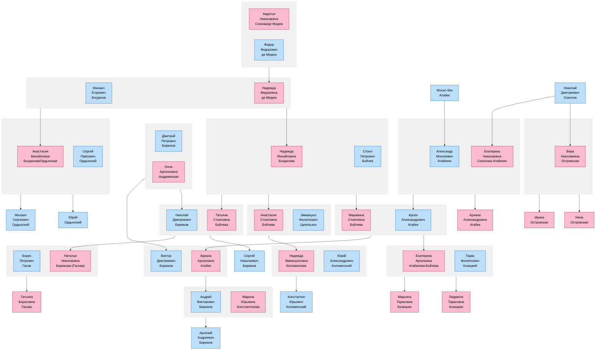

# Генеалогическое дерево

Ниже представлена диаграмма родственных связей людей, упомянутых в биографиях.

## Пояснения к диаграмме

- Синим цветом обозначены мужчины
- Розовым цветом обозначены женщины
- Прямоугольники с серой рамкой обозначают брачные пары
- Стрелки от брачных пар к людям обозначают родительские связи

## Основные семейные группы

1. **Семья Богдановых**:
   - Михаил Егорович Богданов женат на Надежде Федоровне де Медем
   - Их дети: Анастасия Михайловна и Надежда Михайловна
   - Анастасия вышла замуж за Сергея Павловича Ордынского
   - Дети Анастасии и Сергея: Михаил и Юрий Ордынские

2. **Семья Атабек/Атабекян**:
   - Александр Моисеевич Атабекян женат на Екатерине Николаевне Соколовой
   - Их дети: Арсен Александрович и Ариана Александровна
   - Арсен женат на Марианне Стоиловне Бойчевой
   - Дети Арсена и Марианны: Екатерина и Ариана Арсеновна
   - Ариана Арсеновна вышла замуж за Виктора Дмитриевича Бирюкова
   - Их сын: Андрей Викторович Бирюков
   - Андрей женат на Марине Юрьевне Константиновой
   - Их сын: Арсений Андреевич Бирюков
   - Виктор и Николай Бирюковы - дети Дмитрия Петровича Бирюкова и Анны Арсеньевны Андриевской
   - Николай Дмитриевич Бирюков женат на Татьяне Стоиловне Бойчевой
   - Их дети: Наталья Николаевна Бирюкова (Гасова) и Сергей Николаевич Бирюков
   - Наталья вышла замуж за Бориса Петровича Гасова
   - Их дочь: Татьяна Гасова

3. **Семья Соколовых**:
   - Николай Дмитриевич Соколов - отец Екатерины и Веры
   - Дети Веры Николаевны Островской: Ирина и Нина

4. **Семья Бойчевых**:
   - Стоил Петрович Бойчев женат на Надежде Михайловне Богдановой
   - Их дети: Марианна, Анастасия и Татьяна
   - Анастасия вышла замуж за Эммануила Филипповича Ципельзона
   - Их дети: Михаил Бойчев и Надежда Эммануиловна Коломенская
   - Надежда вышла замуж за Юрия Александровича Коломенского
   - Их сын: Константин Юрьевич Коломенский
   
6. **Семья Козицких**:
   - Тарас Филиппович Козицкий женат на Екатерине Арсеновне Атабековой-Бойчевой
   - Их дети: Марьяна Тарасовна и Людмила Тарасовна Козицкие

5. **Семья де Медем**:
   - Авдотья Николаевна Сомова вышла замуж за Федора Федоровича де Медем
   - Их дочь: Надежда Федоровна де Медем, которая вышла замуж за Михаила Егоровича Богданова