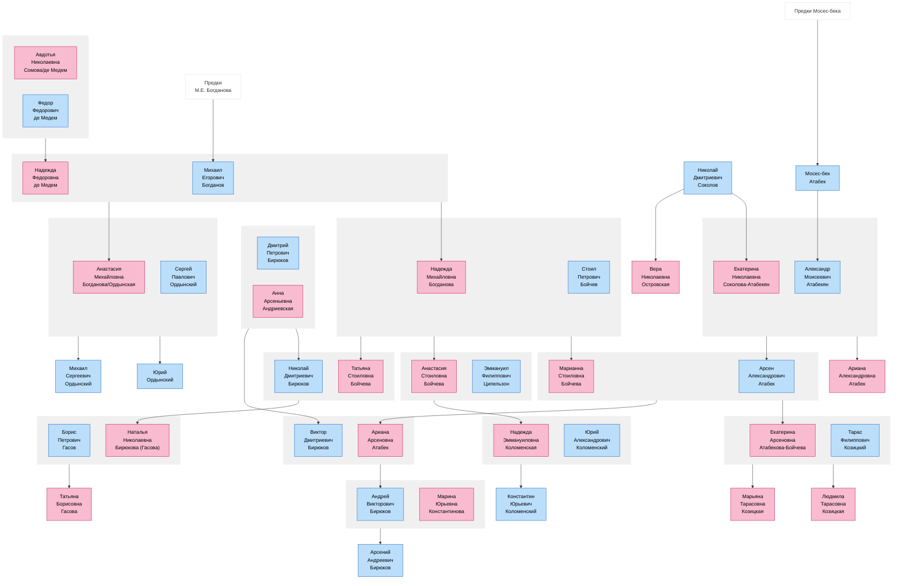

# Генеалогическое дерево

Ниже представлена диаграмма родственных связей людей, упомянутых в биографиях.

```mermaid
graph TD
    %% Определение стилей
    classDef male fill:#BBDEFB,stroke:#1565C0,color:black
    classDef female fill:#F8BBD0,stroke:#C2185B,color:black
    classDef couple fill:#F0F0F0,stroke:#F0F0F0,stroke-width:1px
    classDef link fill:#FFFFFF,stroke:#F0F0F0,stroke-width:2px
    
    %% Определение узлов для людей
    %% Семья Богдановых
    MEB-ancestors["Предки<br>М.Е. Богданова"]:::link
    MEB["Михаил<br>Егорович<br>Богданов"]:::male
    NFBdM["Надежда<br>Федоровна<br>де Медем"]:::female
    AMO["Анастасия<br>Михайловна<br>Богданова/Ордынская"]:::female
    NMB["Надежда<br>Михайловна<br>Богданова"]:::female
    SPO["Сергей<br>Павлович<br>Ордынский"]:::male
    MSO["Михаил<br>Сергеевич<br>Ордынский"]:::male
    YuO["Юрий<br>Ордынский"]:::male
    
    %% Семья Атабек/Атабекян
    MbA-ancestors["Предки Мосес-бека"]:::link
    MbA["Мосес-бек<br>Атабек"]:::male
    AMA["Александр<br>Моисеевич<br>Атабекян"]:::male
    ENS["Екатерина<br>Николаевна<br>Соколова-Атабекян"]:::female
    ArAA["Арсен<br>Александрович<br>Атабек"]:::male
    Ariana_sen["Ариана<br>Александровна<br>Атабек"]:::female
    MSB["Марианна<br>Стоиловна<br>Бойчева"]:::female
    EAAB["Екатерина<br>Арсеновна<br>Атабекова-Бойчева"]:::female
    AAA["Ариана<br>Арсеновна<br>Атабек"]:::female

    %% Семья Бирюковых (родители)
    DPB["Дмитрий<br>Петрович<br>Бирюков"]:::male
    AAA_["Анна<br>Арсеньевна<br>Андриевская"]:::female
    NDB["Николай<br>Дмитриевич<br>Бирюков"]:::male

    VDB["Виктор<br>Дмитриевич<br>Бирюков"]:::male
    AVB["Андрей<br>Викторович<br>Бирюков"]:::male
    MYK["Марина<br>Юрьевна<br>Константинова"]:::female
    AAB["Арсений<br>Андреевич<br>Бирюков"]:::male

    %% Семья Гасовых
    BPG["Борис<br>Петрович<br>Гасов"]:::male
    NNG["Наталья<br>Николаевна<br>Бирюкова (Гасова)"]:::female
    TG["Татьяна<br>Борисовна<br>Гасова"]:::female
    
    %% Семья Козицких
    TFK["Тарас<br>Филиппович<br>Козицкий"]:::male
    MTK["Марьяна<br>Тарасовна<br>Козицкая"]:::female
    LTK["Людмила<br>Тарасовна<br>Козицкая"]:::female
    
    %% Семья Соколовых
    NDS["Николай<br>Дмитриевич<br>Соколов"]:::male
    VNO["Вера<br>Николаевна<br>Островская"]:::female
    
    %% Семья Бойчевых
    SPB["Стоил<br>Петрович<br>Бойчев"]:::male
    NMB["Надежда<br>Михайловна<br>Богданова"]:::female
    ASB["Анастасия<br>Стоиловна<br>Бойчева"]:::female
    TSB["Татьяна<br>Стоиловна<br>Бойчева"]:::female
    EFC["Эммануил<br>Филиппович<br>Ципельзон"]:::male
    NEK["Надежда<br>Эммануиловна<br>Коломенская"]:::female
    YAK["Юрий<br>Александрович<br>Коломенский"]:::male
    KJuK["Константин<br>Юрьевич<br>Коломенский"]:::male
    
    %% Семья де Медем
    ANdMS["Авдотья<br>Николаевна<br>Сомова/де Медем"]:::female
    FFdM["Федор<br>Федорович<br>де Медем"]:::male
    
    %% Использование subgraph для обозначения брачных пар
    

    %% Семья Атабекянов
    MbA-ancestors ---> MbA
    MbA --> AMA

    %% Семья де Медем
    subgraph couple_ANdMS_FFdM [" "]
        ANdMS
        FFdM
    end
    couple_ANdMS_FFdM:::couple
    couple_ANdMS_FFdM --> NFBdM
    
    %% Семья Богдановых
    subgraph couple_MEB_NFBdM [" "]
        direction RL
        MEB
        NFBdM
    end
    couple_MEB_NFBdM:::couple
    couple_MEB_NFBdM --> AMO
    couple_MEB_NFBdM --> NMB

    MEB-ancestors --> MEB
    
    %% Семья Ордынских
    subgraph couple_SPO_AMO [" "]
        SPO 
        AMO
    end
    couple_SPO_AMO:::couple
    couple_SPO_AMO --> MSO
    couple_SPO_AMO --> YuO

    
    subgraph couple_AMA_ENS [" "]
        AMA
        ENS
    end
    couple_AMA_ENS:::couple
    couple_AMA_ENS --> ArAA
    couple_AMA_ENS --> Ariana_sen
    
    %% Семья Арсена Атабека
    subgraph couple_ArAA_MSB [" "]
        ArAA
        MSB
    end
    couple_ArAA_MSB:::couple
    couple_ArAA_MSB --> AAA
    couple_ArAA_MSB --> EAAB

    %% Семья Бирюковых
    subgraph couple_VDB_AAA [" "]
        VDB
        AAA
    end
    couple_VDB_AAA:::couple
    couple_VDB_AAA --> AVB
    
    %% Семья Андрея Бирюкова
    subgraph couple_AVB_MYK [" "]
        AVB
        MYK
    end
    couple_AVB_MYK:::couple
    couple_AVB_MYK --> AAB
    
    %% Семья Бирюковых (родители)
    subgraph couple_DPB_AAA_ [" "]
        DPB
        AAA_
    end
    couple_DPB_AAA_:::couple
    couple_DPB_AAA_ ---> VDB
    couple_DPB_AAA_ --> NDB
    
    %% Семья Николая Бирюкова
    subgraph couple_NDB_TSB [" "]
        NDB
        TSB
    end
    couple_NDB_TSB:::couple
    couple_NDB_TSB --> NNG
    
    %% Семья Гасовых
    subgraph couple_BPG_NNG [" "]
        BPG
        NNG
    end
    couple_BPG_NNG:::couple
    couple_BPG_NNG --> TG
    
    %% Семья Козицких
    subgraph couple_TFK_EAAB [" "]
        TFK
        EAAB
    end
    couple_TFK_EAAB:::couple
    couple_TFK_EAAB --> MTK
    couple_TFK_EAAB --> LTK
    
    %% Семья Соколовых
    NDS --> VNO
    NDS --> ENS
    
    
    %% Семья Бойчевых
    subgraph couple_SPB_NMB [" "]
        SPB 
        NMB
    end
    couple_SPB_NMB:::couple
    couple_SPB_NMB --> TSB
    couple_SPB_NMB --> ASB
    couple_SPB_NMB --> MSB
    
    
    %% Семья Ципельзон
    subgraph couple_EFC_ASB [" "]
        EFC
        ASB
    end
    couple_EFC_ASB:::couple
    couple_EFC_ASB --> NEK
    
    %% Семья Коломенских
    subgraph couple_YAK_NEK [" "]
        YAK
        NEK
    end
    couple_YAK_NEK:::couple
    couple_YAK_NEK --> KJuK

    click MbA-ancestors "/people/MbA-ancestors"
    click MbA "/people/MbA"
    click AMA "/people/AMA"
    click ENS "/people/ENS"
    click ArAA "/apeople/ArAA"
    click Ariana_sen "/people/Ariana-sen"
    click MSB "/people/MSB"
    click EAAB "/people/EAAB"
    click AAA "/people/AAA"
    click MEB-ancestors "/people/MEB-ancestors"
    click MEB "/people/MEB"
    click NFBdM "/people/NFBdM"
    click AMO "/people/AMO"
    click NMB "/people/NMBB"
    click SPO "/people/SPO"
    click DPB "/people/DPB"
    click NDB "/people/NDB"
    click SNB "/people/SNB"
    click AVB "/people/AVB"
    click MYK "/people/MYK"
    click AAB "/people/AAB"
    click BPG "/people/BPG"
    click NNG "/people/NNG"
    click TFK "/people/TFK"
    click MTK "/people/MTK"
    click LTK "/people/LTK"
    click NDS "/people/NDS"
    click VNO "/people/VNO"
    click SPB "/people/SPB"
    click ASB "/people/ASB"
    click TSB "/people/TSB"
    click EFC "/people/EFC"
    click NEK "/people/NEK"
    click YAK "/people/YAK"
    click KJuK "/people/KJuK"
    click ANdMS "/people/ANdMS"
    click FFdM "/people/SdM"
    click VDB "/biryukov/VDB"

```

Диаграмма кликабельна
