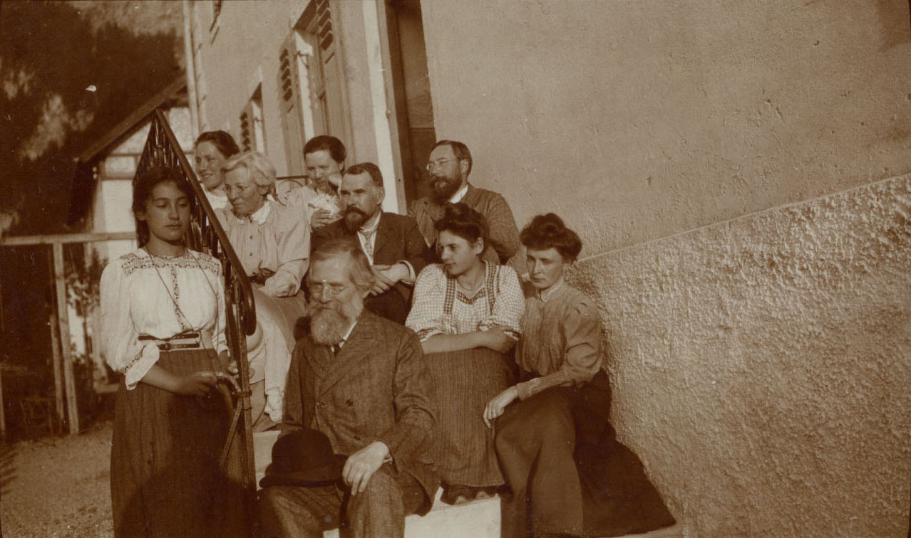

# Александр Александрович Чупров
(1874–1926)

Сын [Александра Ивановича Чупрова](AICh.md), теоретик статистики, член-корреспондент Российской Академии наук, почётный член Королевского статистического общества в Лондоне.

У Александра Ивановича и Ольги Егоровны Чупровых было пятеро детей, Александр был старший, далее родились четыре дочери — Ольга (Ляля; замужем за Николаем Васильевичем Сперанским), [Мария](MESB.md), Елена (Лёля) и Ася (1884–1889).

По свидетельству писателя А.В. Амфитеатрова, двоюродного брата А.А. Чупрова, женское влияние сестер и многочисленных теток Александра Александровича оказало сильное влияние на его характер.

**См. также:**

- [Статья в Википедии.](https://ru.wikipedia.org/wiki/%D0%A7%D1%83%D0%BF%D1%80%D0%BE%D0%B2,_%D0%90%D0%BB%D0%B5%D0%BA%D1%81%D0%B0%D0%BD%D0%B4%D1%80_%D0%90%D0%BB%D0%B5%D0%BA%D1%81%D0%B0%D0%BD%D0%B4%D1%80%D0%BE%D0%B2%D0%B8%D1%87)

  

Фотограф Ф. Вишневский, Москва. | Фотограф Фр. Опитц, Москва | Фотограф Г.В. Трунов, Москва

 

На этих двух фотографиях, сделанных, очевидно, в последние годы жизни Александра Ивановича Чупрова, рядом с ним изображены: А.А. Чупров (см. более чёткое правое фото) — во втором ряду справа, Мария Александровна, Ольга Александровна (в третьем ряду) и Николай Васильевич Сперанский (рядом с А.А. Чупровым). Кроме них: Юлия Егоровна Богданова (рядом с Н.В. Сперанским) и неизвестные.