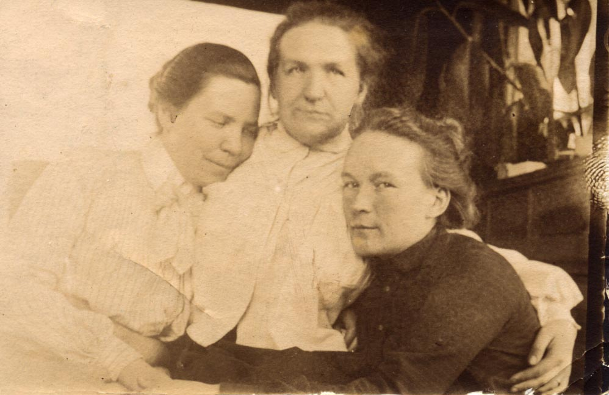

# Анастасия Михайловна Ордынская, урожд. Богданова
(1874–1916)

Дочь [Михаила Егоровича](MEB.md) и [Надежды Федоровны Богдановых](NFBdM.md). Муж — [Сергей Павлович Ордынский](SPO.md); дети — Михаил и Юрий.

Известный книгоиздатель Михаил Васильевич Сабашников писал в своих мемуарах: „…мы с [братом] Сережей, соскучив сидеть одни в Никольском, вдруг вздумали проехать в гости к Михаилу Егоровичу Богданову, свояку А.И. Чупрова, незадолго перед тем купившему небольшой хуторок на берегу Сейма, верстах в 25–30 от нас. К нему должны уже были приехать из Москвы на лето его дочери Надежда и Настасья Михайловны, и это придавало поездке тем большую заманчивость, что Настасия Михайловна и Сережа в то время [1896] определённо интересовались друг другом" (*Сабашников М.В.* Записки. М., 1995. С. 189). Но из этого «интереса» получилось вот что: А.Н. познакомилась с другом братьев Сабашниковых Сергеем Павловичем Ордынским и после нескольких лет раздумий вышла за него замуж.

Сестры Надежда и Анастасия Богдановы.
Фотограф И. Дьяговченко, Москва.

 

Надежда (слева) и Анастасия Богдановы.
Москва, фотограф И.Г. Дьяговченко, 1877 г.
Фотографии сделаны почти одновременно: дети почти не изменили позы. Я пытался разглядеть, что у них в руках — игрушки? цветы? Непонятно…

 

 

Стоит Надежда Михайловна Богданова; сидят (слева направо) **Анастасия Михайловна Богданова,** Надежда Фёдоровна Богданова, Екатерина Егоровна Богданова
Фотограф неизвестен. | Фотограф Л.В. Крассовский, Курск.

 

Фотограф Л.В. Красовский, Курск.

Фотограф Р. Бродовский, Москва.

В апреле 1897 г. будущий муж подарил Насте свою фотографию с прочувствованной, хотя и не [совсем ясной для нас надписью](SPO.md#AKTolstoy). Неизвестно, что ответила она тогда, но вот прошло без малого два года, и Анастасия Михайловна дарит Сергею Павловичу фотографию с очень душевной надписью, по сути, признанием в любви:

Не знаю, но теперь мне часто думается, что: „Да".

> …разлюбить тебя мне невозможно:  
> Всё, что не ты, так суетно и ложно,  
> Всё, что не ты, безцветно и мертво!  
>   
> Как праздничный мне лик весны теперь несносен,  
> Как грустен без тебя дерев зеленых вид!  
> И мыслю я: когда ж на них повеет осень  
> И, сыпля жёлтый лист, нас вновь соединит.  

Ванино.

18 23/II 99 г. Анастасия Богданова.

Обе цитаты — из А.К. Толстого.

Ванино — имение М.Е. Богданова в Курской губ.

Не могу сказать точно, когда А.М. и С.П. соединились, но в уже цитировавшихся мемуарах М.В. Сабашникова мы читаем, что в 1902 г. он, едучи в Сибирь, «значительную часть железнодорожного пути скоротал в обществе Настасии Михайловны Ордынской, урождённой Богдановой. Она ехала в одном со мной поезде в Канск, где муж её Сергей Павлович Ордынский занял должность крестьянского начальника».
И далее: «В Канске С.П. встретил Настасию Михайловну, и я успел их снять на платформе» (С. 254).

Увы, снимка, сделанного в Канске, в моем архиве нет.

Фотограф Л.В. Красовский, Курск.
Наверное, свадебная фотография — молоды и счастливы.

Слева направо: Ольга Александровна Чупрова (двоюродная сестра А.М. Ордынской), 
Надежда Михайловна Богданова, **Анастасия Михайловна Ордынская**
Фотограф неизвестен.

## Дети А.М. и С.П. Ордынских — Миша и Юра {#m-ju}

Михаил Сергеевич Ордынский.
Фотограф неизвестен.
На об стороне надпись: «Август 1904 г. Мише 1 г. 3 мес.»

С двоюродными сестрами (справа налево) 
Татьяной, Марианной и Анастасией Бойчевыми.
Москва, фотограф Д.С. Козловский, 1905.
На обороте надпись рукой А.М. Ордынской: «Москва, 4ое мая 1905 г. Мише 2 года».

Миша и Юра Ордынские 
с бабушкой Надеждой Федоровной Богдановой. 
В глубине — Анастасия Михайловна Ордынская.
Фотограф неизвестен.

**Михаил Сергеевич Ордынский.**
Фотограф неизвестен.
На лицевой стороне надпись: «11/VI 22 г.»