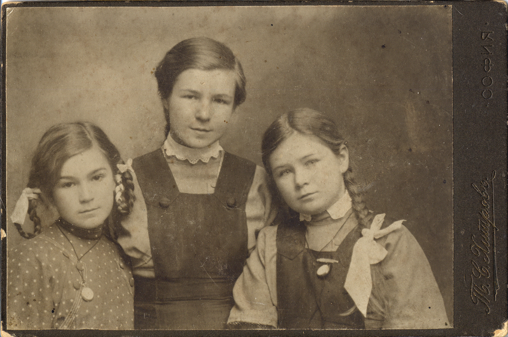
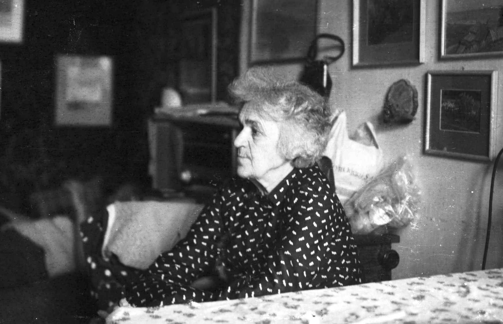
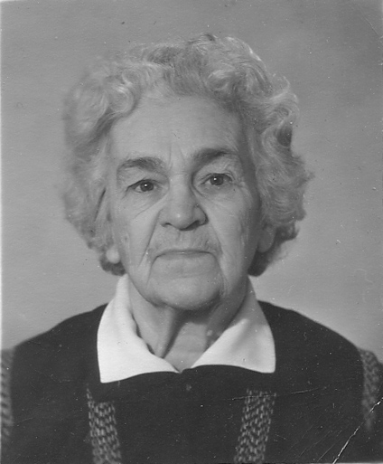
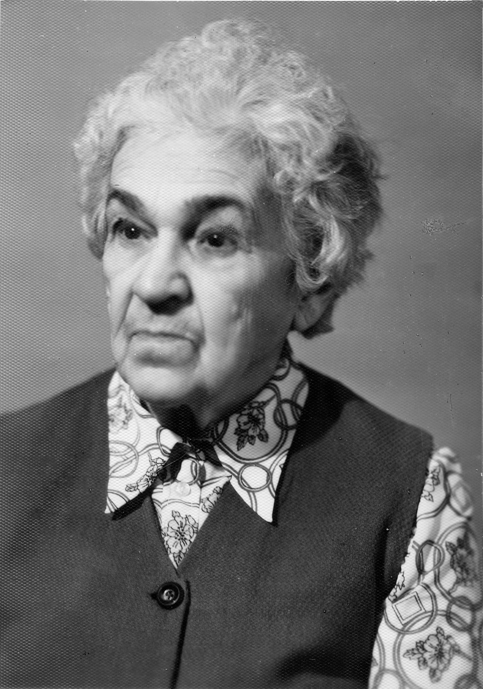

# Анастасия Стоиловна Бойчева
(1904–1983)

Младшая дочь [Стоила Петровича](SPB.md) и [Надежды Михайловны Бойчевых](NMBB.md), жена [Эммануила Филипповича Ципельзона](EFC.md). С мужем разошлись.

Много лет провела в лагерях из-за анекдота, рассказанного на коммунальной кухне.

Дети — близнецы Михаил Бойчев и [Надежда Коломенская](NEK.md); от второго брака сын Павел.

Справа налево: Татьяна, Марианна, Анастасия Бойчевы 
и их двоюродный брат Миша Ордынский.
Москва, фотограф Д.С. Козловский, 1905.
На обороте надпись рукой А.М. Ордынской: «Москва, 4ое мая 1905 г. Мише 2 года».

Марианна, Татьяна и Анастасия Бойчевы
Фотограф неизвестен.

Марианна, Татьяна и Анастасия Бойчевы с матерью Надеждой Михайловной.
Фотограф П.Ф. Пирашков, Москва
С матерью Надеждой Михайловной Богдановой 
и сестрами Татьяной (стоит сзади) и Марианной (слева)

Слева направо: Анастасия, Татьяна, Марианна Бойчевы.
София, фотограф Т.С. Хитров, 1913 г.

Слева направо, нижний ряд: Валерия Хлыновская (невеста М.С. Ордынского), [Михаил Сергеевич Ордынский](AMO.md#m-ju), [Надежда Федоровна Богданова](NFBdM.md); средний ряд: Алексей Иванович Оловянишников, Татьяна Ивановна Оловянишникова, А.С. Бойчева, бюст тётки [Анастасии Михайловны Ордынской](AMO.md) (ум. в 1916 г.), [Марианна Стоиловна Бойчева](MSB.md), [Татьяна Стоиловна Бойчева](TSB.md); верхний ряд: Николай Дмитриевич Бирюков, [Юрий Сергеевич Ордынский](AMO.md#m-ju). 1920-е гг.

Дрова пилят Татьяна (слева) и Анастасия Бойчевы.
На заднем плане дети Т. Бойчевой 
Сергей и Наталья Бирюковы и 
неизвестный мальчик. 1930-е гг.

Анастасия и Марианна Бойчевы, Екатерина Атабекова-Бойчева.
Видимо, на какой-то автобусной экскурсии; судя по дизайну автобуса,
1960-е — начало 1970-х гг.

У племянницы Арианы. 1972–1973 гг.

Ноябрь 1976 г.

1980 г.