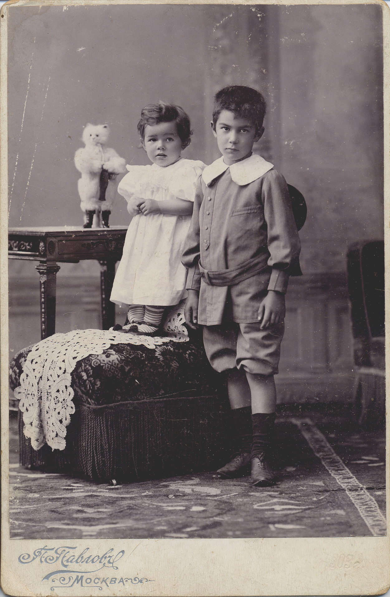
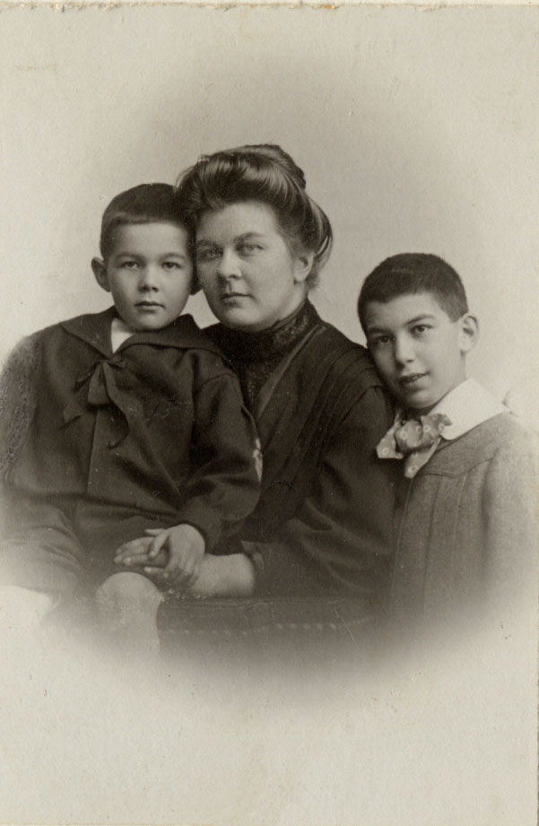
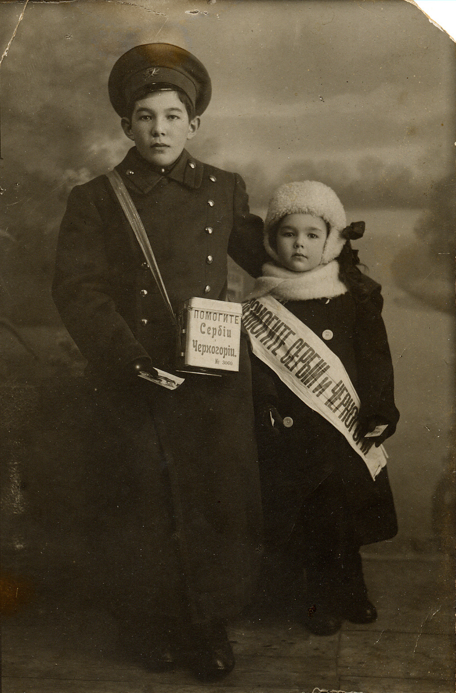
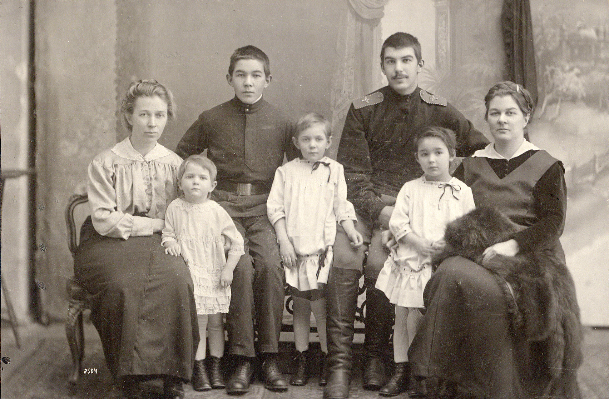
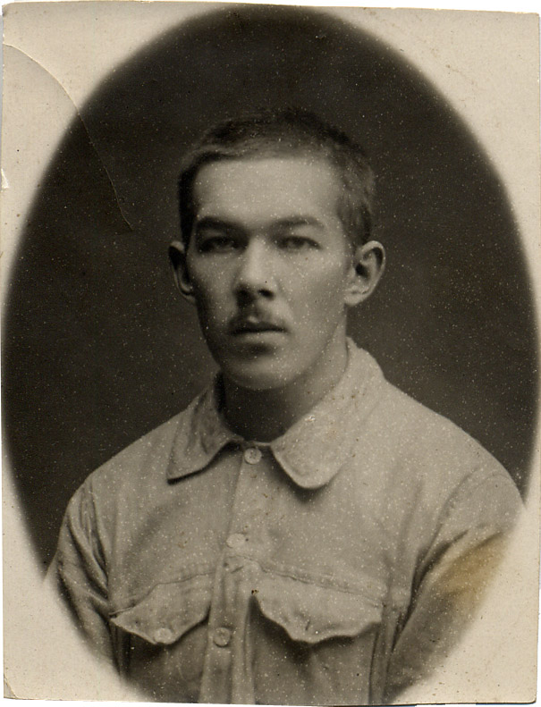
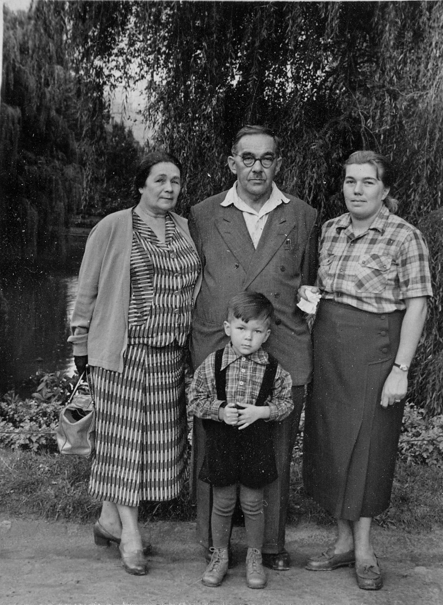
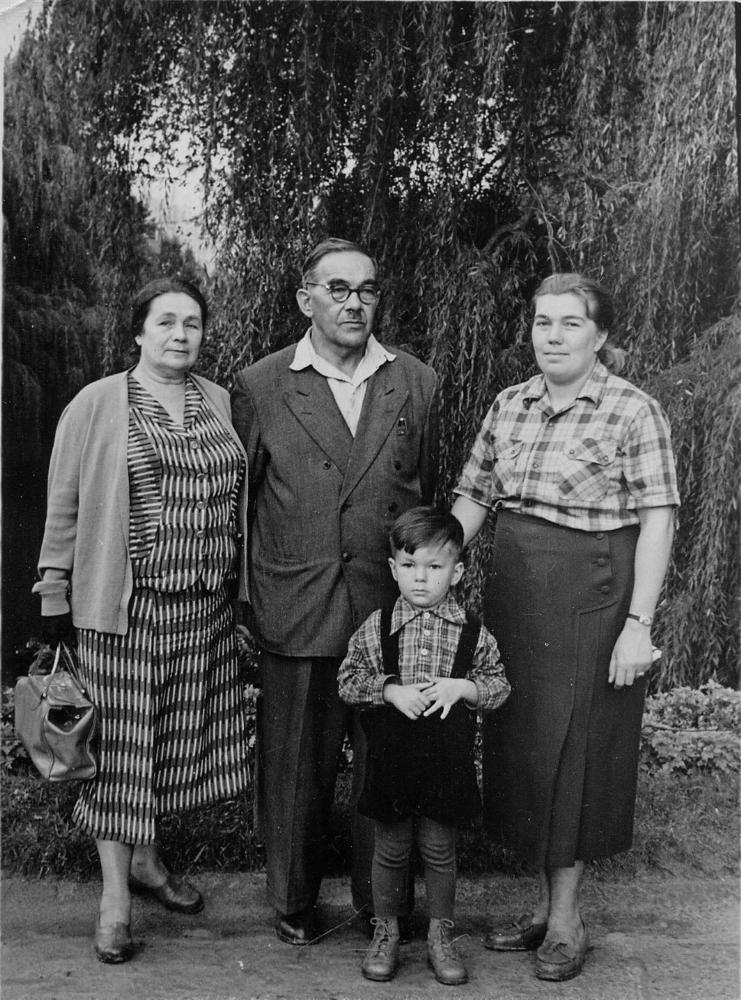
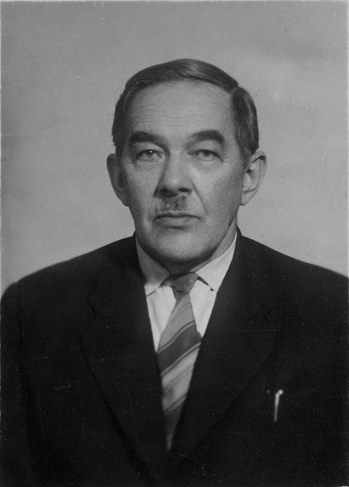

# Арсен Александрович Атабек
(1902–1960)

Младший сын [Александра Моисеевича Атабекяна](AMA.md). Известный врач-эндокринолог, автор нескольких десятков научных статей и брошюр и двух монографий.

В 1922 г. поступил на естественное отделение Физико-математического факультета МГУ, но на третьем курсе оставил учебу из-за материальных трудностей. в медицинском институте Работал секретарем на стройке Всесоюзной сельскохозяйственной выставки, затем репортером в «Вечерней Москве» и других московских газетах. Наверное, репортерская работа повлияла на слог его научных работ: образный, сжатый и предельно понятный, особенно в научно-популярных статьях и брошюрах.

С весны 1929 г. стал учиться на Медицинском факультете 2-го МГУ, который закончил в 1931 г., после чего два года отработал по распределению на Дальнем Востоке.

В 1942–1945 гг. был начальником эвакуационных госпиталей; в августе 1942 г. на санитарно-транспортном судне вывозил раненых из Сталинграда. С осени 1943 г. вместе с ним работала его жена [Марианна Стоиловна Бойчева](MSB.md) (дочь давнишних друзей родителей).

Дочери [Екатерина](EAAB.md) и Ариана тоже были врачами.

**См. также:**

• [Удостоверениео дате и месте рождения](../docs/doc-1921-04-12.md), датировано 12 апреля 1921 г.

• [Рапорт о гибели санитарно-транспортного судна](../docs/doc-1942-09-16.md), 16 сентября 1942 г.

Со старшим братом Александром. Фотограф П.П. Павлов, Москва, 1903 г.

С матерью Екатериной Николаевной и старшим братом Александром
Женева. Фотограф Fréd. Boissonnas, 
1905–1906 гг.

С сестрой Арианой.
Осенью 1915 Германия и Австро-Венгрия при поддержке вступившей в войну 14 октября Болгарии разбили Сербию и захватили всю ее территорию. Видимо, к этому времени и относится та благотворительная кампания, в которой участвовали Арсен и Ариана.

Слева направо: тетка Вера Николаевна Островская, Арсен с двоюродными сестрами Ириной (слева от него) и Ниной (справа) Островскими, старший брат Александр (в форме вольноопределяющегося) и мать Екатерина Николаевна. Ковров, 1916 г.

Мать и тетка — врачи. Из пятерых детей врачами станут Арсен и обе девочки Островские.

Судя по всему, юноше здесь лет 17–20, т.е. это конец 1910-х — начало 1920-х гг.

 

Картинки из серии «Найдите 10 отличий»

Слева направо: Марианна Стоиловна Бойчева, Арсен Александрович Атабек, Андрей Бирюков, Ариана Арсеновна Атабек. Львов, август 1958 г.

1960 г.