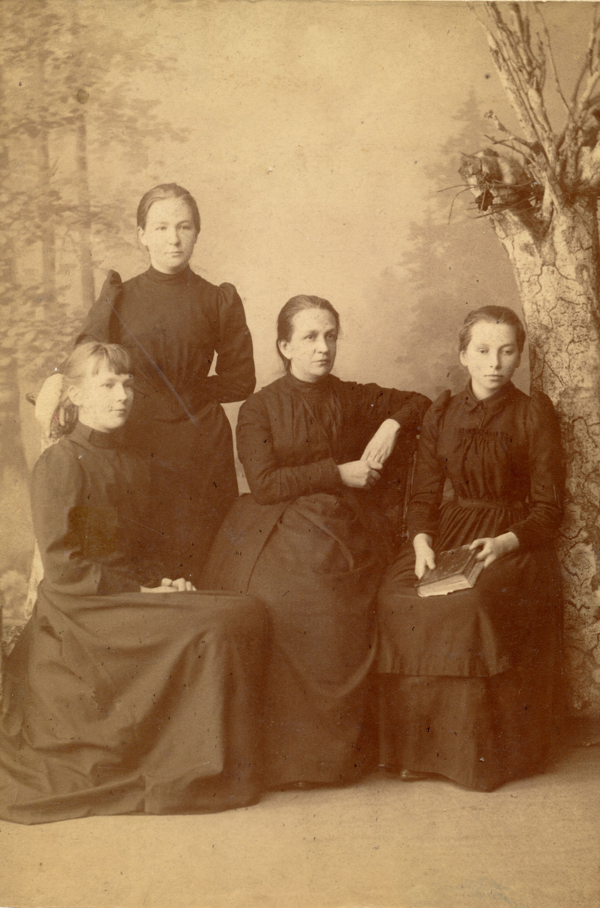

# Семья Егора Егоровича Богданова

Егор Егорович Богданов — младший брат Михаила Егоровича Богданова. Достоверных изображений Е.Е. Богданова нет (в альбоме имеется несколько фотографий, которые предположительно можно считать его портретами). Однако под несколькими фотографиями рукой М.С. Бойчевой сделаны надписи, свидетельствующие, что они изображают жену и дочерей Е.Е. Богданова.

**Любовь Ивановна Богданова,** жена Е.Е. Богданова
Фотограф В. Накельский, Курск

## Екатерина Егоровна Богданова

 

**Екатерина Егоровна Богданова**
Большая Московская фотография Э. Левенштейн, Москва.
На об. надпись: «Сентябрь 1872» | **Екатерина Егоровна Богданова**
Фотограф И. Курбатов, Москва

Екатерина Егоровна Богданова (сидит крайняя справа) 
с двоюродными сестрами Надеждой Михайловной (стоит) 
и Анастасией Михайловной Богдановыми (слева) 
и их матерью Надеждой Фёдоровной (в центре).
Фотограф неизвестен

 

**Екатерина Егоровна Богданова**
Фотограф Т.Н. Нужденко, Курск | **Любовь Егоровна и Екатерина Егоровна Богдановы**
Фотограф Е. Чеховский, Москва