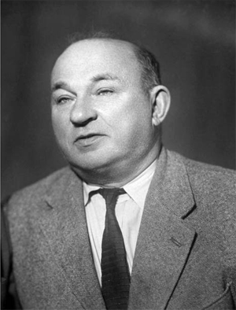
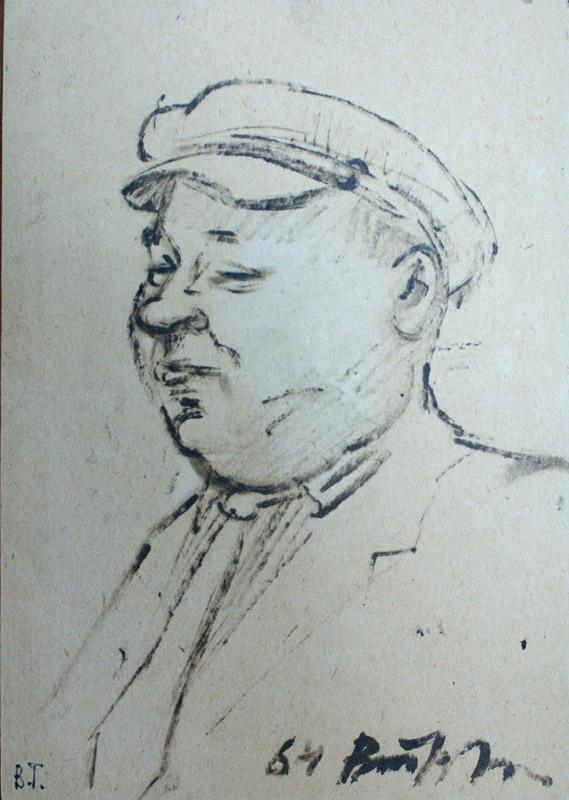

# Эммануил Филиппович Ципельзон
(1890–1971)

Известный московский букинист, библиограф, собиратель автографов, на почве чего разошелся со своей женой [Анастасией Стоиловной Бойчевой](ASB.md).

Начиная с 1950-х гг. публиковал в газетах и журналах небольшие заметки о книгах и автографах, главным образом из своей коллекции. Был бескорыстен и охотно дарил музеям и архивам всакие редкости из накопленных богатств.

Дети — близнецы Михаил Бойчев и [Надежда Коломенская](NEK.md).

Фото из Интернета.

Шарж неизвестного художника, 1964 г.