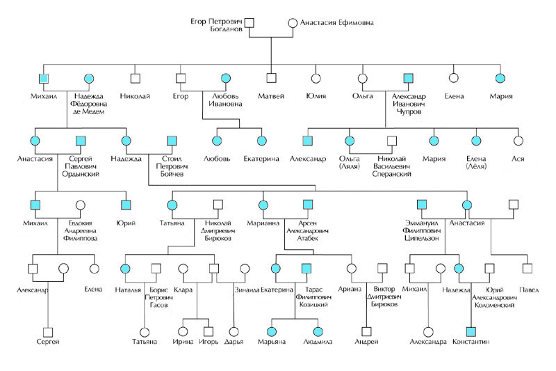

# Генеалогическое дерево Богдановых

```mermaid
graph TD
    %% Определение стилей
    classDef male fill:#BBDEFB,stroke:#1565C0,color:black
    classDef female fill:#F8BBD0,stroke:#C2185B,color:black
    classDef couple fill:#F0F0F0,stroke:#F0F0F0,stroke-width:1px
    classDef link fill:#FFFFFF,stroke:#F0F0F0,stroke-width:2px
    
    %% Определение узлов для людей
    %% Семья Богдановых (первое поколение)
    EPB["Егор<br>Петрович<br>Богданов"]:::male
    NEF["Настасья<br>Ефимовна<br>?"]:::female
    
    %% Семья Богдановых (второе поколение)
    MEB["Михаил<br>Егорович<br>Богданов"]:::male
    NEB["Николай<br>Егорович<br>Богданов"]:::male
    EEB["Егор<br>Егорович<br>Богданов"]:::male
    MatEB["Матвей<br>Егорович<br>Богданов"]:::male
    YuEB["Юлия<br>Егоровна<br>Богданова"]:::female
    OEB["Ольга<br>Егоровна<br>Богданова"]:::female
    ElEB["Елена<br>Егоровна<br>Богданова"]:::female
    MESB["Мария<br>Егоровна<br>Богданова"]:::female
    
    %% Семья Егора Егоровича Богданова
    LIB["Любовь<br>Ивановна<br>?"]:::female
    EkEB["Екатерина<br>Егоровна<br>Богданова"]:::female
    LEB["Любовь<br>Егоровна<br>Богданова"]:::female
    
    %% Семья де Медем
    FFdM["Федор<br>Федорович<br>де Медем"]:::male
    ANdMS["Авдотья<br>Николаевна<br>Сомова"]:::female
    NFBdM["Надежда<br>Федоровна<br>де Медем"]:::female
    
    %% Семья Михаила Егоровича Богданова
    AMO["Анастасия<br>Михайловна<br>Богданова"]:::female
    NMB["Надежда<br>Михайловна<br>Богданова"]:::female
    
    %% Семья Чупровых
    AICh["Александр<br>Иванович<br>Чупров"]:::male
    AACh["Александр<br>Александрович<br>Чупров"]:::male
    OACh["Ольга<br>Александровна<br>Чупрова"]:::female
    MACh["Мария<br>Александровна<br>Чупрова"]:::female
    EACh["Елена<br>Александровна<br>Чупрова"]:::female
    ACh["Ася<br>Чупрова"]:::female
    
    %% Семья Сперанских
    NVS["Николай<br>Васильевич<br>Сперанский"]:::male
    
    %% Семья Ордынских
    SPO["Сергей<br>Павлович<br>Ордынский"]:::male
    MSO["Михаил<br>Сергеевич<br>Ордынский"]:::male
    YuSO["Юрий<br>Сергеевич<br>Ордынский"]:::male
    
    %% Семья Бойчевых
    SPB["Стоил<br>Петрович<br>Бойчев"]:::male
    TSB["Татьяна<br>Стоиловна<br>Бойчева"]:::female
    MSB["Марианна<br>Стоиловна<br>Бойчева"]:::female
    ASB["Анастасия<br>Стоиловна<br>Бойчева"]:::female
    
    %% Использование subgraph для обозначения брачных пар
    
    %% Семья Богдановых (первое поколение)
    subgraph couple_EPB_NEF [" "]
        EPB
        NEF
    end
    couple_EPB_NEF:::couple
    couple_EPB_NEF ---> MEB
    couple_EPB_NEF --> NEB
    couple_EPB_NEF ---> EEB
    couple_EPB_NEF --> MatEB
    couple_EPB_NEF --> YuEB
    couple_EPB_NEF ---> OEB
    couple_EPB_NEF --> ElEB
    couple_EPB_NEF --> MESB
    
    %% Семья Егора Егоровича Богданова
    subgraph couple_EEB_LIB [" "]
        EEB
        LIB
    end
    couple_EEB_LIB:::couple
    couple_EEB_LIB --> EkEB
    couple_EEB_LIB --> LEB
    
    %% Семья де Медем
    subgraph couple_FFdM_ANdMS [" "]
        FFdM
        ANdMS
    end
    couple_FFdM_ANdMS:::couple
    couple_FFdM_ANdMS ---> NFBdM
    
    %% Семья Михаила Егоровича Богданова
    subgraph couple_MEB_NFBdM [" "]
        MEB
        NFBdM
    end
    couple_MEB_NFBdM:::couple
    couple_MEB_NFBdM --> AMO
    couple_MEB_NFBdM --> NMB
    
    %% Семья Чупровых
    subgraph couple_AICh_OEB [" "]
        AICh
        OEB
    end
    couple_AICh_OEB:::couple
    couple_AICh_OEB --> AACh
    couple_AICh_OEB --> OACh
    couple_AICh_OEB --> MACh
    couple_AICh_OEB --> EACh
    couple_AICh_OEB --> ACh
    
    %% Семья Сперанских
    subgraph couple_NVS_OACh [" "]
        NVS
        OACh
    end
    couple_NVS_OACh:::couple
    
    %% Семья Ордынских
    subgraph couple_SPO_AMO [" "]
        SPO
        AMO
    end
    couple_SPO_AMO:::couple
    couple_SPO_AMO --> MSO
    couple_SPO_AMO --> YuSO
    
    %% Семья Бойчевых
    subgraph couple_SPB_NMB [" "]
        SPB
        NMB
    end
    couple_SPB_NMB:::couple
    couple_SPB_NMB --> TSB
    couple_SPB_NMB --> MSB
    couple_SPB_NMB --> ASB
    
    %% Добавление кликабельных ссылок
    click MEB "/people/MEB"
    click EEB "/people/EEB"
    click MESB "/people/MESB"
    click FFdM "/people/SdM"
    click ANdMS "/people/ANdMS"
    click NFBdM "/people/NFBdM"
    click AMO "/people/AMO"
    click NMB "/people/NMBB"
    click AICh "/people/AICh"
    click AACh "/people/AACh"
    click SPO "/people/SPO"
    click SPB "/people/SPB"
    click TSB "/people/TSB"
    click MSB "/people/MSB"
    click ASB "/people/ASB"
    
```

Значительная часть людей, представленных на этом дереве, не являются моими прямыми предками, однако они упоминаются в семейном архиве и поэтому несомненно заслуживают включения в генеалогическое дерево.

В детстве я был немного знаком с потомками Сергея Павловича Ордынского, так что определенная связь сохранилась и в наши дни.

