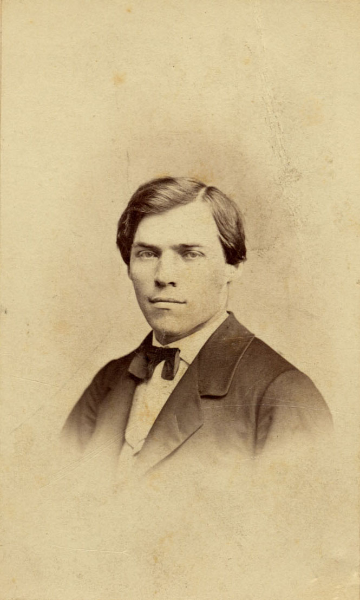
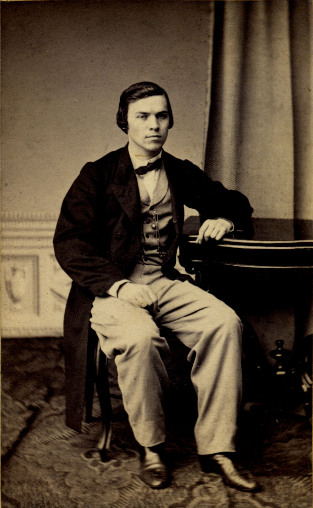
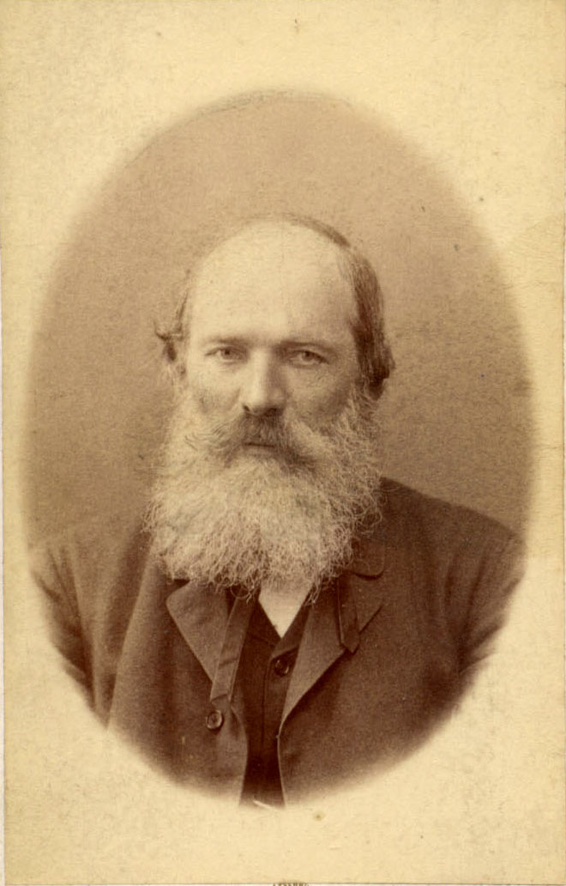
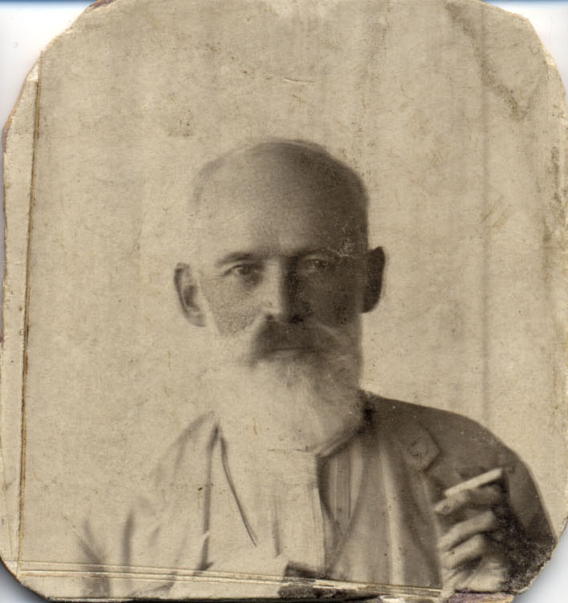
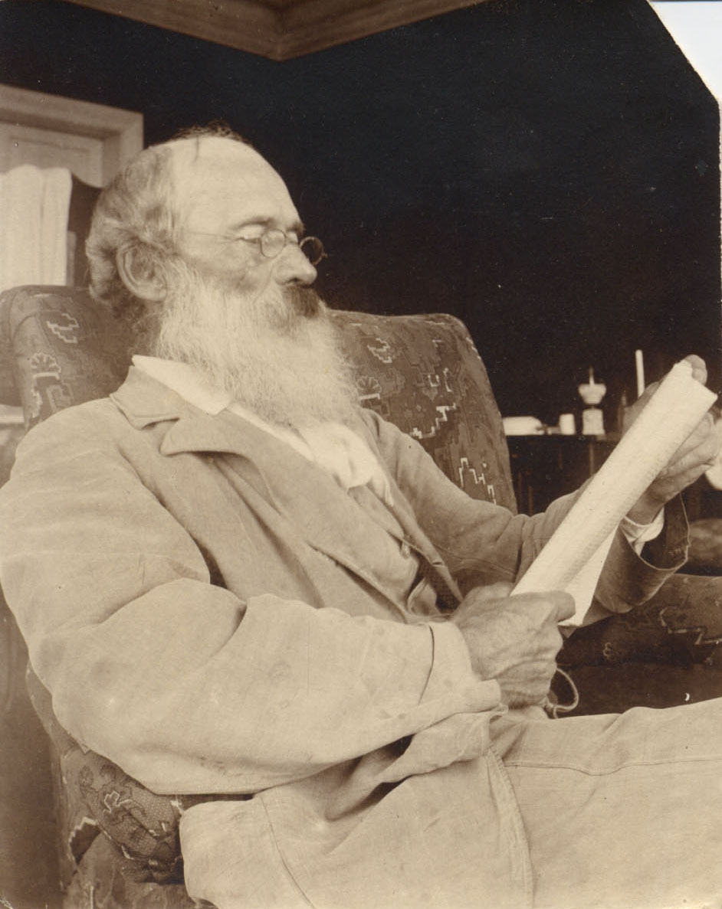
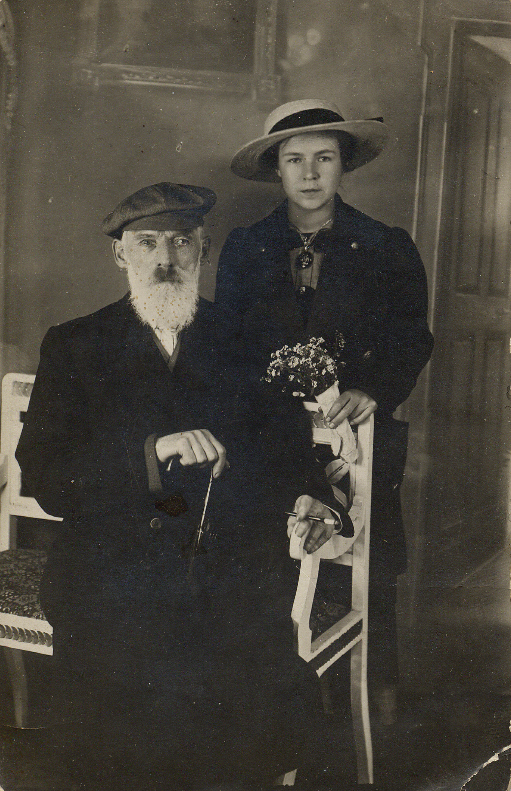

# Михаил Егорович Богданов
(1842–1920)

Экономист, с 1883 г. — один из членов товарищества по изданию газеты «Русские ведомости».

Родился в г. Мосальске Калужской губ. О его родителях писал в воспоминаниях писатель А.В. Амфитеатров: «Богдановы — купеческий мосальский род, распавшийся на несколько семейств, близких по крови и свойству. Из них некоторые в 60-х годах пребывали в полудикости „темного царства", а некоторые устремились к просвещению. Тесть Александра Ивановича Чупрова, Егор Петрович Богданов, был главою семьи второй категории. Сам он был человек, схвативший самоучкою внешность кое-какого образования, а супруга его, Настасья Ефимовна, женщина очень умная, строгая, справедливая и вместе с тем сердечная, едва ли была грамотна. В 70-х годах, поселившись по смерти мужа у Чупровых, она появлялась на их профессорских журфиксах в шушунчике и круглой наколке, которые тогда в Москве можно было видеть уже только на сцене, на купчихах в комедиях Островского, да и то первого периода, с действием в 30–40-х годах». 

М.Е. Богданов учился в немецкой гимназии в Риге. В краеведческом музее г. Мосальска хранится рукопись местного краеведа В.А. Зайцева «История города Мосальска», который пишет, что местные Богдановы (и «полудикие», и «просвещенные», по Амфитеатрову), очевидно, по распространенности фамилии, носили разные приставки: Богдановы-Юхновские, Богдановы-Егорченковы, Богдановы-Огородники и т.д.; в длинном перечне на первом месте стоят Богдановы-Рижские. Наверное, имели какие-нибудь торговые дела в Риге. Можно не сомневаться, что наши предки именно из них, иначе трудно объяснить, почему мальчик из Калужской глухомани отказался в далеком портовом городе.

Окончил юридический факультет Московского университета. По окончании вновь оказался в Риге, где некоторое время служил в палате государственных имуществ; вероятно, именно в Риге познакомился со своей будущей женой [Надеждой Федоровной де Медем](NFBdM.md). Работая в «Русских ведомостях», был не только экономическим обозревателем газеты, но и ведал экономическими делами самого издания.

У М.Е. Богданова было семь братьев и сестер — Николай, Егор, Матвей, Юлия, Ольга, Елена и Мария. В «Богдановском альбоме» есть достоверные (подписанные) фотографии [Юлии Егоровны](AACh.md#snv), [Марии Егоровны](MESB.md), а также мужа Ольги Егоровны [Александра Ивановича Чупрова](AICh.md), жены Егора Егоровича Богданова [Любови Ивановны](EEB.md) и их дочерей [Екатерины Егоровны](EEB.md#EkEB) и [Любови Егоровны](EEB.md#leb).

**См. также:**

• [Краткая биография](../docs/MEB-1913.md) из кн.: Русские ведомости. 1863–1913: Сборник статей. — М., 1913.

• Переписка С А.И. Чупровым 1905–1906 гг. (хранится в отделе рукописей библиотеки МГУ) — главным образом о делах газеты «Русские Ведомости», но упоминаются и семейные дела. Есть рукописная копия, пока не перепечатанная.

Фотограф Ив. Деговченко, Москва.

Фотограф неизвестен.

Фотограф К.А. Фишер, бывш. И. Дьяговченко, Москва.
На об. надпись: «от Мани Наде»

Фотограф неизвестен.

Фотограф неизвестен.

С внучкой Татьяной Стоиловной Бойчевой.
Фотограф неизвестен.
На об. надпись: «Милым «папаше» и «мамаше» (временно) Таня. 1915 г. IV. София»