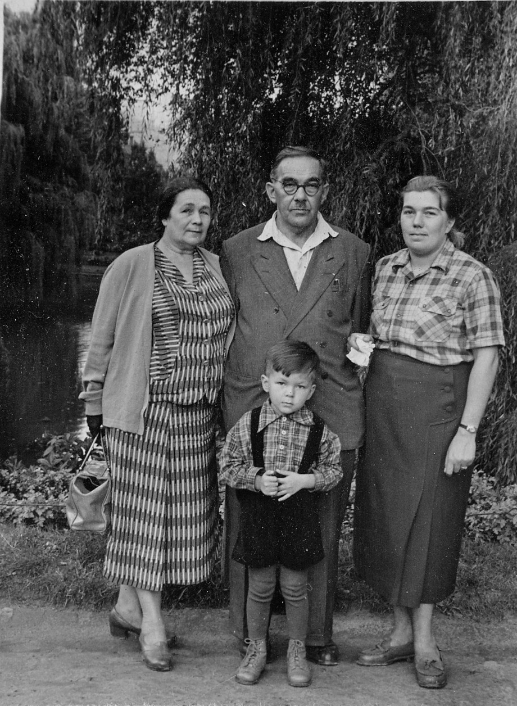

# Марианна Стоиловна Бойчева 
(1900–1981)

Дочь [Стоила Петровича](SPB.md) и [Надежды Михайловны Бойчевых](NMBB.md), жена Арсена Александровича Атабека.

Врач, после войны работала врачом-лаборантом.

Справа налево: Татьяна, Марианна, Анастасия Бойчевы 
и их двоюродный брат Миша Ордынский.
Москва, фотограф Д.С. Козловский, 1905.
На обороте надпись рукой А.М. Ордынской: «Москва, 4ое мая 1905 г. Мише 2 года».

Марианна, Татьяна и Анастасия Бойчевы
Фотограф неизвестен.

С матерью Надеждой Михайловной Богдановой 
и сестрами Татьяной (стоит сзади) и Настей (справа)

Слева направо: Анастасия, Татьяна, Марианна Бойчевы 
София, фотограф Т.С. Хитров, 1913 г.
Надписи на обороте:
Бабушке Маше. 18.II.1913. София.
„Шишко бабаджан,
Червен батлажан".
Последняя надпись — позднейшая, сделана М.С. Бойчевой в 1970-х гг. и передаёт болгарскую дразнилку, связанную с тем, что она в это время 
болела свинкой и ходила с раздувшимся лицом и шеей.

Фотооткрытка; на обороте — письмо, адресованное «Милой бабушке Юле», 
т.е., очевидно, Юлии Егоровне Богдановой, 
и позднейшая дата: «1913 г. София».

Надежда Михайловна Бойчева с дочерьми
Марианной, Анастасией (стоят сзади)
и Татьяной.
Конец 1910-х гг.

 

С подругой Галиной Зборовской (слева).
На об. надпись: «Январь 1923 г.» | На обороте надпись рукой М.С. Бойчевой:
«Май мес. 1923 г. София.
*Сзади* стоят — Наташа, Б-го, плем. А.В-ны и муж Рузи.
*Сидят:* Люля, Рузя, А.В., Ирочка, Галя, я, Мишу и Миня».

 

На об. частично обрезанная надпись: 
«София. [Ч]етверг 13 сентября 1923. Около С[емидо]вской двери» | С подругой Люлей Семидовой.
На об. частично обрезанная надпись: 
«[Че]тверг София Снимок 13 сентября 1923. Около двери к С[емидо]вым»

Слева направо, нижний ряд: Валерия Хлыновская (невеста М.С. Ордынского), [Михаил Сергеевич Ордынский](AMO.md#m-ju), [Надежда Федоровна Богданова](NFBdM.md); средний ряд: Алексей Иванович Оловянишников, Татьяна Ивановна Оловянишникова, [Анастасия Стоиловна Бойчева](ASB.md), бюст тётки [Анастасии Михайловны Ордынской](AMO.md) (ум. в 1916 г.), М.С. Бойчева, [Татьяна Стоиловна Бойчева](TSB.md); верхний ряд: Николай Дмитриевич Бирюков, [Юрий Сергеевич Ордынский](AMO.md#m-ju). 1920-е гг.

 

Картинки из серии «Найдите 10 отличий»

Слева направо: Марианна Стоиловна Бойчева, Арсен Александрович Атабек, Андрей Бирюков, Ариана Арсеновна Атабек. Львов, август 1958 г.

С внучками Марьяной и Людой. 10 ноября 1961 г.

Анастасия и Марианна Бойчевы, Екатерина Атабекова-Бойчева.
Видимо, на какой-то автобусной экскурсии; судя по дизайну автобуса,
1960-е — начало 1970-х гг.

Дома у дочери Арианы. Около 1972 г.