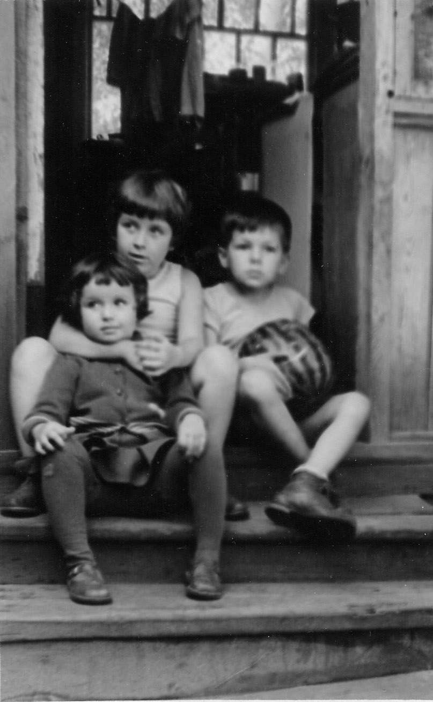

# Марьяна Тарасовна Козицкая
(р. 1954)

Старшая дочь [Тараса Филипповича Козицкого](TFK.md) и [Екатерины Арсеновны Атабековой-Бойчевой](EAAB.md).

&nbsp;

С папой.

 

Люда и Марьяна Козицкие и Костя Коломенский (сын Надежды Эммануиловны Коломенской). 1960 г.

Люда, Марьяна, Андрюша и арбуз. Купавна, август 1960 г.

  

Все три снимка, как и три следующих, сделаны в один день, 10 ноября 1961 г.

«Дети, улыбнитесь».

У Людки живот болит.

С бабушкой Марианной Стоиловной Бойчевой. Кажется, скоро конец мучениям.

Первый ряд: Марьяна Козицкая, Саша Бойчева (дочь Михаила Эммануиловича Бойчева), Люда Козицкая;
второй ряд: Андрей Бирюков, Костя Коломенский. Москва, 1966 г.

Те же лица, в тот же день.

Пицунда, наверное. Год не знаю; судя по габаритам, начало 1970-х.

Август 1973 г., оз. Селигер

С дочерью Ольгой. 19 марта 2005 г.

Петербург, май 2006 г.

Там же, тогда же.

 

С Надеждой Эммануиловной Коломенской, у нее дома. Петербург, май 2006 г.

Слева направо: Костя Коломенской, его отец Юрий Александрович Коломенский, Марьяна,
Надежда Эммануиловна Коломенская. Петербург, май 2006 г.

Во время мытарств по поводу приватизации купавинского участка. 25 сентября 2008 г.