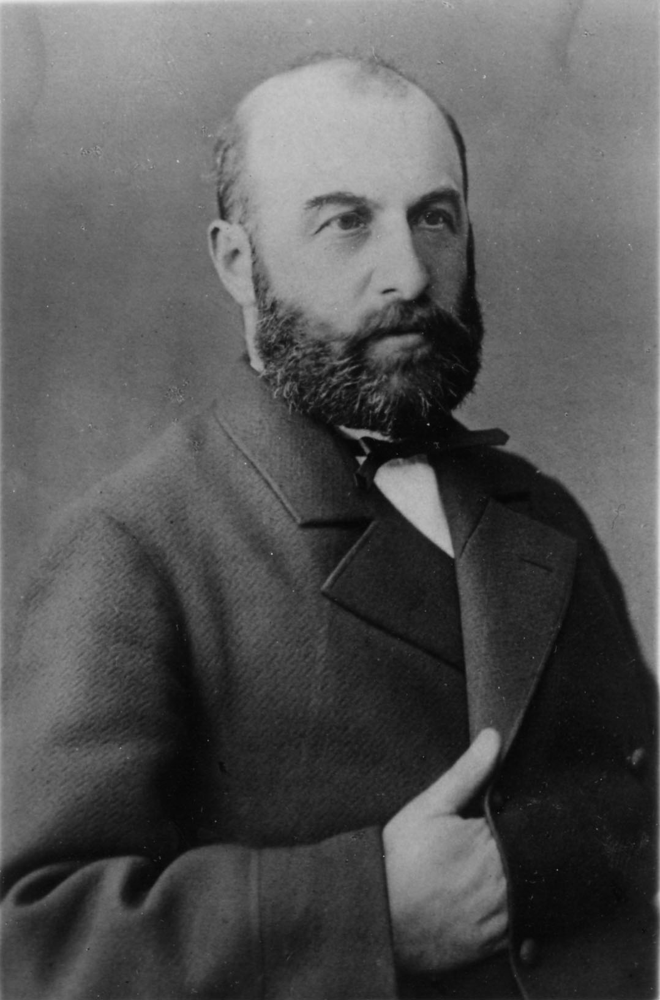
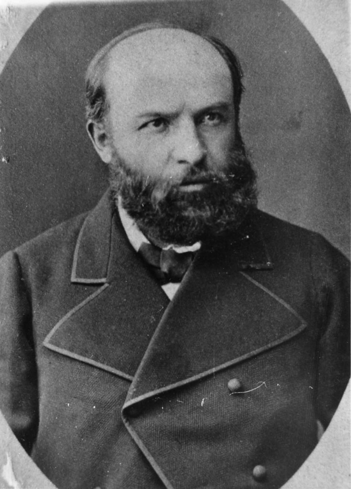

# Мосес бек (Мосес Асланович) Атабекян
(1840–1910)

Врач. Был едва ли не единственным в [Шуше](https://ru.wikipedia.org/wiki/Шуша) специалистом по женским и детским болезням. По семейному преданию, говорил о себе, что стоял перед женщиной на коленях единственный раз — когда принимал роды у роженицы, лежавшей в нищенской сакле на полу.

Был заядлым картёжником; согласно другому семейному преданию, вполне достоверному, исходившему от его невестки Эллы, жены старшего сына Аслана, вскоре после женитьбы она увидала раз тестя утром только что вернувшегося из клуба после ночи, проведённой за картами. Мосес бек попросил невестку изжарить ему яичницу. Когда она принесла в столовую сковородку с тремя яйцами, тесть велел ей сходить к нему в кабинет и принести лупу. С дрожью в душе (что там? таракан? мусор какой-то?) Элла иполнила просьбу тестя. Тот посмотрел на яичницу в лупу, велел разбудить кухарку и сказать ей, чтобы изжарила *его* яичницу.

Блюдо состояло из дюжины яиц, залитых слоем масла в палец толщиной. Мосес бек съел его и отправился спать.

В некрологе, опубликованном в армянском журнале «Тараз» (1910. № 5/6. С. 60) упоминается его склонность к картам и утверждается, что больным он назначал лечение местной минеральной водой и прогулками. Так сказать, родоначальник карабахской бальнеологии.

Дети Аслан, [Александр](AMA.md), [Анна](AnMA.md) и [Абрам](AbMA.md).

**См. также:**

- [Решение Шушинской бекской комиссии о присвоении бекского достоинства.](../docs/doc-1872-02-24.md) Дело было заведено Мосес беком вместе с двоюродным братом Арутюн беком.

{: width="40%" }

{: width="40%" }