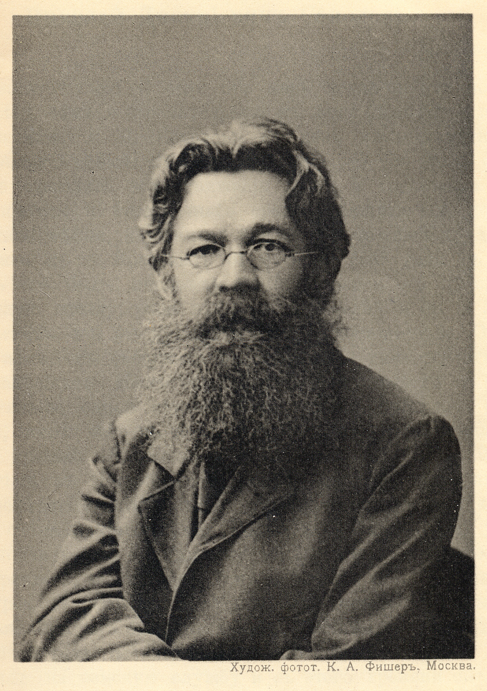

# Николай Дмитриевич Соколов
(1848–1911)

Врач. Учился с перерывами, т.к. дважды был отчислен — в первый раз из Московского университета в 1868 г. за участие в каких-то студенческих беспорядках, во второй раз в 1970 г. из Петербургской Медико-хирургической академии. Тут дело было серьезнее: был привлечен в связи с «делом Нечаева», больше года просидел в тюрьме, но был выпущен без суда.

Много лет проработал санитарным врачом Клинского уезда Московской губ., где с водоснабжением дела были плохи (Клинско-Дмитровская гряда). Колодцев было мало, население брало воду из прудов, это вело ко всяким эпидемическим заболеваниям, а тут уже начиналось поле деятельности санитарной медицины. Постепенно расширил свои изыскания на всю Московскую губернию, работая вместе с геологами. Составленные им гидрогеологическая карта и очерк вышли уже после его смерти.

Дети Софья (о ней практически ничего не известно, но есть две фотографии) [Екатерина](ENS.md), [Вера](VNO.md), Дмитрий, Галина (последние двое известны лишь по именам).

**См. также:**

- [Статья в словаре «Деятели революционного движения в России».](https://slovari.yandex.ru/%D1%81%D0%BE%D0%BA%D0%BE%D0%BB%D0%BE%D0%B2%20%D0%BD%D0%B8%D0%BA%D0%BE%D0%BB%D0%B0%D0%B9%20%D0%B4%D0%BC%D0%B8%D1%82%D1%80%D0%B8%D0%B5%D0%B2%D0%B8%D1%87/%D0%A0%D0%B5%D0%B2%D0%BE%D0%BB%D1%8E%D1%86%D0%B8%D0%BE%D0%BD%D0%B5%D1%80%D1%8B/%D0%A1%D0%BE%D0%BA%D0%BE%D0%BB%D0%BE%D0%B2%20%D0%9D%D0%B8%D0%BA%D0%BE%D0%BB%D0%B0%D0%B9%20%D0%94%D0%BC%D0%B8%D1%82%D1%80%D0%B8%D0%B5%D0%B2%D0%B8%D1%87/)

- [*Соколов Н.Д.* Гидрогеологический очерк Московской губернии. М., 1913.](http://www.etomesto.ru/map/moscow/gidrogeolog/gidrologiya-sokolov.pdf) Это, конечно, узко специальный труд, но он снабжен предисловием биографического характера.

Фото из книги, упомянутой выше. У меня в комнате висит большой, 40 на 30 см, портрет Н.Д. Соколова, на котором есть подпись фотографа К. Фишера с датой «1911». Но это, очевидно, дата изготовления копии, а снято, я думаю, на несколько лет раньше. Других портретов нет, кажется, ни у кого из родственников.