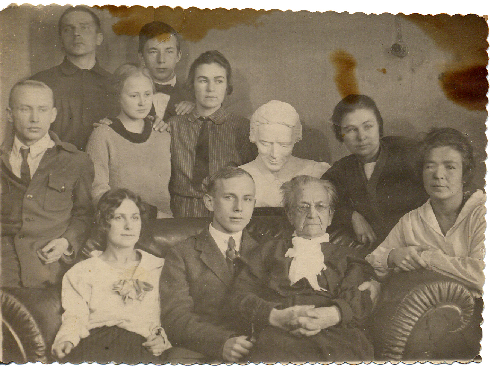

# Надежда Федоровна БОГДАНОВА, урожд. де Медем
(1845–1928)

Жена Михаила Егоровича Богданова. Конкретных данных о ней, даже в форме семейных преданий, сохранилось мало. Поскольку М.Е. Богданов в молодости некоторое время служил в Риге, а также учитывая прибалтийские корни рода де Медемов, можно предположить, что родом она из русской или даже немецкой Прибалтики. Об этом косвенно свидетельствует ряд фотографий в «Богдановском архиве», сделанных в Риге и в Кенигсберге.

М.В. Сабашников упоминает М.Е. Богданову в своих «Записках» (М.: Изд-во им. Сабашниковых, 1995, с. 97): весной 1885 г., когда будущему издателю было 14 лет, «Надежда Федоровна Богданова привезла к нам на дачу в Жуковку знакомиться нашего нового учителя, Николая Васильевича Сперанского». Следует иметь в виду, что Н.В. Сперанский оказал очень серьезное влияние на братьев Михаила и Сергея Сабашниковых. Женат он был на дочери А.И. Чупрова Ольге Александровне.

 

Фотограф неизвестен.
На об. надпись: «Надя Де-Медем. Снята 
1862 года в Декабре». | Дрезденская фотография на Арбате, Москва.

 

Фотографы братья Цикен, Москва.
На об. надпись: «Снята 1864 года в Августе» | Фотограф Цикен, Москва.
На об. надпись: «10 Апреля».

 

Французская фотография Мальм и Шмидт, 
Москва. | Фотограф И. Дьяговченко, Москва.

 

Дрезденская фотография, Москва. | Фотограф И. Дьяговченко, Москва.

 

Фотограф Ив. Деговченко, 
Москва. | Фотография Gottheil & Sohn, Кёнигсберг.

Фотограф Е. Овчаренко, Москва.

 

Фотограф А. Федецкий, Харьков. 1896 г. | Фотографы Шиндлер и Мей под фирмою Шерер и Набгольц, Москва.
Не ранее1892 г.

 

С дочерьми Надеждой Михайловной (стоит) и Анастасией Михайловной (слева) и племянницей Екатериной Егоровной Богдановой (сидит крайняя справа)
Фотограф неизвестен. | Фотограф неизвестен.

 

С племянницей Ольгой Александровной Чупровой (слева) и дочерью Анастасией.
Фотограф неизвестен. | С внуками Михаилом и Юрием Ордынскими. В глубине — Анастасия Михайловна Ордынская (урожд. Богданова)
Фотограф неизвестен.

С бюстом дочери [Анастасии Михайловны Ордынской](AMO.md) (ум. в 1916 г.), со всеми внуками и внучками и даже пассиями последних.

Слева направо, нижний ряд: Валерия Хлыновская (невеста М.С. Ордынского), [Михаил Сергеевич Ордынский](AMO.md#m-ju), Н.Ф. Богданова; средний ряд: Алексей Иванович Оловянишников, Татьяна Ивановна Оловянишникова, [Анастасия Стоиловна Бойчева](ASB.md), бюст А.М. Ордынской, [Марианна Стоиловна Бойчева](MSB.md), [Татьяна Стоиловна Бойчева](TSB.md); верхний ряд: Николай Дмитриевич Бирюков, [Юрий Сергеевич Ордынский](AMO.md#m-ju).