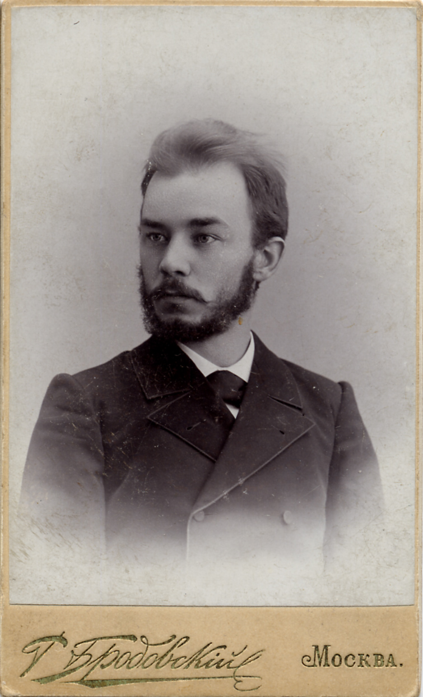
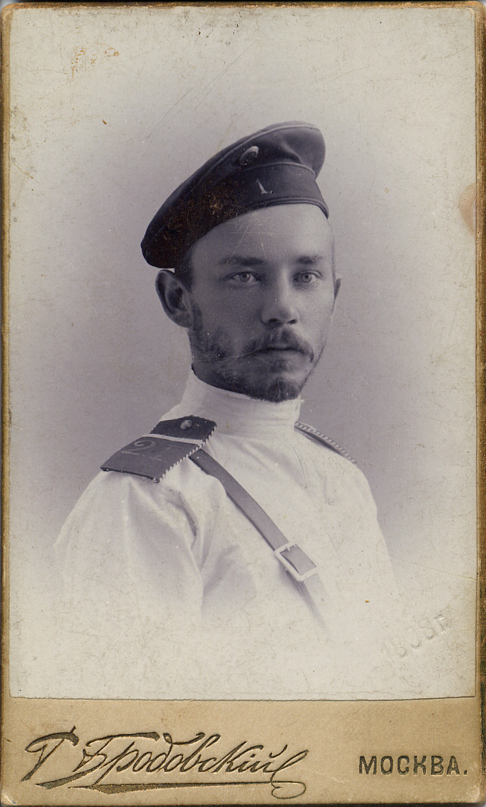
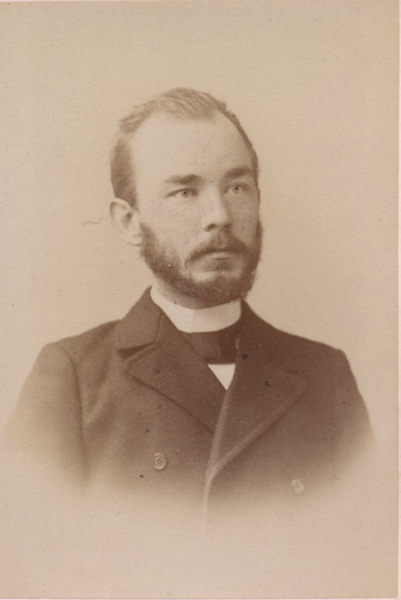
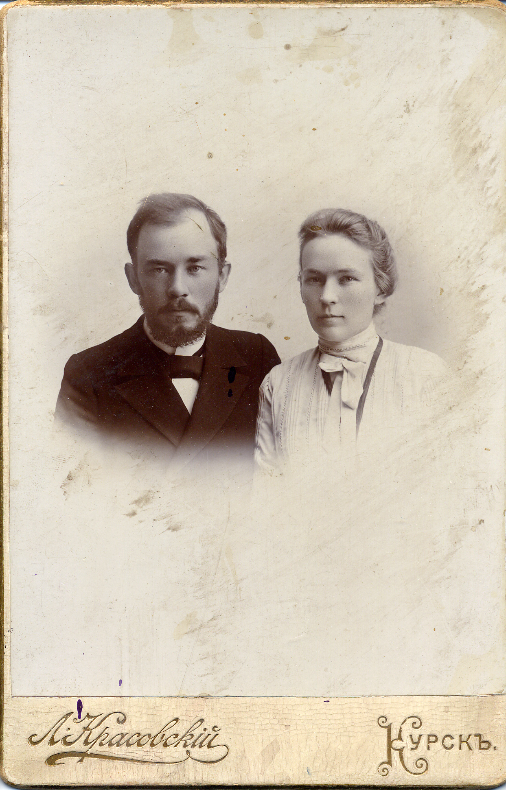
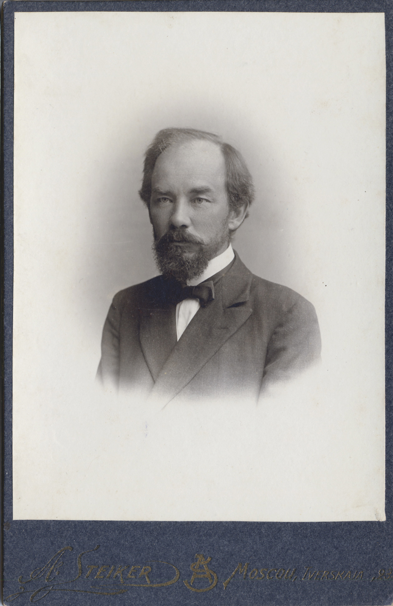

# Сергей Павлович Ордынский
(1870–1929)

Муж [Анастасии Михайловны Богдановой](AMO.md). По образованию юрист.

Гимназический товарищ [А.А. Чупрова](AACh.md), через которого очевидно, знаком был и семьей Богдановых. М.В. Сабашников свидетельствовал, что „Настасия Михайловна и Сережа [Серг. Вас. Сабашников, брат М.В.] в то время [1896] определённо интересовались друг другом" (*Сабашников М.В.* Записки. М., 1995. С. 189). Но из этого «интереса» получилось вот что: А.Н. познакомилась с другом братьев Сабашниковых Сергеем Ордынским и после нескольких лет раздумий вышла за него замуж.

**См. также:**

- [Автобиография](../docs/SPO-1913.md) из кн.: Русские ведомости. 1863–1913: Сборник статей. — М., 1913.
- [Письмо С.П. Ордынского](../docs/doc-1911-12-11.md) революционеру и ученому Н.А. Морозову, 1911 г.

Фотограф Р. Бродовский, Москва, 1897 г.

На обороте надпись:
В выполнение об „утре наших лет", которое мы вместе с тобой пережили, дорогой друг.
Сергей Ордынский.
1897 5/IV.

Фотограф Р. Бродовский, Москва, 1898 г.

Фотограф Отто Ренар, Москва

 

Фотограф Л.В. Красовский, Курск.
Наверное, свадебная фотография — молоды и счастливы. | Фотограф А.Ф. Стейкер, Москва