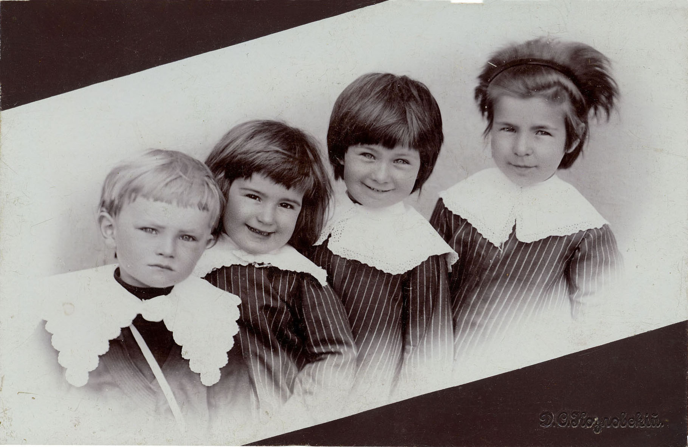
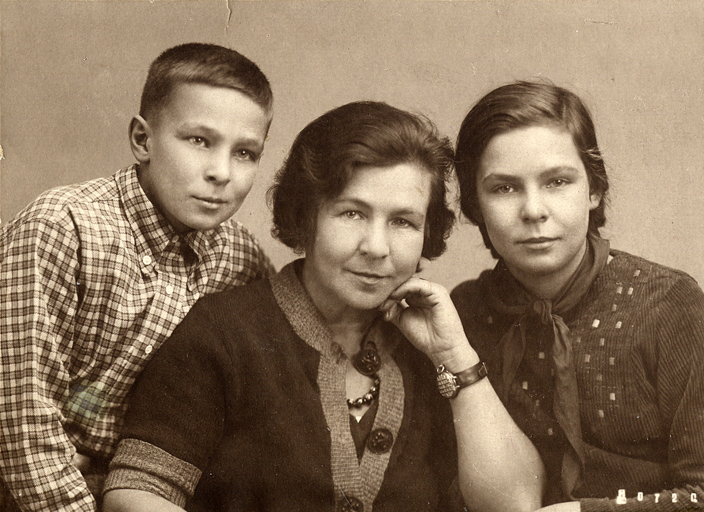

# Татьяна Стоиловна Бойчева
(1899–1969)

Старшая дочь [Стоила Петровича](SPB.md) и [Надежды Михайловны Бойчевых](NMBB.md), жена Николая Дмитриевича Бирюкова. С мужем жили порознь, неоднократно делали попытки сойтись вновь, но из-за его тяжелейшего характера это было, очевидно, невозможно.

По профессии медсестра.

Дети Наталья Гасова и Сергей Бирюков.

**См. также:**

- [Выпись из метрической книги о рождении Т.С. Бойчевой](../docs/doc-1899-11-02.md).

Справа налево: Татьяна, Марианна, Анастасия Бойчевы 
и их двоюродный брат Миша Ордынский.
Москва, фотограф Д.С. Козловский, 1905.
На обороте надпись рукой А.М. Ордынской: «Москва, 4ое мая 1905 г. Мише 2 года».

Марианна, Татьяна и Анастасия Бойчевы
Фотограф неизвестен.

С матерью Надеждой Михайловной Богдановой 
и сестрами Марианной (слева) и Настей (справа).
Фотограф П.Ф. Пирашков, Москва.

Слева направо: Анастасия, Татьяна, Марианна Бойчевы 
София, фотограф Т.С. Хитров, 1913 г.

С дедом Михаилом Егоровичем Богдановым.
Фотограф неизвестен.
На об. надпись: «Милым «папаше» и «мамаше» (временно) Таня. 1915 г. IV. София»

Дрова пилят Татьяна (слева) и Анастасия Бойчевы.
На заднем плане дети Т. Бойчевой 
Сергей и Наталья Бирюковы и 
неизвестный мальчик. 1930-е гг.

Слева направо, нижний ряд: Валерия Хлыновская (невеста М.С. Ордынского), [Михаил Сергеевич Ордынский](AMO.md#m-ju), [Надежда Федоровна Богданова](NFBdM.md); средний ряд: Алексей Иванович Оловянишников, Татьяна Ивановна Оловянишникова, [Анастасия Стоиловна Бойчева](ASB.md), бюст тётки [Анастасии Михайловны Ордынской](AMO.md) (ум. в 1916 г.), [Марианна Стоиловна Бойчева](MSB.md), Т.С. Бойчева: верхний ряд: Николай Дмитриевич Бирюков, [Юрий Сергеевич Ордынский](AMO.md#m-ju). 1920-е гг.

Дрова пилят Татьяна (слева) и Анастасия Бойчевы.
На заднем плане дети Т. Бойчевой 
Сергей и Наталья Бирюковы и 
неизвестный мальчик. 1930-е гг.

С сыном Сергеем и дочерью Натальей. 1940 г.