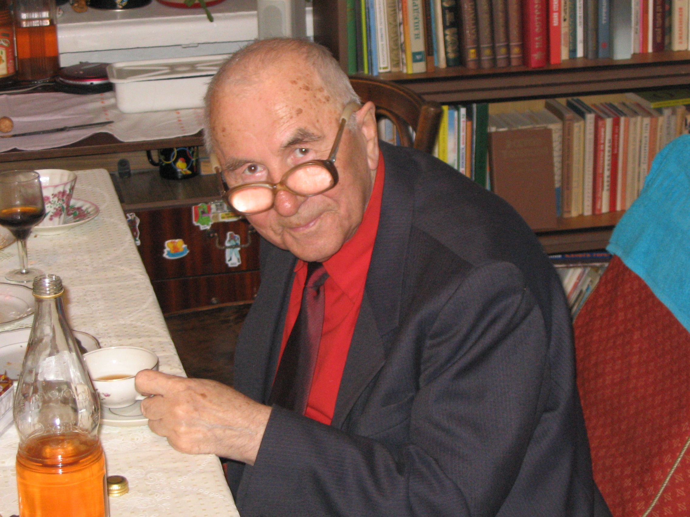

# Владимир Александрович Нестеров
(1927–2013)

Муж Бэты Александровны Атабек, отец Велентины Владимировны Нестеровой.

Физик-ядерщик, закончил Ленинградский электротехнический институт в 1950 г. и почти всю жизнь проработал в Курчатовском институте.

12 марта 2005 г.