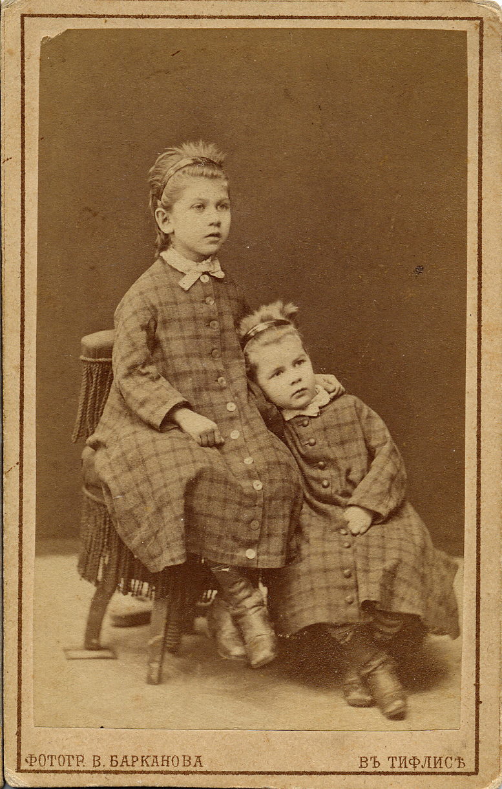
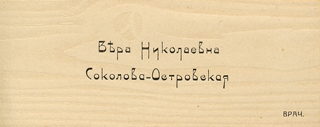

# Вера Николаевна Островская
(1880–1955)

Дочь [Николая Дмитриевича Соколова](NDS.md). Почти всю жизнь проработала во Владимирской области, вначале в с. Черкутине, а с 1913 г. и до самой смерти — в городе Коврове, причем жила в одном и том же доме, где потом продолжала жить ее дочь Ирина. Благодаря такой оседлости в семье сохранилось множество документов. В частности, сохранилось около 80 адресованных ей писем сестры Екатерины Николаевны за 1903–1920 гг. и множество фотографий.

Екатерина (слева) и Вера Соколовы.
Тифлис, фотография В. Барканова, 1878.
Их отец Николай Дмитриевич Соколов, получив диплом врача, должен был отслужить военную службу за стипендию, которую он получал в Петербургской медико-хирургической академии. Был назначен на Кавказ. Фото сделано незадолго до возвращения в Россию.

С сестрой Екатериной Николаевной Соколовой-Атабекян (крайняя справа) и детьми Ириной Островской (рядом с матерью), Ниной Островской (посередине), Арианой Атабекян (рядом с матерью), Арсеном и Александром Атабекянами (в форме вольноопределяющегося). Ковров, 1916 г.

