# Генеалогическое дерево

Ниже представлена диаграмма родственных связей людей, упомянутых в биографиях.

```mermaid
graph TD
    %% Определение стилей
    classDef male fill:#BBDEFB,stroke:#1565C0,color:black
    classDef female fill:#F8BBD0,stroke:#C2185B,color:black
    classDef couple fill:none,stroke:#9E9E9E,stroke-width:1px
    
    %% Определение узлов для людей
    %% Семья Богдановых
    MEB["Михаил Егорович<br>Богданов<br>(MEB)"]:::male
    NFBdM["Надежда Федоровна<br>де Медем<br>(NFBdM)"]:::female
    AMO["Анастасия Михайловна<br>Богданова/Ордынская<br>(AMO)"]:::female
    NMB["Надежда Михайловна<br>Богданова<br>(NMB)"]:::female
    SPO["Сергей Павлович<br>Ордынский<br>(SPO)"]:::male
    MSO["Михаил Сергеевич<br>Ордынский<br>(MSO)"]:::male
    YuO["Юрий Ордынский<br>(YuO)"]:::male
    
    %% Семья Атабек/Атабекян
    MbA["Мосес-бек<br>Атабек<br>(MbA)"]:::male
    AMA["Александр Моисеевич<br>Атабекян<br>(AMA)"]:::male
    ENS["Екатерина Николаевна<br>Соколова-Атабекян<br>(ENS)"]:::female
    ArAA["Арсен Александрович<br>Атабек<br>(ArAA)"]:::male
    Ariana_sen["Ариана Александровна<br>Атабек<br>(Ariana-sen)"]:::female
    MSB["Марианна Стоиловна<br>Бойчева<br>(MSB)"]:::female
    EAAB["Екатерина Арсеновна<br>Атабек<br>(EAAB)"]:::female
    AAA["Ариана Арсеновна<br>Атабек<br>(AAA)"]:::female
    VDB["Виктор Дмитриевич<br>Бирюков<br>(VDB)"]:::male
    AVB["Андрей Викторович<br>Бирюков<br>(AVB)"]:::male
    
    %% Семья Соколовых
    NDS["Николай Дмитриевич<br>Соколов<br>(NDS)"]:::male
    VNO["Вера Николаевна<br>Островская<br>(VNO)"]:::female
    INO["Ирина<br>Островская<br>(INO)"]:::female
    NNO["Нина<br>Островская<br>(NNO)"]:::female
    
    %% Семья Бойчевых
    SPB["Стоил Петрович<br>Бойчев<br>(SPB)"]:::male
    NMB["Надежда Михайловна<br>Богданова<br>(NMB)"]:::female
    ASB["Анастасия Стоиловна<br>Бойчева<br>(ASB)"]:::female
    TSB["Татьяна Стоиловна<br>Бойчева<br>(TSB)"]:::female
    EFC["Эммануил Филиппович<br>Ципельзон<br>(EFC)"]:::male
    MEB2["Михаил Эммануилович<br>Бойчев<br>(MEB2)"]:::male
    NEK["Надежда Эммануиловна<br>Коломенская<br>(NEK)"]:::female
    YAK["Юрий Александрович<br>Коломенский<br>(YAK)"]:::male
    KJuK["Константин Юрьевич<br>Коломенский<br>(KJuK)"]:::male
    
    %% Семья де Медем
    ANdMS["Авдотья Николаевна<br>Сомова/де Медем<br>(ANdMS)"]:::female
    FFdM["Федор Федорович<br>де Медем<br>(FFdM)"]:::male
    
    %% Использование subgraph для обозначения брачных пар
    
    %% Семья де Медем
    subgraph couple_ANdMS_FFdM ["Супруги де Медем"]
        ANdMS
        FFdM
    end
    couple_ANdMS_FFdM:::couple
    couple_ANdMS_FFdM --> NFBdM
    
    %% Семья Богдановых
    subgraph couple_MEB_NFBdM ["Супруги Богдановы"]
        direction RL
        MEB
        NFBdM
    end
    couple_MEB_NFBdM:::couple
    couple_MEB_NFBdM --> AMO
    couple_MEB_NFBdM --> NMB
    
    %% Семья Ордынских
    subgraph couple_SPO_AMO ["Супруги Ордынские"]
        SPO 
        AMO
    end
    couple_SPO_AMO:::couple
    couple_SPO_AMO --> MSO
    couple_SPO_AMO --> YuO
    
    %% Семья Атабекянов
    MbA --> AMA
    
    subgraph couple_AMA_ENS ["Супруги Атабекяны"]
        AMA
        ENS
    end
    couple_AMA_ENS:::couple
    couple_AMA_ENS --> ArAA
    couple_AMA_ENS --> Ariana_sen
    
    %% Семья Арсена Атабека
    subgraph couple_ArAA_MSB ["Супруги Атабек"]
        ArAA
        MSB
    end
    couple_ArAA_MSB:::couple
    couple_ArAA_MSB --> EAAB
    couple_ArAA_MSB --> AAA
    
    %% Семья Бирюковых
    subgraph couple_VDB_AAA ["Супруги Бирюковы"]
        VDB
        AAA
    end
    couple_VDB_AAA:::couple
    couple_VDB_AAA --> AVB
    
    %% Семья Соколовых
    NDS --> ENS
    NDS --> VNO
    
    %% Семья Островских
    subgraph couple_VNO_Unknown ["Семья Островских"]
        VNO
    end
    couple_VNO_Unknown:::couple
    couple_VNO_Unknown --> INO
    couple_VNO_Unknown --> NNO
    
    %% Семья Бойчевых
    subgraph couple_SPB_NMB ["Супруги Бойчевы"]
        SPB 
        NMB
    end
    couple_SPB_NMB:::couple
    couple_SPB_NMB --> TSB
    couple_SPB_NMB --> ASB
    couple_SPB_NMB --> MSB
    
    
    %% Семья Ципельзон
    subgraph couple_EFC_ASB ["Супруги Ципельзон"]
        EFC
        ASB
    end
    couple_EFC_ASB:::couple
    couple_EFC_ASB --> MEB2
    couple_EFC_ASB --> NEK
    
    %% Семья Коломенских
    subgraph couple_YAK_NEK ["Супруги Коломенские"]
        YAK
        NEK
    end
    couple_YAK_NEK:::couple
    couple_YAK_NEK --> KJuK
```

## Пояснения к диаграмме

- Синим цветом обозначены мужчины
- Розовым цветом обозначены женщины
- Прямоугольники с серой рамкой обозначают брачные пары
- Стрелки от брачных пар к людям обозначают родительские связи

## Основные семейные группы

1. **Семья Богдановых**:
   - Михаил Егорович Богданов (MEB) женат на Надежде Федоровне де Медем (NFBdM)
   - Их дети: Анастасия Михайловна (AMO) и Надежда Михайловна (NMB)
   - Анастасия вышла замуж за Сергея Павловича Ордынского (SPO)
   - Дети Анастасии и Сергея: Михаил (MSO) и Юрий (YuO) Ордынские

2. **Семья Атабек/Атабекян**:
   - Александр Моисеевич Атабекян (AMA) женат на Екатерине Николаевне Соколовой (ENS)
   - Их дети: Арсен Александрович (ArAA) и Ариана Александровна (Ariana-sen)
   - Арсен женат на Марианне Стоиловне Бойчевой (MSB)
   - Дети Арсена и Марианны: Екатерина (EAAB) и Ариана Арсеновна (AAA)
   - Ариана Арсеновна вышла замуж за Виктора Дмитриевича Бирюкова (VDB)
   - Их сын: Андрей Викторович Бирюков (AVB)

3. **Семья Соколовых**:
   - Николай Дмитриевич Соколов (NDS) - отец Екатерины (ENS) и Веры (VNO)
   - Дети Веры Николаевны Островской: Ирина (INO) и Нина (NNO)

4. **Семья Бойчевых**:
   - Стоил Петрович Бойчев (SPB) женат на Надежде Михайловне Богдановой (NMB)
   - Их дети: Марианна (MSB), Анастасия (ASB) и Татьяна (TSB)
   - Анастасия вышла замуж за Эммануила Филипповича Ципельзона (EFC)
   - Их дети: Михаил Бойчев (MEB2) и Надежда Эммануиловна Коломенская (NEK)
   - Надежда вышла замуж за Юрия Александровича Коломенского (YAK)
   - Их сын: Константин Юрьевич Коломенский (KJuK)

5. **Семья де Медем**:
   - Авдотья Николаевна Сомова (ANdMS) вышла замуж за Федора Федоровича де Медем (FFdM)
   - Их дочь: Надежда Федоровна де Медем (NFBdM), которая вышла замуж за Михаила Егоровича Богданова (MEB)